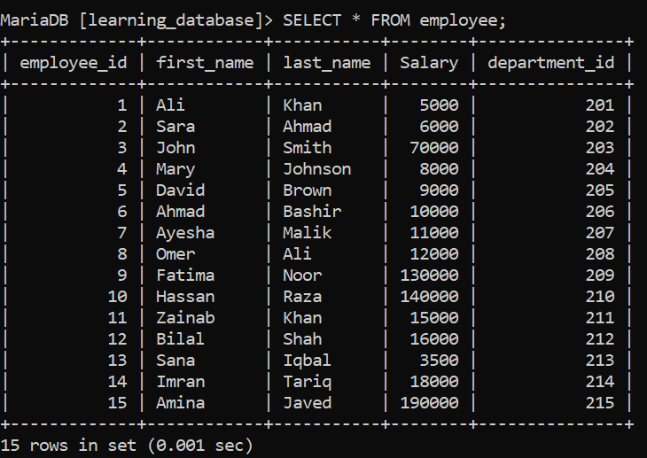
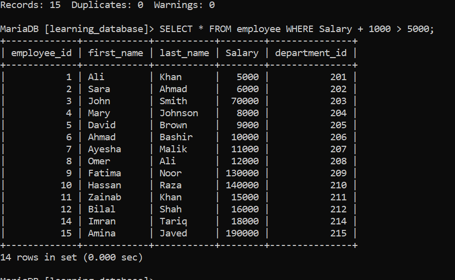
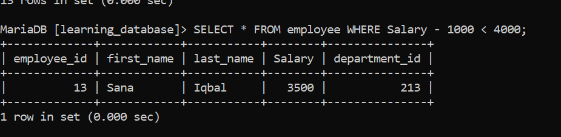
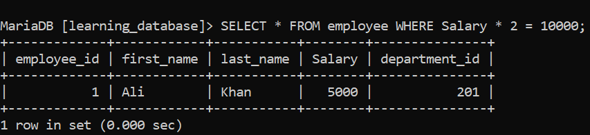
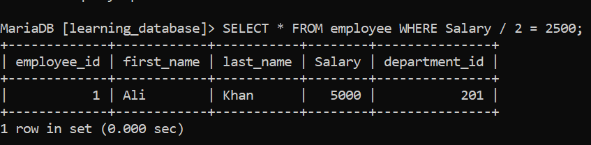
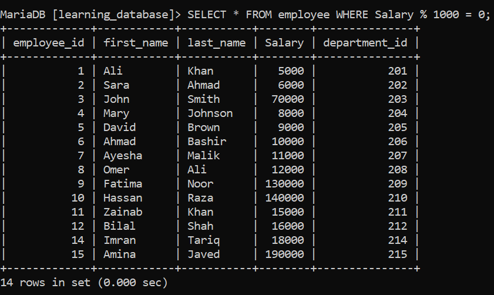

# Day 35: SQL Arithmetic Operators

From today, we will begin learning about SQL operators, and today we will focus on arithmetic operators.

Arithmetic operators are used to perform mathematical operations on numeric data types. The common arithmetic operators in SQL include addition, subtraction, multiplication, division, and modulus.

For this, we will use the `employees` table, which contains the following columns: `employee_id`, `first_name`, `last_name`, `salary`, and `department_id`.

**Employee Table:**



---

## 1. Addition ( + )

Used to add two numbers together.

**SQL Query:**
```sql
SELECT * FROM employees WHERE salary + 1000 > 5000;
```

**Output:** This query returns all employees whose salary plus 1000 is greater than 5000.



---

## 2. Subtraction ( - )

Used to subtract one number from another.

**SQL Query:**
```sql
SELECT * FROM employees WHERE salary - 1000 < 4000;
```

**Output:** This query returns all employees whose salary minus 1000 is less than 4000.



---

## 3. Multiplication ( * )

Used to multiply two numbers.

**SQL Query:**
```sql
SELECT * FROM employees WHERE salary * 2 = 10000;
```

**Output:** This query returns all employees whose salary multiplied by 2 equals 10000.



---

## 4. Division ( / )

Used to divide one number by another.

**SQL Query:**
```sql
SELECT * FROM employees WHERE salary / 2 = 2500;
```

**Output:** This query returns all employees whose salary divided by 2 equals 2500.



---

## 5. Modulus ( % )

Used to find the remainder of a division operation.

**SQL Query:**
```sql
SELECT * FROM employees WHERE salary % 1000 = 0;
```

**Output:** This query returns all employees whose salary is divisible by 1000 with no remainder.



---

← [Back to main README](./README.md) | ← [Previous Day (Day 34) this not yet uploaded so, this is point to the day 35 ](./Day-35-SQL-Arithmetic-Operators.md) | [Next Day (Day 36) →](./Day-36-SQL-Comparison-operators.md)