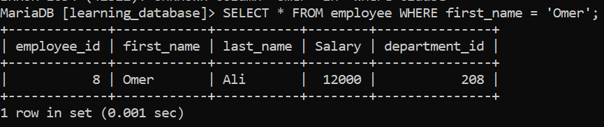
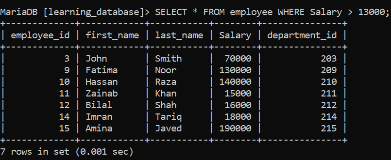
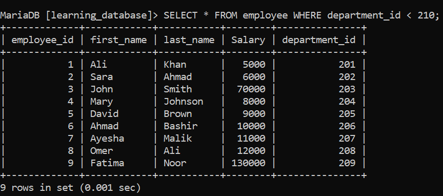
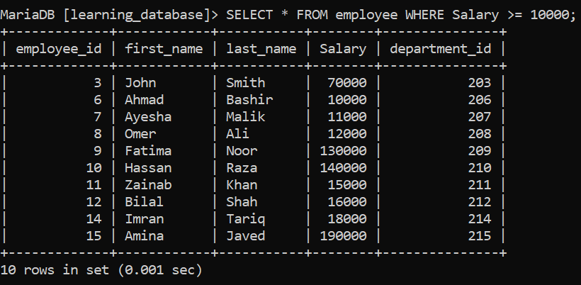
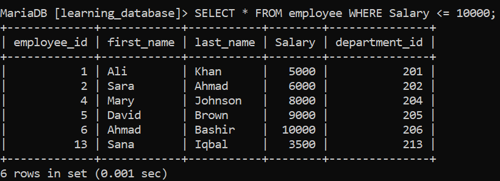
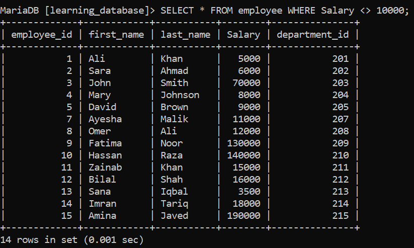
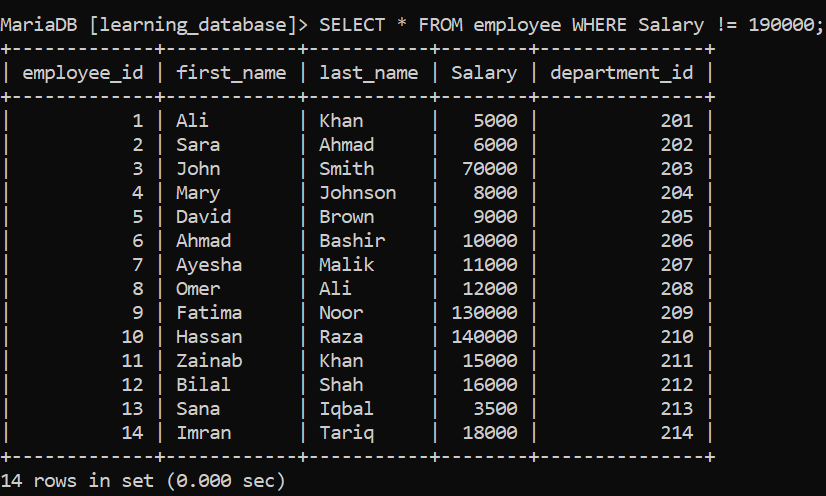

# Day 36: SQL Comparison Operators

Today we learn about SQL comparison operators and practice using them so that we can understand these operators better and use them in our projects easily.

Comparison operators are used with the `WHERE` clause to perform a comparison between two operands, and filtering is done accordingly.

For this, we will use the `employees` table, which contains the following columns: `employee_id`, `first_name`, `last_name`, `salary`, and `department_id`.

**Employee Table:**


---

## 1. Equal To ( = ) Operator

The equal to (`=`) operator is used to compare two values, and filtering is done accordingly.

**SQL Query:**
```sql
SELECT * FROM employee WHERE first_name = 'Omer';
```

**Output:**



---

## 2. Greater Than ( > ) Operator

The greater than (`>`) operator returns values that are greater than the given attribute value.

**SQL Query:**
```sql
SELECT * FROM employee WHERE salary > 13000;
```

**Output:**



---

## 3. Less Than ( < ) Operator

The less than (`<`) operator returns values of the attribute that are less than the given value.

**SQL Query:**
```sql
SELECT * FROM employee WHERE department_id < 210;
```

**Output:**



---

## 4. Greater Than or Equal To ( >= ) Operator

The greater than or equal to (`>=`) operator returns values of the attribute that are greater than or equal to the given value.

**SQL Query:**
```sql
SELECT * FROM employee WHERE salary >= 10000;
```

**Output:**



---

## 5. Less Than or Equal To ( <= ) Operator

The less than or equal to (`<=`) operator returns values of the attribute that are less than or equal to the given value.

**SQL Query:**
```sql
SELECT * FROM employee WHERE salary <= 10000;
```

**Output:**



---

## 6. Not Equal To ( <> | != ) Operator

The not equal to (`<>` or `!=`) operator returns values of the attribute that are not equal to the given value.

**SQL Query:**
```sql
SELECT * FROM employee WHERE salary <> 10000;
```

**Output:**




**SQL Query:**
```sql
SELECT * FROM employee WHERE salary != 190000;
```

**Output:**




[← Back to main README](./README.md) | [← Previous Day (Day 35)](./Day-35-SQL-Arithmetic-Operators.md) | [Next Day (Day 37) →](./Day-37-SQL-Logical-operators.md)