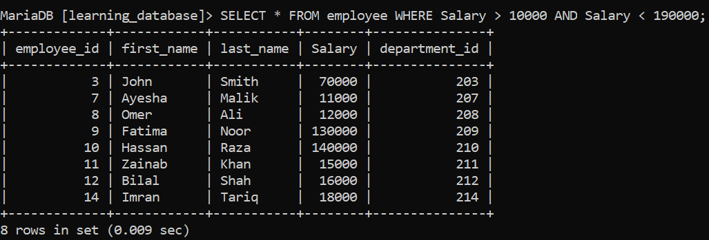
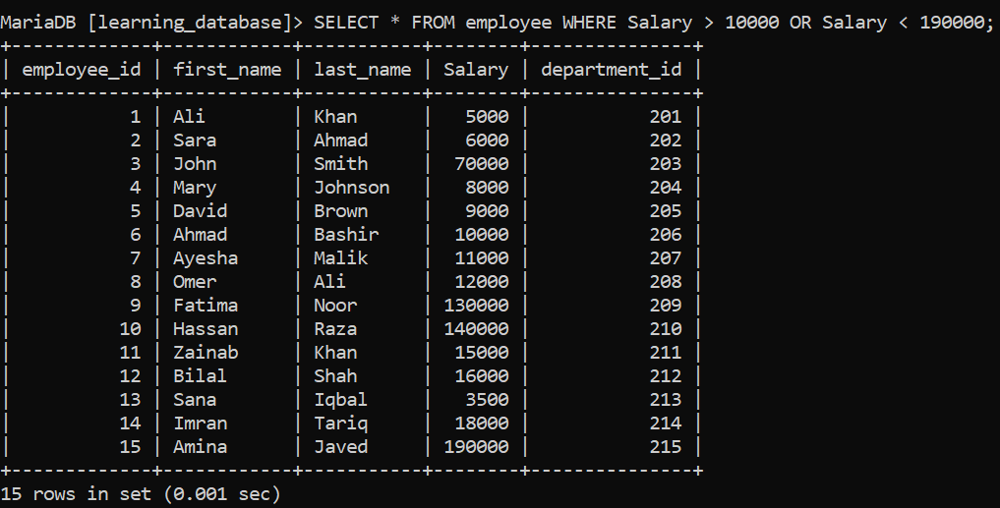
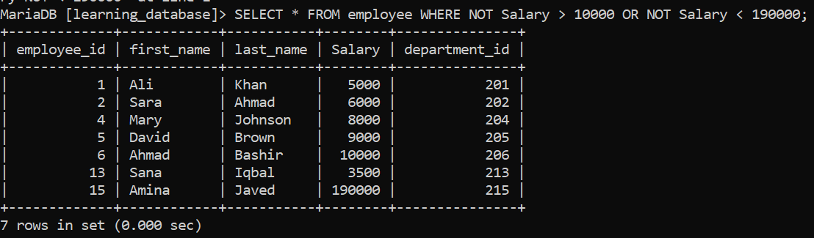

# Day 37: SQL Logical Operators

Today we will look at SQL logical operators.

---

Logical operators are used to combine more than one condition so that we can retrieve the data we want. In other words, logical operators are used to build compound conditions. There are three logical operators:

1. AND
2. OR
3. NOT

---

For this, we will use the `employees` table, which contains the following columns: `employee_id`, `first_name`, `last_name`, `salary`, and `department_id`.

**Employee Table:**


---

## 1. AND Operator

The AND operator returns true only if all conditions evaluate to true.

**SQL Query:**
```sql
SELECT * FROM employee WHERE salary > 10000 AND salary < 190000;
```

**Explanation:**
The SQL engine checks and applies both conditions to each row. If a row satisfies both conditions, the SQL engine includes that row in the result; otherwise, the row is discarded.

**Output:**



---

## 2. OR Operator

The OR operator evaluates to true if at least one condition in the compound condition is true.

**SQL Query:**
```sql
SELECT * FROM employee WHERE salary > 10000 OR salary < 190000;
```

**Explanation:**
The OR operator evaluates the compound condition as true if at least one condition is true, and the SQL engine returns the corresponding row(s).

**Output:**



---

## 3. NOT Operator

The NOT operator reverses a condition — turning true into false and false into true. This is useful when we want to exclude unwanted data.

**SQL Query:**
```sql
SELECT * FROM employee WHERE NOT salary > 10000 OR NOT salary < 190000;
```

**Explanation:**
The NOT operator reverses each condition's result — true becomes false and false becomes true. As a result, the query returns the records that satisfy the condition `NOT salary > 10000 OR NOT salary < 190000`.

**Output:**



---

[← Back to main README](./README.md) | [← Previous Day (Day 36)](./Day-36-SQL-Comparison-operators.md) | [Next Day (Day 38) →](./Day-37-SQL-Logical-operators.md)