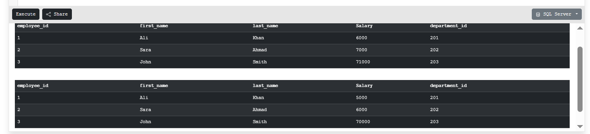
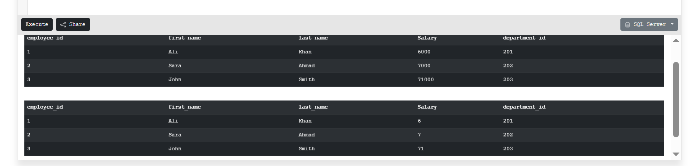
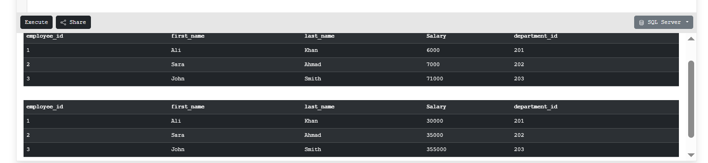
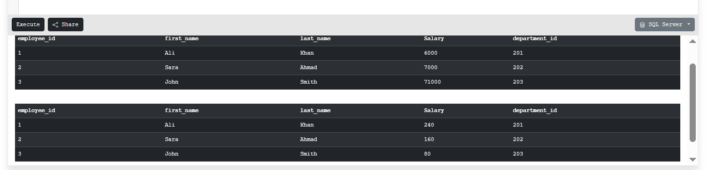

# Compound Operators

Compound operators combine an operation with assignment. The compound operator first performs the operation on the column and then stores the updated result back in the same column.

---

For this, we will use the `employees` table, which contains the following columns: `employee_id`, `first_name`, `last_name`, `salary`, and `department_id`.

**Employee Table:**


---

## 1. Addition Assignment (+=) Compound Operator

This operator first performs addition on the column value and then assigns the updated value back to the same column.

**SQL Query:**
```sql
UPDATE employee SET Salary += 10000;
```

**Explanation:**
When the addition and assignment operators are combined, SQL first performs the addition on the column and then assigns the result back to that same column.

**Output:**


---

## 2. Subtraction Assignment (-=) Compound Operator

This operator first performs subtraction on the column and then assigns the result back to the same column.

**SQL Query:**
```sql
UPDATE employee SET Salary -= 10000;
```

**Explanation:**
When the subtraction and assignment operators are combined, SQL first performs the subtraction on the `Salary` column in the `employee` table and then assigns the result back to that same column.

**Output:**



---

## 3. Division Assignment (/=) Compound Operator

This operator first performs division on the column and then assigns the updated value back to the same column.

**SQL Query:**
```sql
UPDATE employee SET Salary /= 10;
```

**Explanation:**
When the division and assignment operators are combined, SQL first performs the division on the `Salary` column in the `employee` table and then assigns the result back to that same column.

**Output:**



---

## 4. Multiplication Assignment (*=) Compound Operator

This operator first performs multiplication on the column and then assigns the updated value back to the same column.

**SQL Query:**
```sql
UPDATE employee SET Salary *= 10;
```

**Explanation:**
When the multiplication and assignment operators are combined, SQL first performs the multiplication on the `Salary` column in the `employee` table and then assigns the result back to that same column.

**Output:**



---

## 5. Modulus Assignment (%=) Compound Operator

This operator divides the column value by a given number and stores the remainder back in the same column.

**SQL Query:**
```sql
UPDATE employee SET Salary %= 10;
```

**Explanation:**
When the modulus and assignment operators are combined, SQL first divides the `Salary` column in the `employee` table by the given value, and then assigns the remainder back to that same column.

**Output:**



---

I've covered these 5 compound operators, but there are three more — `&=`, `^=`, and `|=` — which we'll cover once we understand bitwise operators.

---

```
NOTE:
Not all databases support compound operators. The following database systems are exceptions i.e., they DO support them:

Microsoft SQL Server (T-SQL)
Scope: Full support across table updates (UPDATE employee SET Salary += 1000) and local variable modifications (SET @val += 10).
Supported Operators: +=, -=, *=, /=, %=, &=, ^=, |=

Azure SQL Database & Azure SQL Managed Instance
Shares the same T-SQL engine as Microsoft SQL Server.

Microsoft Fabric SQL Database
Built on top of the T-SQL dialect.

SAP ASE / Sybase ASE
Supports basic T-SQL compound operators due to shared historical codebase heritage with early SQL Server versions.
```

---

[← Back to main README](./README.md) | [← Previous Day (Day 37)](./Day-37-SQL-Logical-operators.md) | [Next Day (Day 39) →](./Day-38-SQL-Compound-operators.md)