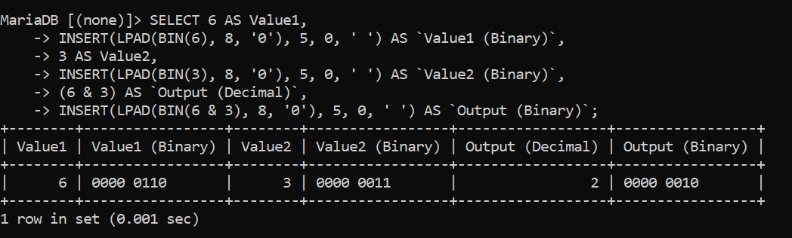
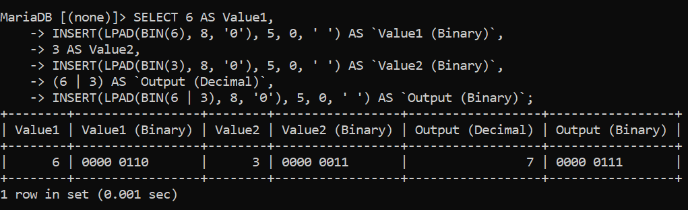
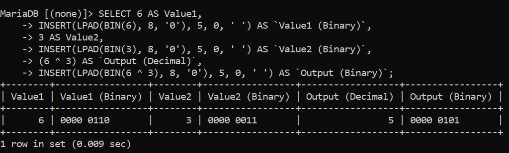
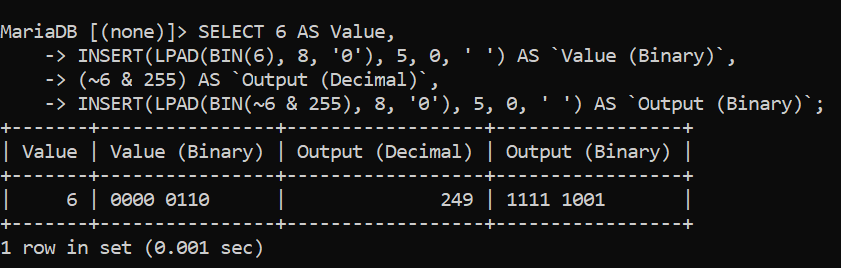
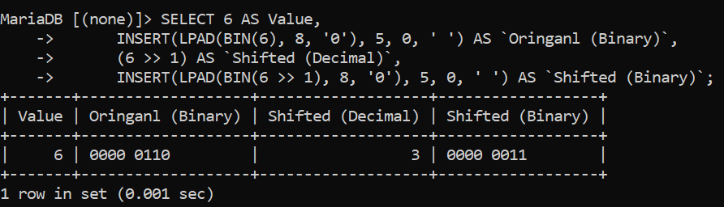

# SQL Bitwise operators:

Bitwise operators evaluate and manipulate individual bits (0s and 1s) within integers. In databases, they are most commonly used to store multiple status flags or permissions inside a single integer column saving storage space and enabling lightning-fast filtering.

---

**The Bitwise Operators Breakdown:**

```
To understand how these work, convert numbers to an 8-bit binary representation::

5 in binary = 0000 0101

3 in binary = 0000 0011
```

---

# 1. Bitwise AND ( & ) Operator:

This evaluates as true if both bits are true; otherwise, false.

**SQL QUERY:**

```sql
SELECT 6 AS Value1,
       INSERT(LPAD(BIN(6), 8, '0'), 5, 0, ' ') AS `Value1 (Binary)`,
       3 AS Value2,
       INSERT(LPAD(BIN(3), 8, '0'), 5, 0, ' ') AS `Value2 (Binary)`,
       (6 & 3) AS `Output (Decimal)`,
       INSERT(LPAD(BIN(6 & 3), 8, '0'), 5, 0, ' ') AS `Output (Binary)`;
```

**Explanation:**

```
  In the bitwise AND (&) operator, when both bits are 1s, it evaluates to true; otherwise, it evaluates to false.

   6 in binary = 0000 0110

   3 in binary = 0000 0011
 -----------------------------------------
   Output:     & 0000 0010 = (Decimal: 2)
```

**Output:**



---

# 2. Bitwise OR ( | ) Operator:

    This evaluates as true if at least one bit is 1; otherwise, false.

**SQL QUERY:**

```sql
   SELECT 6 AS Value1,
       INSERT(LPAD(BIN(6), 8, '0'), 5, 0, ' ') AS `Value1 (Binary)`,
       3 AS Value2,
       INSERT(LPAD(BIN(3), 8, '0'), 5, 0, ' ') AS `Value2 (Binary)`,
       (6 | 3) AS `Output (Decimal)`,
       INSERT(LPAD(BIN(6 | 3), 8, '0'), 5, 0, ' ') AS `Output (Binary)`;
```

**Explanation:**

```
  In the bitwise OR (|) operator, when at least one bit is 1, it evaluates to true; otherwise, false.

   6 in binary = 0000 0110

   3 in binary = 0000 0011
 -----------------------------------------
   Output:     | 0000 0111 = (Decimal: 7)
```

**Output:**



---

# 3. Bitwise XOR ( ^ ) Operator:

     This evaluates as true if the bits are opposite each other; matching bits evaluate as false (0), and opposite bits evaluate as true (1).

**SQL QUERY:**

```sql
   SELECT 6 AS Value1,
       INSERT(LPAD(BIN(6), 8, '0'), 5, 0, ' ') AS `Value1 (Binary)`,
       3 AS Value2,
       INSERT(LPAD(BIN(3), 8, '0'), 5, 0, ' ') AS `Value2 (Binary)`,
       (6 ^ 3) AS `Output (Decimal)`,
       INSERT(LPAD(BIN(6 ^ 3), 8, '0'), 5, 0, ' ') AS `Output (Binary)`;
```

**Explanation:**

```
  In the bitwise XOR (^) operator, when bits are opposite each other, it evaluates to true; otherwise, false.

   6 in binary = 0000 0110

   3 in binary = 0000 0011
 -----------------------------------------
   Output:     | 0000 0101 = (Decimal: 5)
```

**Output:**



---

# 4. Bitwise NOT ( ~ ) Operator:

     This flips 1s to 0s and vice versa. In SQL, the database engine reserves 64 bits for the NOT operator, which turns the result into a very large number. To get a smaller, readable number and discard the extra high-order bits, we combine NOT with the AND operator (& 255).

**SQL QUERY:**

```sql
   SELECT 6 AS Value,
       INSERT(LPAD(BIN(6), 8, '0'), 5, 0, ' ') AS `Value (Binary)`,
       (~6 & 255) AS `Output (Decimal)`,
       INSERT(LPAD(BIN(~6 & 255), 8, '0'), 5, 0, ' ') AS `Output (Binary)`;
```

**Explanation:**

```
  In SQL, the NOT operator converts 0 bits into 1s and 1 bits into 0s. By default, SQL uses 64 bits for the NOT operator, so when we apply NOT to a number, it becomes a very large number. Because of this, we use the AND operator (& 255) so it discards the extra higher bits and keeps the number small.

  ~6 in binary = 0000 0000 0000 0000 0000 0000 0000 0000 0000 0000 0000 0000 0000 0000 1111 1001
 255 in binary = 0000 0000 0000 0000 0000 0000 0000 0000 0000 0000 0000 0000 0000 0000 1111 1111

 -------------------------------------------------------------------------------------------------
   Output:     & 0000 0000 0000 0000 0000 0000 0000 0000 0000 0000 0000 0000 0000 0000 1111 1001(Decimal: 249)
```

**Output:**



---

# 5. Left Shift Operator ( << ):

    The left shift operator is like multiplying by powers of 2 at the bit level.
    For example, 6 << 1 is like $6 \times 2 = 12$, and 6 << 2 is like $6 \times 2 \times 2 = 24$.

    OR

    In other words, we can say that this moves the bits to the left side by the specified number of positions.

**SQL QUERY:**

```sql
   SELECT 6 AS Value,
      INSERT(LPAD(BIN(6), 8, '0'), 5, 0, ' ') AS `Oringanl (Binary)`,
      (6 << 1) AS `Shifted (Decimal)`,
      INSERT(LPAD(BIN(6 << 1), 8, '0'), 5, 0, ' ') AS `Shifted (Binary)`;
```

**Output:**


> **NOTE:**

```
Bits on the far left are discarded according to the specified number of shifted bits.

```

---

# 6. Right Shift Operator ( >> ):

This moves the bits to the right side, inserting bits on the left side so that the remaining bits shift to the right.

OR

In other words, this divides the number by powers of 2 at the bit level, based on the specified number of shift positions.

**SQL QUERY:**

```sql
   SELECT 6 AS Value,
             INSERT(LPAD(BIN(6), 8, '0'), 5, 0, ' ') AS `Oringanl (Binary)`,
             (6 >> 1) AS `Shifted (Decimal)`,
             INSERT(LPAD(BIN(6 >> 1), 8, '0'), 5, 0, ' ') AS `Shifted (Binary)`;
```

**Output:**



> **NOTE:**

```
Bits on the far right are discarded according to the specified number of shifted bits.

```

---

> **NOTE:**

> AS Keyword: Assigns an alias to name the output column (e.g., naming the result `Value`).
> BIN(): Converts a decimal integer into its binary string representation.
> LPAD(): Pads the left side of a string with zeros to ensure a consistent 8-bit length.
> INSERT(): Inserts a space at position 5 to separate the 8 bits into two 4-bit groups (0000 0110) for better visual readability.

---

---

> **Note:**
> Compound bitwise assignment operators (such as `&=`, `|=`, and `^=`) are skipped here for brevity and will be covered in a later section.

---

[← Back to main README](./README.md) | [← Previous Day (Day 38)](./Day-38-SQL-Compound-operators.md) | [Next Day (Day 40) →](./Day-39-SQL-Bitwise-Operators.md)
