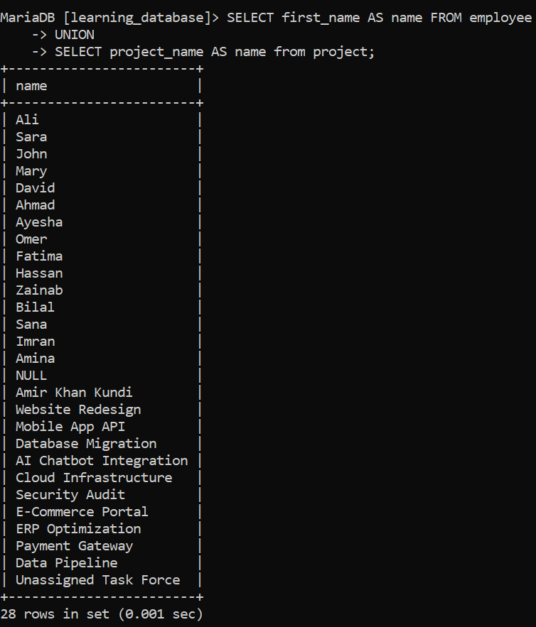

# UNION Operator

The `UNION` operator is used to combine the result sets of two or more `SELECT` statements into a single result set. It removes duplicate rows across the combined statements.

In short: the `UNION` operator in SQL merges the result sets of two or more `SELECT` queries into one unified result set.

Below is a complete breakdown of how `UNION` works — its syntax, rules, and variations.

- `UNION` removes duplicate rows from the combined result.
- `UNION ALL` includes all rows, even duplicates.
- Queries must have matching columns and compatible data types.
- Both are especially useful for combining data from different tables or sources.

---

## 1. Mandatory Rules for UNION

For a `UNION` query to execute without errors, your `SELECT` statements must follow three strict rules:

1. **Equal Number of Columns** — Each `SELECT` statement must return the exact same number of columns.
2. **Compatible Data Types** — Corresponding columns must have compatible data types (e.g., a `VARCHAR` matched with a `VARCHAR`, or an `INT` matched with a `FLOAT`).
3. **Same Column Order** — Columns in both queries must appear in the same logical order, since `UNION` matches columns by position, not by name.

---

## 2. UNION vs. UNION ALL

This is the most crucial distinction to understand when working with set operations:

| Feature | UNION | UNION ALL |
| :--- | :--- | :--- |
| Duplicate Handling | Removes all duplicate rows | Keeps all duplicate rows |
| Performance | **Slower** (requires sorting/hashing the data in memory to eliminate duplicates) | **Faster** (simply combines the datasets directly) |
| Use Case | When you want distinct, unique results | When duplicates are fine or expected |

> For the practice examples below, we will use two related tables:

- `employee`: `employee_id`, `first_name`, `last_name`, `salary`, `department_id`


- `project`: `project_id`, `project_name`, `employee_id`


---

## 3. Syntax of the UNION Operator

```sql
SELECT column1, column2, ...
FROM table1
WHERE condition1
UNION
SELECT column1, column2, ...
FROM table2
WHERE condition2;
```

The syntax for `UNION ALL` is identical — simply replace `UNION` with `UNION ALL`:

```sql
SELECT column1, column2, ...
FROM table1
WHERE condition1
UNION ALL
SELECT column1, column2, ...
FROM table2
WHERE condition2;
```

---

## 4. Example 1: Using UNION to Combine Employee Names and Project Names

**SQL Query:** Retrieve a combined, duplicate-free list of all employee first names and project names.

```sql
SELECT first_name AS name FROM employee
UNION
SELECT project_name AS name FROM project;
```

**Output:**


---

## 5. Example 2: Using UNION ALL to Combine Employee Names and Project Names

**SQL Query:** Retrieve the same combined list as above, but keep every row — including duplicates.

```sql
SELECT first_name AS name FROM employee
UNION ALL
SELECT project_name AS name FROM project;
```

Unlike `UNION`, this query does not deduplicate the result, so if an employee's first name happens to match a project name, both rows will appear in the output. It also runs faster, since the database skips the extra step of sorting and comparing rows to remove duplicates.

---

## 6. Best Practices

- Use `UNION ALL` instead of `UNION` whenever you know the result sets won't contain duplicates, or when duplicates don't matter — it avoids unnecessary sorting overhead.
- Give consistent column aliases (as shown with `AS name` above) so the final result set has clear, predictable column names.
- Only the first `SELECT` statement's column names (or aliases) are used as the column headers in the final output.
- An `ORDER BY` clause can only be applied once, at the very end of the combined query — it sorts the entire unified result set, not each individual `SELECT`.

---

[← Back to main README](./README.md) | [← Previous Day (Day 47)](./SQL-Special-Operators/Day-47-Special_Operator_REGEXP_or_RLIKE.md) | [Next Day (Day 49) →](./Day-48-UNION-and-UNION_ALL-Operator.md)
