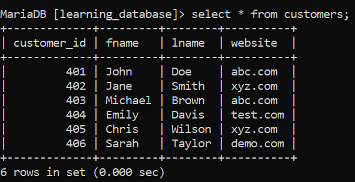
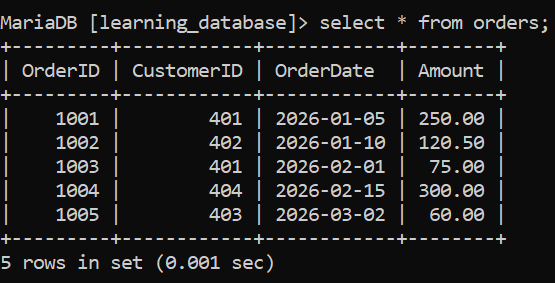
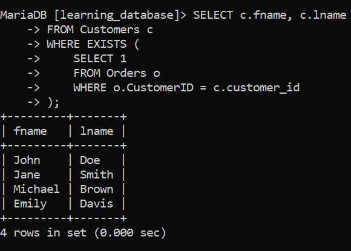
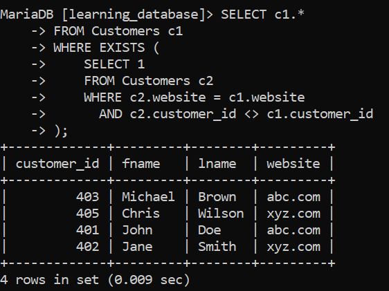
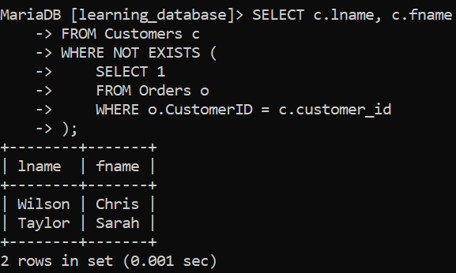
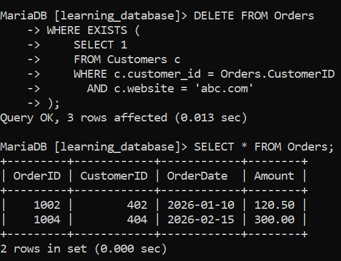
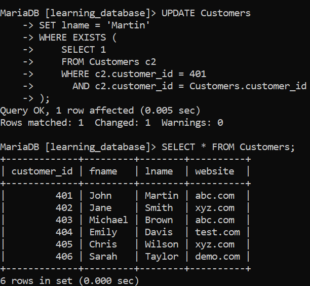
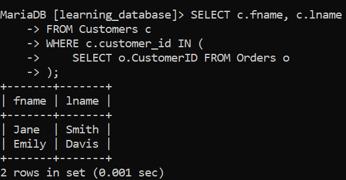

# SQL EXISTS Operator:

## Introduction

SQL provides the `EXISTS` operator to check whether a subquery returns **at least one row**. It is useful for filtering data based on the presence of related records.

**Key Points:**
- Checks if a subquery returns one or more rows.
- Returns `TRUE` if data exists, otherwise `FALSE`.
- Commonly used with correlated subqueries.
- Stops scanning as soon as one matching row is found, which often makes it faster than `IN` for large datasets.
- Can be combined with `NOT` to check for the *absence* of matching rows.
- Works with `SELECT`, `UPDATE`, `DELETE`, and `INSERT` statements.

---

## Syntax

```sql
SELECT column_name(s)
FROM table_name
WHERE EXISTS (
    SELECT column_name(s)
    FROM subquery_table
    WHERE condition
);
```

- **EXISTS**: The boolean operator that checks if a subquery returns rows.
- **Subquery**: A nested `SELECT` query that returns data for evaluation.
- **Condition**: The condition applied to the subquery, usually correlating it to the outer query.

> **Tip:** Since `EXISTS` only cares whether rows exist (not their content), it's a common convention to use `SELECT 1` inside the subquery instead of selecting actual columns.

---

> We will use the following example tables for practice:

**Customers**



**Orders**



Notice: customers `405` (Chris) and `406` (Sarah) have **no orders**, and customers `401` and `403` share the same website (`abc.com`) with another customer.

---

## Basic Example: Customers Who Have Placed an Order:

**Query:**

```sql
SELECT c.fname, c.lname
FROM Customers c
WHERE EXISTS (
    SELECT 1
    FROM Orders o
    WHERE o.CustomerID = c.customer_id
);
```

**Output:**



**Explanation:**
- For each row in `Customers`, the subquery checks whether a matching row exists in `Orders`.
- `EXISTS` returns `TRUE` for John, Jane, Michael, and Emily since they all have at least one order.
- Chris and Sarah are excluded because no row in `Orders` matches their `customer_id`.

---

## Example 1: Using EXISTS with SELECT (Self-Referencing Subquery):

Fetch customers whose website is shared by at least one other customer in the same `Customers` table.

**Query:**
```sql
SELECT c1.*
FROM Customers c1
WHERE EXISTS (
    SELECT 1
    FROM Customers c2
    WHERE c2.website = c1.website
      AND c2.customer_id <> c1.customer_id
);
```

**Output:**



**Explanation:**
- The subquery (`c2`) checks whether another row exists with the **same website** but a **different `customer_id`**.
- `John` and `Michael` both use `abc.com` — each satisfies the other's condition, so both appear.
- `Jane` and `Chris` both use `xyz.com` — same logic applies.
- `Emily` (`test.com`) and `Sarah` (`demo.com`) have unique websites, so they're excluded.

---

## Example 2: Using NOT with EXISTS:

Fetch the last and first name of customers who have **not** placed any order.

**Query:**
```sql
SELECT c.lname, c.fname
FROM Customers c
WHERE NOT EXISTS (
    SELECT 1
    FROM Orders o
    WHERE o.CustomerID = c.customer_id
);
```

**Output:**



**Explanation:**
- `NOT EXISTS` reverses the logic — it returns `TRUE` when the subquery finds **no** matching rows.
- Chris and Sarah have no entries in `Orders`, so they are returned.
- This is a common and efficient pattern for finding "records with no related data."

---

## Example 3: Using EXISTS with DELETE:

Delete all records from the `Orders` table belonging to customers whose website is `'abc.com'`.

**Query:**
```sql
DELETE FROM Orders
WHERE EXISTS (
    SELECT 1
    FROM Customers c
    WHERE c.customer_id = Orders.CustomerID
      AND c.website = 'abc.com'
);
```

```sql
SELECT * FROM Orders;
```

**Output (after deletion):**



**Explanation:**
- The subquery checks each `Orders` row to see if its `CustomerID` belongs to a customer whose `website` is `'abc.com'`.
- Customers `401` (John) and `403` (Michael) both use `abc.com`, so their orders (`1001`, `1003`, `1005`) are deleted.
- Orders belonging to `402` and `404` remain untouched.

---

## Example 4: Using EXISTS with UPDATE:

Update the `lname` to `'Martin'` for the customer whose `customer_id` is `401`.

**Query:**
```sql
UPDATE Customers
SET lname = 'Martin'
WHERE EXISTS (
    SELECT 1
    FROM Customers c2
    WHERE c2.customer_id = 401
      AND c2.customer_id = Customers.customer_id
);
```

```sql
SELECT * FROM Customers;
```

**Output (after update):**



**Explanation:**
- The subquery only returns a row when `customer_id = 401`, matching against the outer query's current row.
- `EXISTS` evaluates to `TRUE` only for the row where `Customers.customer_id = 401`.
- Only John Doe's `lname` is updated to `Martin`; all other rows remain unchanged.
- This is a somewhat contrived way to target a single row — in practice a plain `WHERE customer_id = 401` would be simpler, but it demonstrates that `EXISTS` works in `UPDATE` statements too.

---

## EXISTS vs IN:

Both can check for matching values in a subquery, but they behave differently:

| Aspect              | EXISTS                                      | IN                                          |
|---------------------|----------------------------------------------|----------------------------------------------|
| Checks              | Whether subquery returns any row              | Whether a value matches any in a list/subquery |
| NULL handling        | Not affected by `NULL`s in subquery results   | Can behave unexpectedly if subquery returns `NULL` |
| Performance          | Often faster on large tables (stops at first match) | Can be slower since it may materialize the full list |
| Correlated subquery  | Typically correlated (references outer query) | Usually independent, but can be correlated too |

**Equivalent using IN:**
```sql
SELECT c.fname, c.lname
FROM Customers c
WHERE c.customer_id IN (
    SELECT o.CustomerID FROM Orders o
);
```

**Output:**



This produces the same result as our basic `EXISTS` example, but `EXISTS` is generally preferred when checking for existence (especially with `NULL`-prone columns) and `IN` is more natural when comparing directly against a known list of values.

---

## EXISTS vs NOT EXISTS — Quick Reference:

| Operator      | Returns TRUE when...                          |
|---------------|-------------------------------------------------|
| `EXISTS`      | The subquery returns **at least one** row        |
| `NOT EXISTS`  | The subquery returns **zero** rows               |

---

## Performance Notes:

- `EXISTS` short-circuits: the database engine stops searching as soon as it finds one matching row, making it efficient for large datasets.
- Always correlate the subquery to the outer query (e.g., `o.CustomerID = c.customer_id`) — an uncorrelated `EXISTS` subquery either always returns all rows or none, which is rarely useful.
- Indexing the join/comparison columns (like `CustomerID` and `customer_id`) significantly speeds up `EXISTS` checks.
- `NOT EXISTS` is generally safer and faster than `NOT IN` when the subquery column might contain `NULL` values, since `NOT IN` can silently return an empty result if any `NULL` is present.

---

## Summary

- `EXISTS` checks whether a subquery returns any rows and evaluates to `TRUE`/`FALSE`.
- It's typically used with correlated subqueries that reference the outer query.
- `NOT EXISTS` is the logical opposite — useful for finding missing/unmatched records.
- Works seamlessly with `SELECT`, `UPDATE`, and `DELETE` statements.
- Prefer `EXISTS`/`NOT EXISTS` over `IN`/`NOT IN` when subquery results might contain `NULL`s or when performance on large tables matters.

---

[← Back to main README](./README.md) | [← Previous Day (Day 50)](./Day-50-INTERSECT-Operator.md) | [Next Day (Day 52) →](./Day-52-CASE_Statement.md)