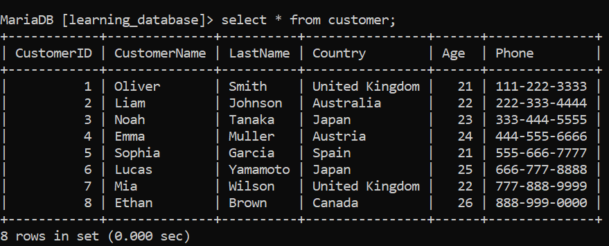
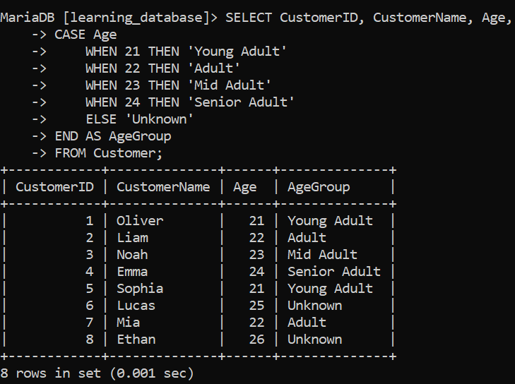
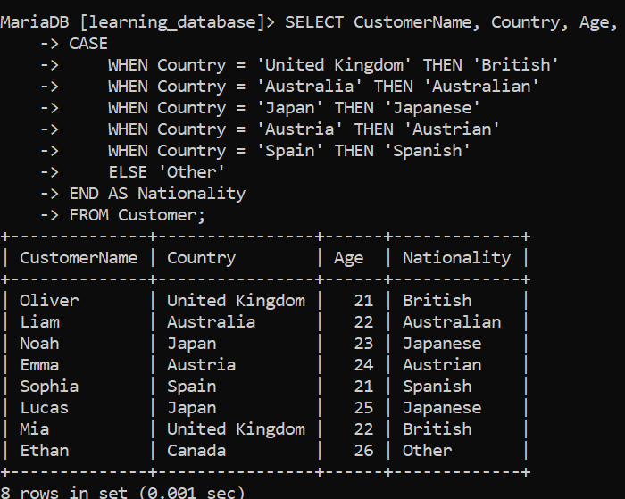
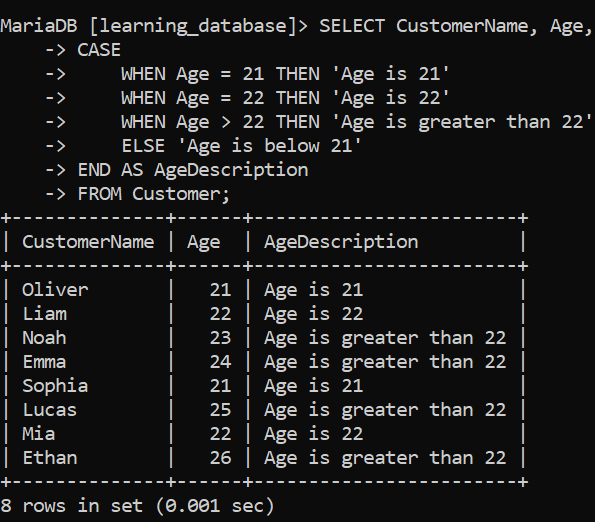
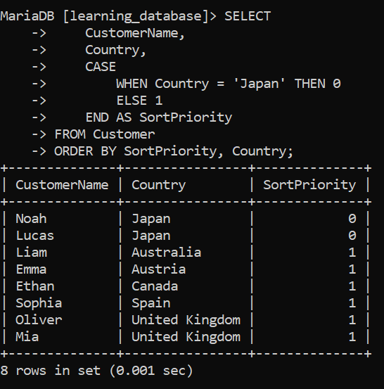
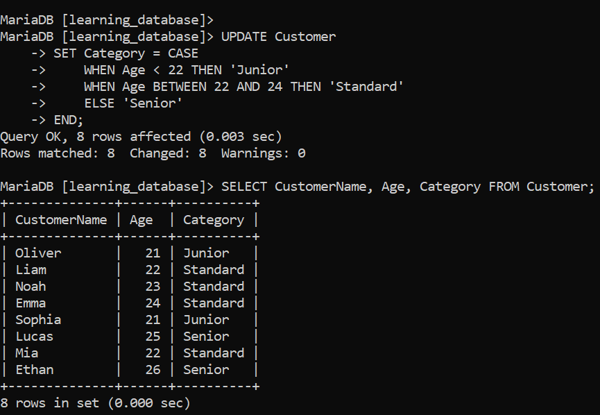
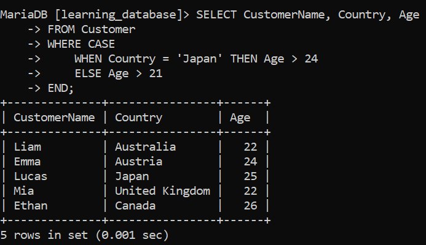
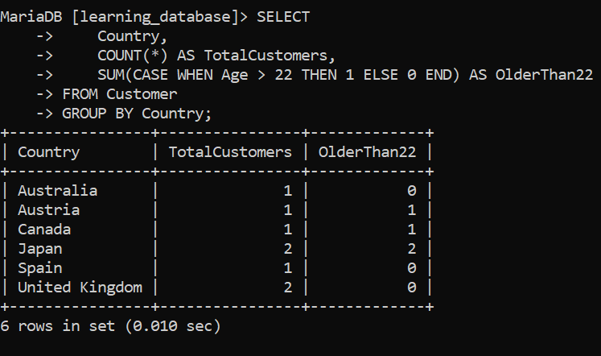

# SQL CASE Statement

## Introduction

The SQL `CASE` statement is used to add conditional logic inside SQL queries. It checks conditions one by one and returns a value as soon as a matching condition is found.

**Key Points:**
- Works like an `IF-THEN-ELSE` statement inside SQL.
- Helps categorize data or transform values dynamically.
- Can be used in `SELECT`, `UPDATE`, `ORDER BY`, `WHERE`, and other clauses.
- Evaluation stops at the **first matching condition** — later conditions are ignored even if they'd also be true.
- If no condition matches and there's no `ELSE`, the result is `NULL`.

---

## Syntax

### 1. Simple CASE (compares against fixed values)

```sql
CASE case_value
    WHEN value1 THEN result1
    WHEN value2 THEN result2
    ...
    ELSE result
END
```
- Compares a column or expression with fixed values.
- Returns the result of the first matching value.

### 2. Searched CASE (evaluates conditions/expressions)

```sql
CASE
    WHEN condition1 THEN result1
    WHEN condition2 THEN result2
    ...
    ELSE result
END
```
- Evaluates multiple logical conditions (can use `>`, `<`, `LIKE`, `BETWEEN`, etc.).
- Returns the result of the first true condition.

---

> We will use the following example table for practice:

**Customer Table:**



---

## Basic Example: Simple CASE with a Fixed Column:

Categorize each customer into an age group based on their exact `Age` value.

**Query:**
```sql
SELECT CustomerID, CustomerName, Age,
CASE Age
    WHEN 21 THEN 'Young Adult'
    WHEN 22 THEN 'Adult'
    WHEN 23 THEN 'Mid Adult'
    WHEN 24 THEN 'Senior Adult'
    ELSE 'Unknown'
END AS AgeGroup
FROM Customer;
```

**Output:**



**Explanation:**
- This is the **simple CASE** form — `CASE Age` compares the `Age` column directly against fixed values (`21`, `22`, `23`, `24`).
- Lucas (25) and Ethan (26) don't match any listed value, so they fall to `ELSE 'Unknown'`.

---

## Example 1: Simple CASE Expression (Searched Form):

Return a nationality based on each customer's country.

**Query:**
```sql
SELECT CustomerName, Country, Age,
CASE
    WHEN Country = 'United Kingdom' THEN 'British'
    WHEN Country = 'Australia' THEN 'Australian'
    WHEN Country = 'Japan' THEN 'Japanese'
    WHEN Country = 'Austria' THEN 'Austrian'
    WHEN Country = 'Spain' THEN 'Spanish'
    ELSE 'Other'
END AS Nationality
FROM Customer;
```

**Output:**



**Explanation:**
- This uses the **searched CASE** form — each `WHEN` holds a full condition (`Country = 'Japan'`) rather than comparing a single column against listed values.
- Ethan is from Canada, which isn't listed, so he falls to `ELSE 'Other'`.
- Notice both Noah and Lucas map to `'Japanese'` since they share the same country.

---

## Example 2: CASE with Multiple Conditions:

Describe each customer's age using comparison operators, not just exact matches.

**Query:**
```sql
SELECT CustomerName, Age,
CASE
    WHEN Age = 21 THEN 'Age is 21'
    WHEN Age = 22 THEN 'Age is 22'
    WHEN Age > 22 THEN 'Age is greater than 22'
    ELSE 'Age is below 21'
END AS AgeDescription
FROM Customer;
```

**Output:**



**Explanation:**
- Conditions are checked **top to bottom**; the first one that's `TRUE` wins.
- Since every customer in this table is 21 or older, the `ELSE 'Age is below 21'` branch never triggers here — it exists purely as a safety fallback for ages under 21.
- This shows why condition **order matters**: if `Age > 22` were listed before `Age = 22`, customers aged exactly 22 would never reach that branch — but since it's checked after, equality is caught first.

---

## Example 3: CASE with ORDER BY:

Use `CASE` to create a custom sort order — showing Japan-based customers first, then everyone else, sorted alphabetically by country.

**Query:**
```sql
SELECT
    CustomerName,
    Country,
    CASE
        WHEN Country = 'Japan' THEN 0
        ELSE 1
    END AS SortPriority
FROM Customer
ORDER BY SortPriority, Country;
```

**Output:**



**Explanation:**
- The `CASE` expression assigns `0` to Japan-based customers and `1` to everyone else.
- `ORDER BY SortPriority, Country` sorts first by that priority (so Japan rows float to the top), then alphabetically by `Country` within each group.
- This is a common trick to enforce custom, non-alphabetical sort orders without altering the underlying data.

---

## Example 4: CASE in an UPDATE Statement:

`CASE` isn't limited to `SELECT` — it can conditionally set values during an `UPDATE` too. Here we'll add a `Category` column and populate it based on age.

**Query:**
```sql
ALTER TABLE Customer ADD Category VARCHAR(20);

UPDATE Customer
SET Category = CASE
    WHEN Age < 22 THEN 'Junior'
    WHEN Age BETWEEN 22 AND 24 THEN 'Standard'
    ELSE 'Senior'
END;
```

```sql
SELECT CustomerName, Age, Category FROM Customer;
```

**Output:**



**Explanation:**
- The `CASE` expression is evaluated **per row** during the `UPDATE`, so each customer's `Category` is set based on their own `Age`.
- This is a common pattern for backfilling categorical/derived columns from existing data.

---

## Example 5: CASE Inside WHERE:

`CASE` can also be used inside a `WHERE` clause to apply conditional filtering logic.

**Query:**
```sql
SELECT CustomerName, Country, Age
FROM Customer
WHERE CASE
    WHEN Country = 'Japan' THEN Age > 24
    ELSE Age > 21
END;
```

**Output:**



**Explanation:**
- For customers from Japan, the filter requires `Age > 24` — only Lucas (25) qualifies (Noah, 23, does not).
- For all other countries, it requires `Age > 21` — Liam, Emma, Mia, and Ethan qualify.
- This demonstrates how `CASE` allows different filter logic depending on another column's value, something a plain `WHERE` condition can't easily do alone.

---

## CASE with Aggregate Functions:

A very common real-world pattern: use `CASE` inside `SUM()`/`COUNT()` to pivot data or compute conditional counts.

**Query:**
```sql
SELECT
    Country,
    COUNT(*) AS TotalCustomers,
    SUM(CASE WHEN Age > 22 THEN 1 ELSE 0 END) AS OlderThan22
FROM Customer
GROUP BY Country;
```

**Output:**



**Explanation:**
- The `CASE` expression converts each row into `1` or `0` depending on whether `Age > 22`.
- `SUM()` then adds these up per group, effectively counting how many customers in each country are older than 22.
- This "conditional aggregation" pattern is widely used for building pivot-style reports without extra subqueries.

---

## Simple CASE vs Searched CASE: Quick Reference:

| Aspect                | Simple CASE                              | Searched CASE                                |
|------------------------|-------------------------------------------|------------------------------------------------|
| Syntax                 | `CASE column WHEN value THEN result`      | `CASE WHEN condition THEN result`               |
| Comparison type        | Equality only (`column = value`)          | Any condition (`>`, `<`, `LIKE`, `BETWEEN`, etc.)|
| Flexibility             | Less flexible                            | More flexible                                   |
| Use case                | Matching exact/known values              | Range checks, multiple columns, complex logic   |

---

## Where CASE Can Be Used:

- `SELECT`: transform or label column values.
- `WHERE`: apply conditional filter logic.
- `ORDER BY`: create custom sort sequences.
- `UPDATE ... SET`: assign values conditionally.
- `GROUP BY`: group rows by a computed category.
- Inside aggregate functions (`SUM`, `COUNT`, `AVG`): conditional aggregation / pivoting.

---

## Performance Notes:

- `CASE` expressions are evaluated row by row, so overly complex nested `CASE` logic can slow down large queries — keep conditions simple and ordered efficiently (most likely/cheapest condition first).
- Indexing the columns used inside `WHEN` conditions can help the optimizer, especially when `CASE` is used in `WHERE` or `JOIN` logic.
- Prefer `CASE` over multiple separate queries combined with `UNION` when you just need conditional labeling — it's usually more efficient and readable.

---

## Summary:

- `CASE` brings `IF-THEN-ELSE` style conditional logic into SQL.
- Two forms exist: **Simple CASE** (equality comparisons) and **Searched CASE** (any condition).
- Evaluation stops at the first matching condition; unmatched rows fall to `ELSE`, or `NULL` if no `ELSE` exists.
- Usable in `SELECT`, `WHERE`, `ORDER BY`, `UPDATE`, `GROUP BY`, and inside aggregate functions.
- A powerful tool for categorizing data, custom sorting, backfilling columns, and building pivot-style reports.

---

[← Back to main README](./README.md) | [← Previous Day (Day 51)](./Day-51-EXISTS-Operator.md) | [Next Day (Day 53) →](./Day-52-CASE_Statement.md)