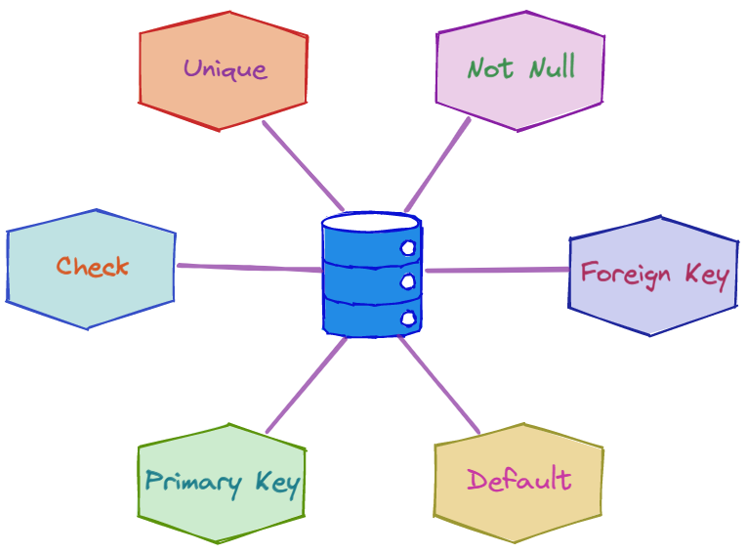
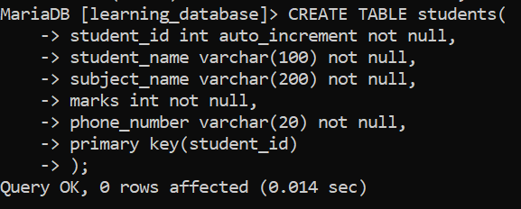
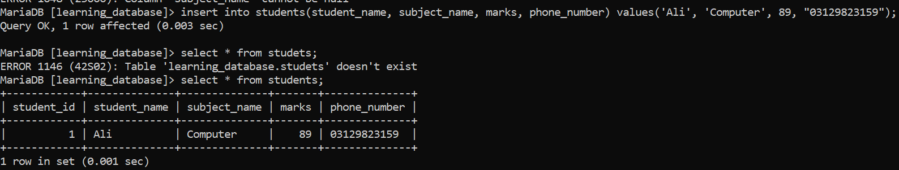
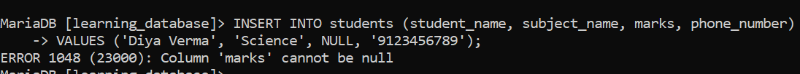
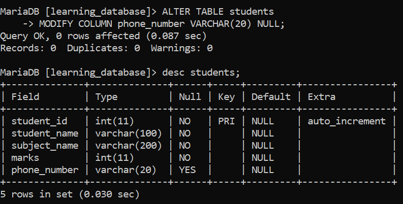
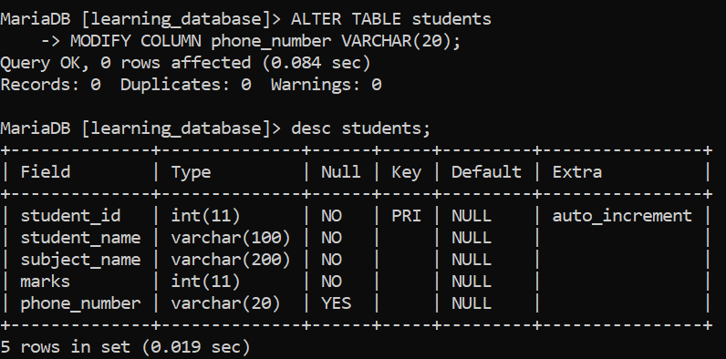
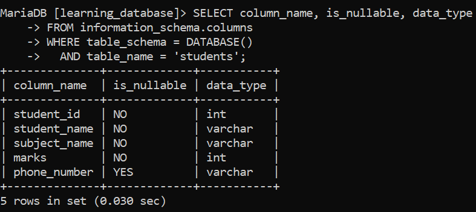

# SQL NOT NULL Constraint:

SQL data constraints are rules applied to table columns that limit the type and quality of data entered into a database. They enforce data integrity, accuracy, and reliability by rejecting any insert or update operation that violates the predefined rule.




---

## 1. SQL NOT NULL Constraint:

The `NOT NULL` constraint is used to prevent `NULL` values from being stored in a column. Once a column is declared `NOT NULL`, every `INSERT` or `UPDATE` that would leave that column empty is rejected by the database instead of silently storing a missing value.

**Creating Student Table:**

**Query:**

```sql
CREATE TABLE students (
    student_id    INT AUTO_INCREMENT NOT NULL,
    student_name  VARCHAR(100) NOT NULL,
    subject_name  VARCHAR(200) NOT NULL,
    marks         INT NOT NULL,
    phone_number  VARCHAR(20) NOT NULL,
    PRIMARY KEY (student_id)
);
```

**Output:**



- Every column except `student_id` (which is handled by `AUTO_INCREMENT`) must be given a value on every insert.

- `student_id` is also implicitly `NOT NULL` because it's the table's `PRIMARY KEY` — a primary key column can never contain `NULL`, with or without writing `NOT NULL` explicitly.

**Inserting Data into the student table:**

```sql
 insert into students(student_name, subject_name, marks, phone_number) values('Ali', 'Computer', 89, "03129823159");
```

**Output:**



- Every `NOT NULL` column (`student_name`, `subject_name`, `marks`, `phone_number`) is given an explicit value.

- `student_id` is left out of the column list entirely, since `AUTO_INCREMENT` generates it automatically.
- The row is inserted successfully because no `NOT NULL` column is left empty.

---

## 2. What Happens When You Try to Insert a NULL Value:

If an `INSERT` attempts to leave a `NOT NULL` column empty — either by passing `NULL` explicitly or by omitting a required column with no default — the database rejects the entire statement and no row is added.

**Query:**

```sql
INSERT INTO students (student_name, subject_name, marks, phone_number)
VALUES ('Diya Verma', 'Science', NULL, '9123456789');
```

**Output:**




- The `marks` column is declared `NOT NULL`, so passing `NULL` for it violates the constraint.

- MySQL and MariaDB both raise error `1048` and reject the entire row — nothing is written to the table.

- The exact wording of the error is the same on both engines, since MariaDB inherited this error message from MySQL.

> **Note on strict vs. non-strict SQL mode:** this error assumes the server is running in a strict SQL mode (the default in current MySQL and MariaDB versions). Under an older, non-strict mode, some servers would instead silently insert the column's implicit default (`0` for numbers, `''` for strings) and only issue a warning rather than an error. Always confirm `sql_mode` includes `STRICT_TRANS_TABLES` or `STRICT_ALL_TABLES` if you want `NOT NULL` violations to hard-fail rather than fall back to a default.

---

## 3. Adding NOT NULL to an Existing Column:

If a column was created without `NOT NULL` and you want to add the constraint later, use `ALTER TABLE ... MODIFY COLUMN`:

**Query:**

```sql
ALTER TABLE students
MODIFY COLUMN phone_number VARCHAR(20) NOT NULL;
```

- `MODIFY COLUMN` redefines the column with the same data type plus the new `NOT NULL` rule.

- The full column definition (type, size) must be restated, even if only the constraint is changing.

- This statement fails if the column currently contains any `NULL` values — those existing `NULL`s must be updated to a real value first, or the `ALTER TABLE` is rejected.

---

## 4. Removing a NOT NULL Constraint:

To allow `NULL` values again, use the same `MODIFY COLUMN` syntax without `NOT NULL`:

**Query:**

```sql
ALTER TABLE students
MODIFY COLUMN phone_number VARCHAR(20) NULL;

OR 

ALTER TABLE students
MODIFY COLUMN phone_number VARCHAR(20);
```






- This reverts the column back to allowing `NULL` values using `NULL` and by `default` approach.

- Existing non-null data in the column is left untouched only future inserts/updates are affected.

---

## 5. Checking Which Columns Are NOT NULL:

To inspect which columns currently enforce `NOT NULL`, query `INFORMATION_SCHEMA.COLUMNS`:

**Query:**

```sql
SELECT column_name, is_nullable, data_type
FROM information_schema.columns
WHERE table_schema = DATABASE()
  AND table_name = 'students';
```



- `is_nullable` returns `'NO'` for `NOT NULL` columns and `'YES'` for nullable ones.

- This view is available identically in both MySQL and MariaDB.

---

## Best Practices:

- Apply `NOT NULL` to any column that must always have a meaningful value names, foreign keys, quantities, timestamps of record creation, and similar required fields.

- Don't default to marking every column `NOT NULL` reflexively; some data is genuinely optional (a middle name, an optional discount code), and forcing a value there just pushes callers toward meaningless placeholder data instead of a real `NULL`.

- Combine `NOT NULL` with a sensible `DEFAULT` value where it makes sense, so inserts that omit the column still succeed with a reasonable default rather than failing outright.

- Remember that `PRIMARY KEY` columns are always `NOT NULL` implicitly you don't need to (and can't meaningfully) make a primary key nullable.

- Confirm your server's `sql_mode` includes strict mode, so `NOT NULL` violations are rejected outright rather than silently replaced with a default value and a warning.

---

## References:

- [GEEKS FOR GEEKS](https://www.geeksforgeeks.org/sql/sql-not-null-constraint)

- [MySQL CREATE TABLE and Column Definitions](https://dev.mysql.com/doc/refman/8.0/en/create-table.html)

- [MariaDB NOT NULL Constraint](https://mariadb.com/docs/server/reference/sql-statements/data-definition/constraint)

- [MySQL Server SQL Modes](https://dev.mysql.com/doc/refman/8.0/en/sql-mode.html)

---

[← Back to main README](./README.md) | [← Previous Day (Day 62)](../SQL-Functions/Day-62-Regular-Expressions-in-SQL.md) | [Next Day (Day 64) →](./Day-64-SQL-PRIMARY-KEY-Constraint.md)