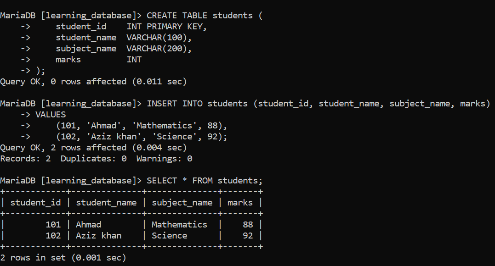
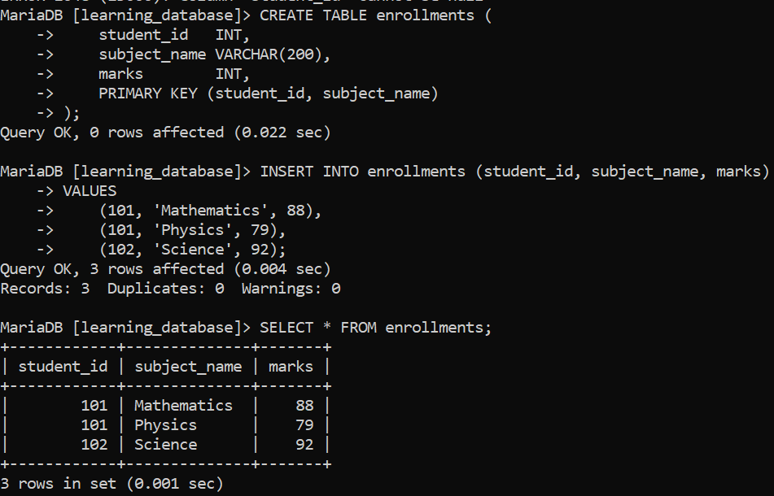
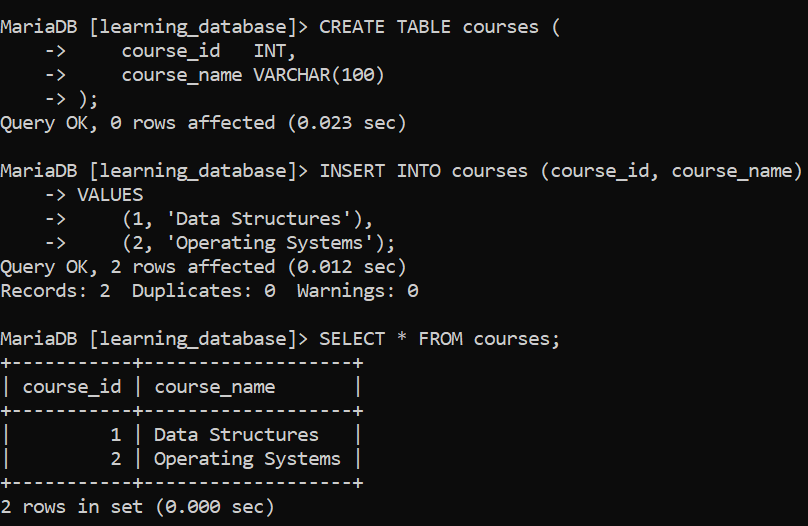

# SQL PRIMARY KEY Constraint:

The `PRIMARY KEY` constraint in SQL uniquely identifies each record in a table and ensures strong data integrity. It prevents duplicate and `NULL` values, making it essential for reliable relational database design.

- Ensures all values in the column (or columns) are unique.

- Does not allow `NULL` values.

- Only one primary key per table (it can be composite made up of more than one column).

- Automatically creates a unique index on the key column(s) for faster lookups.

---

## 1. Creating a PRIMARY KEY with CREATE TABLE:

**Query:**

```sql
CREATE TABLE students (
    student_id    INT PRIMARY KEY,
    student_name  VARCHAR(100),
    subject_name  VARCHAR(200),
    marks         INT
);

-- Insert data into the students table
INSERT INTO students (student_id, student_name, subject_name, marks)
VALUES
    (101, 'Ahmad', 'Mathematics', 88),
    (102, 'Aziz khan', 'Science', 92);

SELECT * FROM students;
```

**Output:**



- `student_id` is the primary key, so every value in it must be unique and cannot be `NULL`.

- If you try inserting a duplicate or `NULL` `student_id`, the database rejects the statement with an error.

**Query:**

```sql
-- Duplicate primary key value (student_id = 101 already exists)
INSERT INTO students (student_id, student_name, subject_name, marks)
VALUES (101, 'Ishaan Rao', 'History', 75);
```

**Output:**


**Query:**

```sql
-- NULL not allowed in a primary key column
INSERT INTO students (student_id, student_name, subject_name, marks)
VALUES (NULL, 'Meera Nair', 'English', 81);
```

**Output:**


- The first query fails because `student_id = 101` is already used, and primary key values must be unique.

- The second query fails because a primary key column cannot hold `NULL`.

- Both errors are raised identically on MySQL and MariaDB. (On some MySQL 8.x versions the duplicate-key message includes the table name, e.g. `key 'students.PRIMARY'` the wording varies slightly by version, but the rejection itself is the same.)

---

## Syntax:

**With `CREATE TABLE`:**

```sql
CREATE TABLE table_name (
    column1 data_type,
    column2 data_type,
    ...,
    PRIMARY KEY (column1, column2)
);
```

**With `ALTER TABLE`, on an existing table:**

```sql
ALTER TABLE table_name
ADD CONSTRAINT constraint_name
PRIMARY KEY (column1, column2, ...);
```

> **Note:** MySQL and MariaDB both accept a `constraint_name` in this syntax, but they silently ignore it a table's primary key is always stored and referenced internally under the fixed name `PRIMARY`, no matter what name you give it. `ADD CONSTRAINT PK_Students PRIMARY KEY (student_id)` and plain `ADD PRIMARY KEY (student_id)` end up identical; you cannot later refer to the constraint as `PK_Students`, only as `PRIMARY`.

---

## Types of PRIMARY KEYs:

There are two types of primary keys:

- **Simple Primary Key:** A primary key that consists of a single column, such as `student_id` above.

- **Composite Primary Key:** A primary key made up of multiple columns together useful when no single column is unique on its own, but a *combination* of columns is.

### Example: Composite Primary Key:

Suppose we track which students are enrolled in which subjects. No single column is unique by itself (a student can take several subjects, and a subject has many students), but the *pair* of `student_id` and `subject_name` together is:

**Query:**

```sql
CREATE TABLE enrollments (
    student_id   INT,
    subject_name VARCHAR(200),
    marks        INT,
    PRIMARY KEY (student_id, subject_name)
);

INSERT INTO enrollments (student_id, subject_name, marks)
VALUES
    (101, 'Mathematics', 88),
    (101, 'Physics', 79),
    (102, 'Science', 92);

SELECT * FROM enrollments;
```

**Output:**



- `(101, 'Mathematics')` and `(101, 'Physics')` are both valid rows, even though `student_id = 101` repeats the *combination* of `student_id` and `subject_name` is what must be unique.

- Trying to insert `(101, 'Mathematics', 95)` again would fail, since that exact combination already exists.

---

## Adding a PRIMARY KEY to an Existing Table:

If a table was created without a primary key, you can add one afterward with `ALTER TABLE`. Suppose the following table was created without one:

**Query:**

```sql
CREATE TABLE courses (
    course_id   INT,
    course_name VARCHAR(100)
);

INSERT INTO courses (course_id, course_name)
VALUES
    (1, 'Data Structures'),
    (2, 'Operating Systems');

SELECT * FROM courses;
```



> **Now add the primary key:**

**Query:**

```sql
ALTER TABLE courses
ADD CONSTRAINT PK_Courses PRIMARY KEY (course_id);
```


- Adds a primary key to the `courses` table, ensuring `course_id` is unique and cannot be `NULL` going forward.

- As noted above, the name `PK_Courses` is accepted but not actually stored the constraint is simply `PRIMARY`.

- This statement fails if `course_id` already contains duplicate values or `NULL`s at the time it runs; those must be cleaned up first.

**Query:**

```sql
INSERT INTO courses (course_id, course_name) VALUES (1, 'Computer Networks');
INSERT INTO courses (course_id, course_name) VALUES (NULL, 'Databases');
```

**Error:**


- The first insert fails because `course_id = 1` is already in the table, violating the uniqueness rule.

- The second insert fails because primary key columns cannot be `NULL`.

---

## Benefits of Using Primary Keys:

- Uniquely identifies each record in a table and helps maintain data integrity.

- Speeds up data retrieval, since a primary key automatically creates a unique index.

- Supports reliable relationships between tables through `FOREIGN KEY` references.

- Prevents duplicate or `NULL` values, keeping the data consistent and clean.

---

## References:

- [GEEKS FOR GEEKS](https://www.geeksforgeeks.org/sql/primary-key-constraint-in-sql)

- [MySQL PRIMARY KEY and UNIQUE Index Constraints](https://dev.mysql.com/doc/refman/8.0/en/constraint-primary-key.html)

- [MariaDB PRIMARY KEY](https://mariadb.com/docs/server/reference/sql-statements/data-definition/constraint)

---

[← Back to main README](./README.md) | [← Previous Day (Day 63)](./Day-63-SQL-NOT-NULL-Constraint.md) | [Next Day (Day 65) →](./Day-65-SQL-FOREIGN-KEY-Constraint.md)