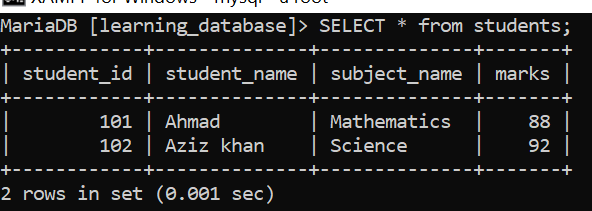
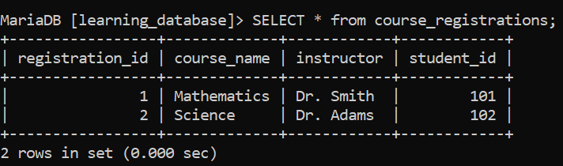
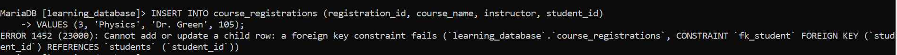

# SQL FOREIGN KEY Constraint:

A `FOREIGN KEY` constraint is a concept in SQL that enforces a valid relationship between two tables by ensuring that the values stored in the child table correspond to existing values in the parent table. This constraint protects the database from inconsistent or invalid relational data.

- Uses `CASCADE`, `RESTRICT`, `SET NULL`, or `NO ACTION` rules to control what happens to related child rows when a parent row is changed or deleted.

- Keeps table relationships consistent by enforcing referential integrity.

> **Engine requirement:** in both MySQL and MariaDB, foreign keys are only enforced by the **InnoDB** storage engine (the default engine in current versions of both). If a table uses `MyISAM` or another engine that doesn't support foreign keys, the `FOREIGN KEY` clause is silently accepted at parse time but never actually enforced no error, but no protection either. Always confirm both the parent and child table are `InnoDB` before relying on this constraint.

---

## Building on the Existing `students` Table:

We'll reuse the `students` table from earlier in this series (`student_id INT PRIMARY KEY, student_name, subject_name, marks`) as the **parent** table, and create a new **child** table, `course_registrations`, that references it.

 
 - Parent table (already exists from earlier in the series)

 

**Query:**

```sql
-- Child table with a FOREIGN KEY reference
CREATE TABLE course_registrations (
    registration_id INT PRIMARY KEY,
    course_name      VARCHAR(50),
    instructor       VARCHAR(50),
    student_id       INT,
    CONSTRAINT fk_student
        FOREIGN KEY (student_id) REFERENCES students(student_id)
);

INSERT INTO course_registrations (registration_id, course_name, instructor, student_id)
VALUES
    (1, 'Mathematics', 'Dr. Smith', 101),
    (2, 'Science', 'Dr. Adams', 102);


```

**Output:**






- `student_id` in `course_registrations` references `student_id` in `students`, creating a valid link between the two tables.

- The `FOREIGN KEY` ensures only `student_id` values that already exist in `students` can be used in `course_registrations`.

- This maintains referential integrity and prevents `course_registrations` from ever pointing at a student that doesn't exist.

---

## Syntax:

**With `CREATE TABLE`:**

```sql
CREATE TABLE table_name (
    column1 datatype,
    column2 datatype,
    ...,
    CONSTRAINT fk_constraint_name
        FOREIGN KEY (column1, column2, ...)
        REFERENCES parent_table (column1, column2, ...)
);
```

**With `ALTER TABLE`, on an existing table:**

```sql
ALTER TABLE table_name
ADD CONSTRAINT fk_constraint_name
    FOREIGN KEY (column1, column2, ...)
    REFERENCES parent_table (column1, column2, ...);
```

> Unlike a `PRIMARY KEY` constraint name (which MySQL/MariaDB silently discard), a foreign key's constraint name **is** stored and used it must be unique within the table (MariaDB additionally requires it to be unique within the whole database), and it's the name you'll see in error messages and use to drop the constraint later with `ALTER TABLE ... DROP FOREIGN KEY fk_constraint_name`.

Two extra requirements worth knowing before adding a foreign key:

- The referenced column(s) in the **parent** table must already have a `PRIMARY KEY` or `UNIQUE` index a foreign key cannot point at an unindexed column.

- The foreign key column and the referenced column must use **compatible data types** (e.g., both `INT`, or both `INT UNSIGNED`) a mismatch (such as `INT` referencing `INT UNSIGNED`) causes `ALTER TABLE`/`CREATE TABLE` to fail with an error.

---

## Foreign Key Constraint Examples:

In these examples, we use the `students` and `course_registrations` tables created earlier, where the foreign key relationship was set up.

### Example 1: Insert a Value That Has No Matching Parent Row:

If a corresponding value doesn't exist in the parent table, a record referencing it cannot be inserted into the child table.

**Query:**

```sql
INSERT INTO course_registrations (registration_id, course_name, instructor, student_id)
VALUES (3, 'Physics', 'Dr. Green', 105);
```

**Error:**



- `student_id = 105` doesn't exist in the `students` table.

- The insert fails because it violates the foreign key constraint.

### Example 2: Delete a Parent Row That Is Still Referenced:

When a row in the parent table is deleted while a matching row still exists in the child table, the delete is rejected by default this default behavior is equivalent to `ON DELETE RESTRICT` / `ON DELETE NO ACTION`.

**Query:**

```sql
DELETE FROM students
WHERE student_id = 101;
```

**Error:**


- `student_id = 101` is already referenced by a row in `course_registrations`.

- The delete fails because removing it would leave that row pointing at a student that no longer exists.

---

## Controlling What Happens with ON DELETE / ON UPDATE:

Instead of simply rejecting the change, you can tell the foreign key what to do to matching child rows when a parent row is deleted or its key is updated:

```sql
CREATE TABLE course_registrations (
    registration_id INT PRIMARY KEY,
    course_name      VARCHAR(50),
    instructor       VARCHAR(50),
    student_id       INT,
    CONSTRAINT fk_student
        FOREIGN KEY (student_id) REFERENCES students(student_id)
        ON DELETE CASCADE
        ON UPDATE CASCADE
);
```

| Action | Behavior |
|---|---|
| `CASCADE` | Deletes/updates the matching child rows along with the parent row |
| `SET NULL` | Sets the child's foreign key column to `NULL` (the column must allow `NULL` for this to work) |
| `RESTRICT` / `NO ACTION` | Rejects the change if any matching child row exists — this is the default if no action is specified |
| `SET DEFAULT` | Accepted by the SQL parser in MySQL, but not actually enforced by InnoDB (treated the same as `NO ACTION`); **not supported at all in MariaDB** |

---

## References

- [GEEKS FOR GEEKS](https://www.geeksforgeeks.org/sql/foreign-key-constraint-in-sql)

- [MySQL FOREIGN KEY Constraints](https://dev.mysql.com/doc/refman/8.0/en/create-table-foreign-keys.html)

- [MariaDB Foreign Keys](https://mariadb.com/docs/server/ha-and-performance/optimization-and-tuning/optimization-and-indexes/foreign-keys)

---

[← Back to main README](./README.md) | [← Previous Day (Day 64)](./Day-64-SQL-PRIMARY-KEY-Constraint.md) | [Next Day (Day 66) →](./Day-66-Composite-Key-in-SQL.md)