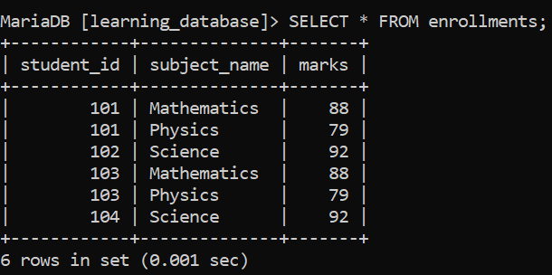
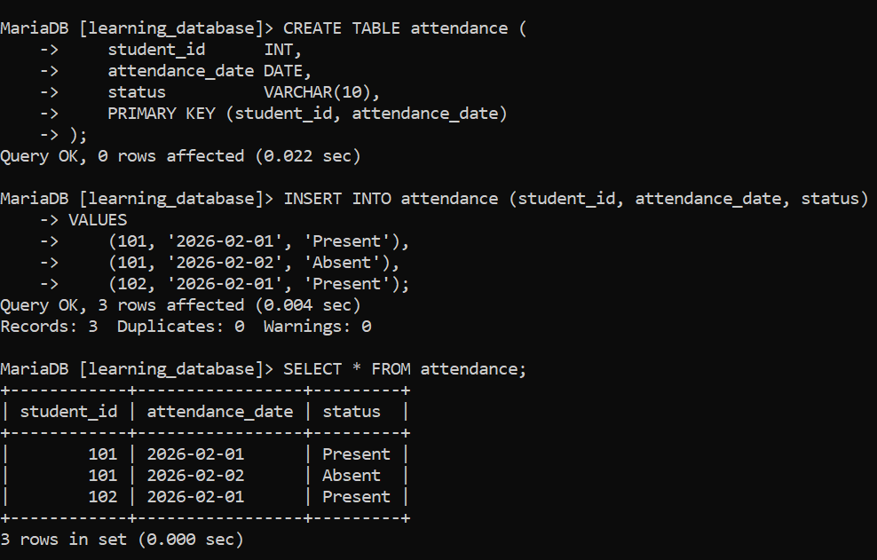

# Composite Key in SQL:

A composite key is a primary key made from two or more columns that together uniquely identify each record in a table. Individually, these columns may not be unique, but their combined values ensure uniqueness.

---

## Example: Composite Key in `learning_database`:

We'll reuse the `enrollments` table from earlier in `learning_database` — it tracks which student is taking which subject, and no single column is unique on its own:

**Query:**

```sql
CREATE TABLE enrollments (
    student_id   INT,
    subject_name VARCHAR(200),
    marks        INT,
    PRIMARY KEY (student_id, subject_name)
);

INSERT INTO enrollments (student_id, subject_name, marks)
VALUES
    (101, 'Mathematics', 88),
    (101, 'Physics', 79),
    (102, 'Science', 92);
```

**Output:**



- `student_id + subject_name` together form the composite key that uniquely identifies each row.

- `student_id = 101` repeats across two rows, and that's fine — it's the *combination* of `student_id` and `subject_name` that must be unique, not either column on its own.

- Inserting `(101, 'Mathematics', 95)` again would fail, since that exact pairing already exists in the table.

---

## Syntax:

```sql
CREATE TABLE table_name (
    column1 datatype,
    column2 datatype,
    column3 datatype,
    ...,
    PRIMARY KEY (column1, column2)
);
```

- Use `PRIMARY KEY (column1, column2)` to define a composite key spanning multiple columns.

- The listed columns together must form a unique combination for every row.

- Just like a single-column primary key, every column that's part of a composite key is implicitly `NOT NULL` none of them can hold `NULL`, with or without writing `NOT NULL` explicitly.

- MySQL and MariaDB automatically build a single composite index across all the listed columns (in the order given) to enforce this uniqueness not a separate index per column.

---

## Composite Key Example: Tracking Daily Attendance:

Here's a second, different use case within `learning_database`: recording one attendance entry per student per day. Neither `student_id` nor `attendance_date` is unique by itself (a student has many attendance records, and many students share the same date), but the *pair* is:

**Query:**

```sql
CREATE TABLE attendance (
    student_id      INT,
    attendance_date DATE,
    status          VARCHAR(10),
    PRIMARY KEY (student_id, attendance_date)
);

INSERT INTO attendance (student_id, attendance_date, status)
VALUES
    (101, '2026-02-01', 'Present'),
    (101, '2026-02-02', 'Absent'),
    (102, '2026-02-01', 'Present');
```

**Output:**



- `student_id + attendance_date` together act as the composite key, ensuring each student has at most one attendance record per day.

- Trying to insert `(101, '2026-02-01', 'Absent')` the same student on the same date again would fail, since that combination is already in the table.

- This is a common real-world pattern for composite keys: whenever "one row per (entity, time period)" is the rule you want enforced, a composite key on `(entity_id, date)` is usually the right tool.

---

## References:

- [GEEKS FOR GEEKS](https://www.geeksforgeeks.org/sql/composite-key-in-sql)

- [MySQL PRIMARY KEY and UNIQUE Index Constraints](https://dev.mysql.com/doc/refman/8.0/en/constraint-primary-key.html)

- [MariaDB PRIMARY KEY](https://mariadb.com/docs/server/reference/sql-statements/data-definition/constraint)

---

[← Back to main README](./README.md) | [← Previous Day (Day 65)](./Day-65-SQL-FOREIGN-KEY-Constraint.md) | [Next Day (Day 67) →](./Day-67-SQL-UNIQUE-Constraint.md)