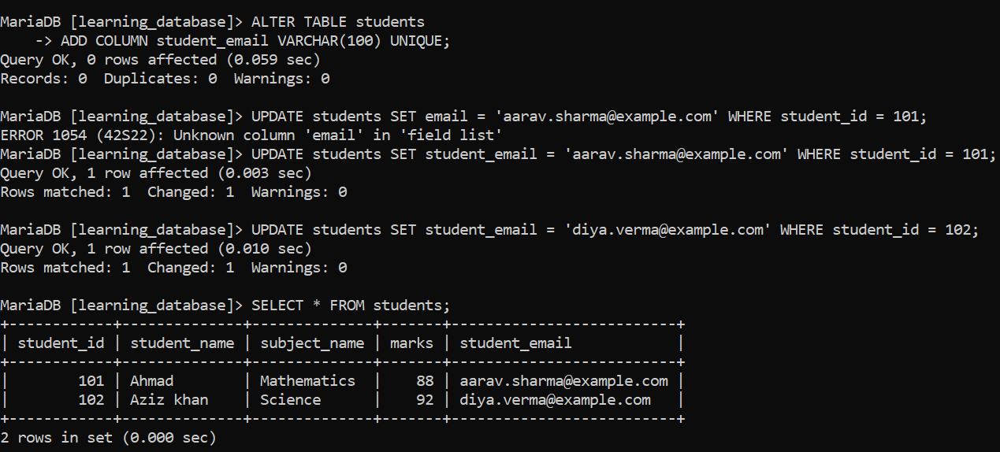
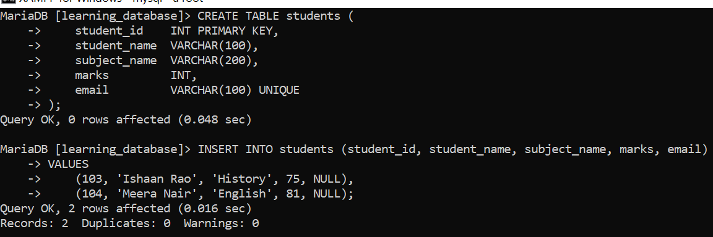

# SQL UNIQUE Constraint:

The `UNIQUE` constraint in SQL prevents duplicate entries in the specified column(s) while still allowing multiple `NULL` values. It helps maintain data accuracy without the strict non-`NULL` requirement of a `PRIMARY KEY`.

- Supports single-column or multi-column definitions.

- Can be added to a new table, or added/removed on an existing table with `ALTER TABLE`.

- In both MySQL and MariaDB, a `UNIQUE` constraint automatically creates a unique index behind the scenes to enforce it — this isn't optional or engine-dependent, it happens every time.

---

## Adding a UNIQUE Column to `students`:

Suppose we want to record each student's email address in `learning_database`, and make sure no two students can share the same one. We'll extend the existing `students` table with an `email` column:

**Query:**

```sql
ALTER TABLE students
ADD COLUMN student_email VARCHAR(100) UNIQUE;

-- Set an email for a couple of existing students
UPDATE students SET student_email = 'aarav.sharma@example.com' WHERE student_id = 101;
UPDATE students SET student_email = 'diya.verma@example.com' WHERE student_id = 102;

SELECT * FROM students;
```

**Output:**



- `UNIQUE` on `email` means no two rows can hold the same non-`NULL` email value.

- A brand-new table can define this the same way at creation time instead of via `ALTER TABLE`:

```sql
CREATE TABLE students (
    student_id    INT PRIMARY KEY,
    student_name  VARCHAR(100),
    subject_name  VARCHAR(200),
    marks         INT,
    email         VARCHAR(100) UNIQUE
);
```

### Multiple NULLs Are Allowed:

If a new student hasn't provided an email yet, that's fine a `UNIQUE` column allows more than one `NULL`, because MySQL and MariaDB never treat two `NULL`s as equal to each other, so they can't violate the uniqueness rule:

**Query:**

```sql
INSERT INTO students (student_id, student_name, subject_name, marks, email)
VALUES
    (103, 'Ishaan Rao', 'History', 75, NULL),
    (104, 'Meera Nair', 'English', 81, NULL);
```

**Output:**



- Both inserts succeed even though `email` is `NULL` in both rows.

- `UNIQUE` only enforces distinctness among the non-`NULL` values in the column — every `NULL` is treated as its own, unmatched case.

### Attempting to Insert a Duplicate Email:

**Query:**

```sql
INSERT INTO students (student_id, student_name, subject_name, marks, email)
VALUES (105, 'Kabir Singh', 'Physics', 70, 'aarav.sharma@example.com');
```

**Error:**

![Attempting to Insert a Duplicate Email]

- The value `'aarav.sharma@example.com'` already exists in the `email` column (belonging to student 101).
- The `UNIQUE` constraint blocks the insert, so the row is rejected.
- The key name in the error (`students.email` here, or just `email` on some MySQL/MariaDB versions) defaults to the column name unless the constraint is given an explicit name.

---

## Syntax:

**At table creation:**

```sql
CREATE TABLE table_name (
    column1 datatype UNIQUE,
    column2 datatype,
    ...
);
```

**On an existing table:**

```sql
ALTER TABLE table_name
ADD CONSTRAINT constraint_name UNIQUE (column1);
```

**Removing it later:**

```sql
ALTER TABLE table_name
DROP INDEX constraint_name;
```

> Unlike `PRIMARY KEY` (whose name MySQL/MariaDB silently discard), a named `UNIQUE` constraint's name **is** stored — it's implemented as a unique index under that name, and that's also the name you use to drop it with `DROP INDEX`, since MySQL/MariaDB don't have a distinct "drop unique constraint" statement separate from dropping its underlying index.

---

## Example: UNIQUE Across Multiple Columns:

`UNIQUE` can also apply to a combination of columns, so that column values may repeat individually, but a specific *pairing* of them can't repeat.

Reusing the `course_registrations` table from earlier in `learning_database` (`registration_id` as its own surrogate primary key, plus `course_name`, `instructor`, and `student_id`): we don't want the same student registering for the same course twice, even though each registration already gets its own unique `registration_id`.

**Query:**

```sql
ALTER TABLE course_registrations
ADD CONSTRAINT uq_student_course UNIQUE (student_id, course_name);
```

- This is exactly the situation `PRIMARY KEY` doesn't cover here: `registration_id` is already unique by itself (it's the primary key), so nothing stops the same `(student_id, course_name)` pair from being inserted twice under two different registration IDs unless a separate `UNIQUE` constraint is added for that pairing.

**Query:**

```sql
INSERT INTO course_registrations (registration_id, course_name, instructor, student_id)
VALUES (3, 'Mathematics', 'Dr. Smith', 103);
```

**Error:**


- Student `103` is already registered for `'Mathematics'` (registration `1`, from the earlier FOREIGN KEY example).

- The new insert has a different `registration_id` (`3`), but the same `(student_id, course_name)` pairing so it's still rejected.

- This is the same underlying idea as a composite primary key, but expressed as a *secondary* uniqueness rule alongside an existing, independent primary key.

---

## References:

- [GEEKS FOR GEEKS](https://www.geeksforgeeks.org/sql/sql-unique-constraint)

- [MySQL UNIQUE Constraint](https://dev.mysql.com/doc/refman/8.0/en/constraint-primary-key.html)

- [MariaDB UNIQUE Constraint](https://mariadb.com/docs/server/reference/sql-statements/data-definition/constraint)

---

[← Back to main README](./README.md) | [← Previous Day (Day 66)](./Day-66-Composite-Key-in-SQL.md) | [Next Day (Day 68) →](./Day-68-SQL-ALTERNATE-KEY.md)