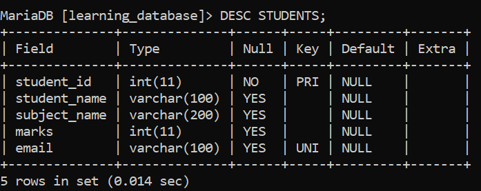
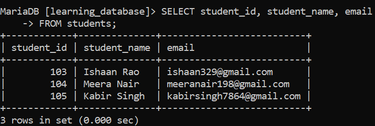
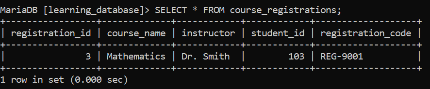

# SQL ALTERNATE KEY:

An **Alternate Key** is a candidate key that is not chosen as the Primary Key but can still uniquely identify a record in a table.

- When multiple columns (or combinations of columns) could each uniquely identify a row, every one of them is a *candidate key*.

- Only one candidate key is selected as the table's `PRIMARY KEY`.

- Every other candidate key that wasn't chosen becomes an **Alternate Key** it still guarantees uniqueness, just not as the table's main identifier.

---

## Example: The Alternate Key Already in `students`:

We don't need a new table to see this it's already sitting in the `students` table from earlier in `learning_database`:

**Student Table:**



- `student_id` and `email` were **both** candidate keys each one can, on its own, uniquely identify a student.

- `student_id` was chosen as the `PRIMARY KEY`.

- `email` was not chosen as the primary key, but it's still constrained to be unique which makes it an **Alternate Key**.

**Query:**

```sql
SELECT student_id, student_name, email
FROM students;
```

**Output:**



- `email` uniquely identifies a student just as well as `student_id` does you could look up either "student 103" or "the student with ishaan329n@example.com" and land on the same row.

- `student_id` is used everywhere as the main identifier (it's the primary key, and what other tables like `course_registrations` reference), while `email` sits alongside it as an alternate, secondary way to pin down the same row.

---

## Syntax:

Alternate Keys in SQL are defined using the `UNIQUE` constraint:

```sql
CREATE TABLE table_name (
    column_1 datatype PRIMARY KEY,   -- Primary Key
    column_2 datatype,
    column_3 datatype UNIQUE,        -- Alternate Key
    column_4 datatype UNIQUE         -- Alternate Key
);
```

> Note: there's no trailing comma after the last column definition (`column_4 datatype UNIQUE`) a comma after the final column is a syntax error in both MySQL and MariaDB.

> A candidate key is any column (or combination of columns) that could, on its own, uniquely identify every row in a table. Any candidate key is eligible to be chosen as the primary key; the ones not chosen become alternate keys.

---

## A Second Example: Alternate Key Alongside a Foreign Key:

Alternate keys aren't limited to standalone tables they work the same way in a table that also has a foreign key. We'll add a `registration_code` column to the `course_registrations` table from earlier in `learning_database`:

**Query:**

```sql
ALTER TABLE course_registrations
ADD COLUMN registration_code VARCHAR(30) UNIQUE;

UPDATE course_registrations SET registration_code = 'REG-9001' WHERE registration_id = 1;

SELECT * FROM course_registrations;
```

**Output:**



- `registration_id` is the `PRIMARY KEY` for `course_registrations`.

- `student_id` is a `FOREIGN KEY`, referencing `students(student_id)` it links this table to its parent, but it isn't unique here on its own (a student can register for more than one course).

- `registration_code` is unique on its own and not the primary key, so it's this table's **Alternate Key** a human-friendly code (like a receipt or ticket number) that identifies the same row `registration_id` does, just in a different form.

---

## Primary Key vs. Alternate Key:

| Primary Key | Alternate Key |
|---|---|
| Must be unique | Must be unique |
| Cannot contain `NULL` values | Can contain `NULL` values (multiple `NULL`s are allowed, since `UNIQUE` never treats two `NULL`s as equal to each other) |
| Used to identify each row uniquely, and referenced by foreign keys in other tables | An alternative, secondary way to identify a row |
| The candidate key that was selected | Any other candidate key that wasn't selected |
| Exactly one primary key per table | A table can have multiple alternate keys |

---

## References

- [GEEKS FOR GEEKS](https://www.geeksforgeeks.org/sql/sql-alternate-key)

- [MySQL UNIQUE Constraint](https://dev.mysql.com/doc/refman/8.0/en/constraint-primary-key.html)

- [MariaDB UNIQUE Constraint](https://mariadb.com/docs/server/reference/sql-statements/data-definition/constraint)

---

[← Back to main README](./README.md) | [← Previous Day (Day 67)](./Day-67-SQL-UNIQUE-Constraint.md) | [Next Day (Day 69) →](./Day-69-SQL-CHECK-Constraint.md)