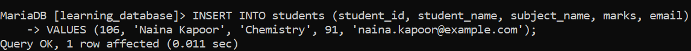
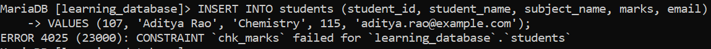
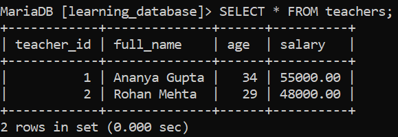
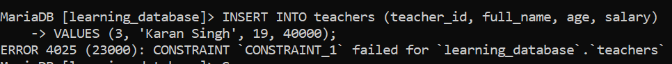

# SQL CHECK Constraint:

The `CHECK` constraint in SQL ensures that only valid data enters a column by enforcing a specific condition. If a value doesn't satisfy the defined rule, the insert or update operation is blocked.

- Can be defined while creating a table, or added later using `ALTER TABLE`.

- Works alongside other constraints like `PRIMARY KEY`, `FOREIGN KEY`, and `NOT NULL`.

- Can check multiple columns at once as a row-level condition, not just a single column.

> **Version requirement read this first:** `CHECK` constraints are only *enforced* starting from **MySQL 8.0.16** and **MariaDB 10.2.1**. On any earlier version of either engine, the `CHECK (...)` syntax is accepted without error, but the constraint is silently parsed and then **ignored** — invalid data goes in with no warning at all. If a `CHECK` constraint appears to "do nothing," the very first thing to verify is the server version.

---

## Adding a CHECK Constraint to `students`:

The `students` table from earlier in `learning_database` has a `marks` column that should logically stay within a sensible range. Let's enforce that with `CHECK`:

**Query:**

```sql
ALTER TABLE students
ADD CONSTRAINT chk_marks CHECK (marks >= 0 AND marks <= 100);
```

**Valid insert:**

```sql
INSERT INTO students (student_id, student_name, subject_name, marks, email)
VALUES (106, 'Naina Kapoor', 'Chemistry', 91, 'naina.kapoor@example.com');
```

**Output:**



**Invalid insert:**

```sql
INSERT INTO students (student_id, student_name, subject_name, marks, email)
VALUES (107, 'Aditya Rao', 'Chemistry', 115, 'aditya.rao@example.com');
```

**Error:**



- The `CHECK` constraint ensures `marks` stays between 0 and 100.

- `115` falls outside that range, so the insert is rejected the wording and error number differ between MySQL and MariaDB, but the effect (row rejected) is the same on both.

---

## Syntax:

**1. Using `CHECK` with `CREATE TABLE`:**

```sql
CREATE TABLE table_name (
    column1 datatype,
    column2 datatype CHECK (condition),
    ...
);
```

**2. Using `CHECK` with `ALTER TABLE`, on an existing table:**

```sql
ALTER TABLE table_name
ADD CONSTRAINT constraint_name CHECK (condition);
```

**Removing it later:**

```sql
ALTER TABLE table_name
DROP CONSTRAINT constraint_name;
```

---

## What CHECK Expressions Cannot Do:

Both engines place similar limits on what a `CHECK` expression is allowed to contain:

- **No `AUTO_INCREMENT` columns.** MySQL disallows referencing an `AUTO_INCREMENT` column in a `CHECK` expression entirely. MariaDB allowed it starting from 10.2.6, but earlier 10.2.x versions accepted the syntax without evaluating it correctly another version detail worth checking before relying on it.

- **No references to other tables.** A `CHECK` expression can only look at columns within the same row of the same table it cannot compare a value against a different table (that's what a `FOREIGN KEY` or a trigger is for).

- **No subqueries, and no non-deterministic functions.** Functions like `RAND()`, `NOW()`, `CURRENT_USER()`, or `LAST_INSERT_ID()` aren't permitted, since a constraint must evaluate the same way every time it's checked.

- **`NULL` passes the check.** If the expression evaluates to `NULL` (`UNKNOWN`) rather than `TRUE` or `FALSE` for example, `marks >= 0` when `marks` itself is `NULL`, the row is accepted, following standard SQL logic where only an explicit `FALSE` blocks the row. This applies on both engines, though a small number of older MariaDB 10.2.x point releases have had inconsistencies here if `NULL` handling in a `CHECK` matters for your schema, test it directly against your target version.

---

## Example: CHECK Constraint with Multiple Columns:

`CHECK` can validate more than one column at once, as a single row-level rule. Suppose we add a `teachers` table to `learning_database`, and want to guarantee every teacher is an adult with a positive salary:

**Query:**

```sql
CREATE TABLE teachers (
    teacher_id INT PRIMARY KEY,
    full_name  VARCHAR(50),
    age        INT,
    salary     DECIMAL(10, 2),
    CHECK (age >= 21 AND salary > 0)
);

-- Valid inserts
INSERT INTO teachers (teacher_id, full_name, age, salary) VALUES
    (1, 'Ananya Gupta', 34, 55000),
    (2, 'Rohan Mehta', 29, 48000);

SELECT * FROM teachers;

-- Invalid insert (age < 21)
INSERT INTO teachers (teacher_id, full_name, age, salary)
VALUES (3, 'Karan Singh', 19, 40000);
```

**Output (valid rows):**



**Error (invalid row):**



- The condition requires `age >= 21` **and** `salary > 0` to both be true for any row.

- `age = 19` breaks the first half of the condition, so the whole row is rejected even though `salary` on its own would have been fine.

- Since this `CHECK` wasn't given an explicit name, MySQL auto-generates one from the table name (`teachers_chk_1`); MariaDB auto-generates one from the column or a numbered `CONSTRAINT_n` label instead. Naming constraints explicitly with `CONSTRAINT chk_name CHECK (...)` avoids relying on either engine's auto-naming scheme.

---

## Example: Adding a CHECK Constraint to an Existing Table:

We can add a `CHECK` constraint to `teachers` after the fact, the same way we did for `students.marks` earlier:

**Query:**

```sql
ALTER TABLE teachers
ADD CONSTRAINT chk_teacher_salary CHECK (salary >= 30000);
```

- `chk_teacher_salary` ensures every teacher's salary is at least 30,000.

- Any insert or update with a salary below that value is rejected from this point forward.

- If `teachers` already contained a row with a salary below 30,000 at the moment this statement runs, the `ALTER TABLE` itself fails existing violating data has to be corrected first, since adding the constraint doesn't retroactively fix rows that already break it.

---

## References:

- [Geeks for Geeks](https://www.geeksforgeeks.org/sql/sql-check-constraint)

- [MySQL CHECK Constraints](https://dev.mysql.com/doc/refman/8.0/en/create-table-check-constraints.html)

- [MariaDB CONSTRAINT (CHECK)](https://mariadb.com/docs/server/reference/sql-statements/data-definition/constraint)


---

[← Back to main README](./README.md) | [← Previous Day (Day 68)](./Day-68-SQL-ALTERNATE-KEY.md) | [Next Day (Day 70) →](./Day-70-SQL-DEFAULT-Constraint.md)