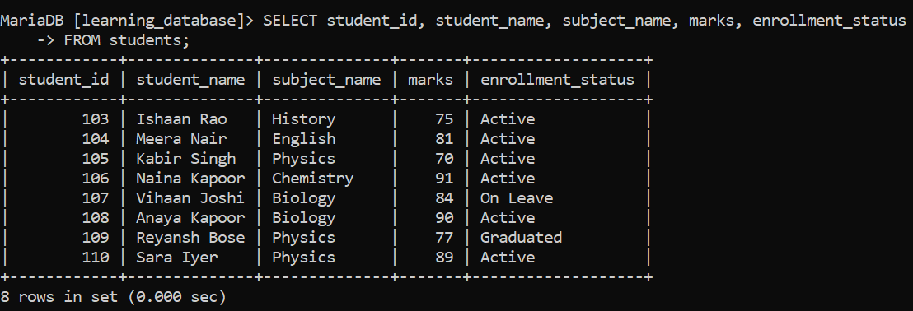
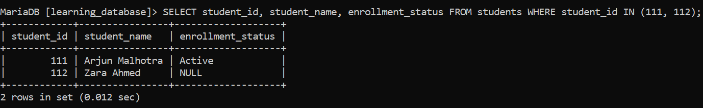

# SQL DEFAULT Constraint

The `DEFAULT` constraint in SQL automatically assigns a predefined value to a column when no value is provided during insertion. It helps maintain consistency and reduces the need to specify a value for every column in an `INSERT` statement.

- Fills the column with a preset value whenever that column is omitted (or explicitly set to `DEFAULT`).

- Ensures consistent data without requiring manual input on every insert.

---

## Adding a DEFAULT to `students`:

Suppose we track each student's enrollment status in `learning_database`, and most new students start out `'Active'`. We can make that the column's default:

**Query:**

```sql
ALTER TABLE students
ADD COLUMN enrollment_status VARCHAR(20) DEFAULT 'Active';

INSERT INTO students (student_id, student_name, subject_name, marks, enrollment_status)
VALUES
    (107, 'Vihaan Joshi', 'Biology', 84, 'On Leave'),
    (108, 'Anaya Kapoor', 'Biology', 90, DEFAULT),
    (109, 'Reyansh Bose', 'Physics', 77, 'Graduated'),
    (110, 'Sara Iyer', 'Physics', 89, DEFAULT);

SELECT student_id, student_name, subject_name, marks, enrollment_status
FROM students;
```

**Output:**



- The keyword `DEFAULT` inserts `'Active'` wherever it's used in the `VALUES` list.

- Explicit values (`'On Leave'`, `'Graduated'`) override the default, as usual.

- A column omitted from the `INSERT` column list entirely behaves the same way as writing `DEFAULT` for it.

---

## Syntax:

```sql
CREATE TABLE table_name (
    column1 datatype DEFAULT default_value,
    column2 datatype DEFAULT default_value
);
```

> **What `default_value` can be:** historically, both MySQL and MariaDB required this to be a plain literal (a fixed number or string) with one long-standing exception, `CURRENT_TIMESTAMP`, which was always allowed as a default for `TIMESTAMP`/`DATETIME` columns. That restriction has since been lifted on both engines, so a parenthesized expression can now also be used as a default: **MySQL from 8.0.13+**, and **MariaDB from 10.2.1+**. On older versions of either engine, only a literal constant (or `CURRENT_TIMESTAMP` for temporal columns) is accepted anything else raises `Invalid default value` at table-creation time.

**Note:** I use the terms **MySQL** and **MariaDB** in this course, which is why I explain them both.
---

## Setting or Changing a DEFAULT on an Existing Column:

To add or update a `DEFAULT` on a column that already exists, without touching its other properties, use `ALTER TABLE ... ALTER COLUMN ... SET DEFAULT`:

**Query:**

```sql
ALTER TABLE students
ALTER COLUMN enrollment_status SET DEFAULT 'Pending Review';
```

- This changes only the default value itself, the column's data type, nullability, and any other attributes stay exactly as they were.

- Existing rows are untouched; the new default only applies to future inserts that omit the column.

---

## Dropping the DEFAULT Constraint:

If you no longer want a column to fall back to a default value, you can drop it with `ALTER TABLE ... ALTER COLUMN ... DROP DEFAULT`. This only affects new rows going forward and does not change any existing data in the table.

**Syntax:**

```sql
ALTER TABLE table_name
ALTER COLUMN column_name DROP DEFAULT;
```

**Query:**

```sql
ALTER TABLE students
ALTER COLUMN enrollment_status DROP DEFAULT;

-- Add two new rows
INSERT INTO students (student_id, student_name, subject_name, marks, enrollment_status)
VALUES (111, 'Arjun Malhotra', 'Chemistry', 85, 'Active');

INSERT INTO students (student_id, student_name, subject_name, marks, enrollment_status)
VALUES (112, 'Zara Ahmed', 'Chemistry', 88, NULL);

SELECT student_id, student_name, enrollment_status FROM students WHERE student_id IN (111, 112);
```

**Output:**



- `DROP DEFAULT` removes the default value from `enrollment_status`, so the column no longer auto-fills anything.

- The first insert supplies a normal value.

- The second insert stores `NULL` explicitly, since no default exists anymore to fall back on this only works because `enrollment_status` allows `NULL`. If the column were also `NOT NULL`, omitting it (or passing `NULL`) after dropping the default would instead raise an error, since there'd be nothing left for the database to fill it with.

> **Note:** dropping the `DEFAULT` constraint does not affect existing data already in the table it only changes what happens on *future* inserts that omit the column.

---

## References:

- [Geeks for Geeks](https://www.geeksforgeeks.org/sql/sql-default-constraint)

- [MySQL Data Type Default Values](https://dev.mysql.com/doc/refman/8.0/en/data-type-defaults.html)

- [MariaDB DEFAULT Clause](https://mariadb.com/docs/server/reference/sql-statements/data-definition/create/create-table)

--- 

[← Back to main README](./README.md) | [← Previous Day (Day 69)](./Day-69-SQL-CHECK-Constraint.md) | [Next Day (Day 71) →](../SQL-Joins/Day-71-SQL-Joins-Introduction.md)