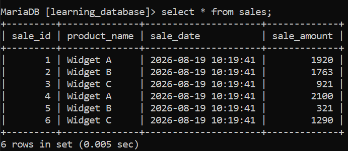

# Date Functions

SQL Date Functions are built-in tools used to handle, modify and analyze date/time values in a database. They help perform tasks like retrieving current dates, calculating differences and formatting results effectively.

 - Extract specific parts of a date (year, month, day).
 - Format dates for user-friendly display.
 - Track trends, deadlines or schedules in business processes.

 > For this lesson we will use the sales table so, we can practice the date functions.

 **Sales Table:**

 

The following are some commonly used SQL Date Functions:

---

# 1. NOW():

 The NOW() function retrieves the server’s current date and time, making it useful for capturing exact event moments such as transaction timestamps, as well as for logging and comparing time-based records.

**Query:**

```sql
SELECT NOW() AS CurrentDateTime;
```

**Output:*

-output.png)

  - Returns the current system date and time.
  - Shows both date and time in one value.

---

# 2. CURDATE():

 The CURDATE() function returns today’s date in YYYY-MM-DD format and is useful when only the current date is needed, especially for reporting or filtering records by date.

**Query:**

```sql
SELECT CURDATE() AS CurrentDate;
```

**Output:*

-output.png)

  - Returns the current date without time.
  - Useful for date comparisons and filtering.

---

# 3. CURTIME():

 The CURTIME() function returns the current time in HH:MM:SS format and is useful for time-based operations, such as scheduling or performing precise time comparisons.

**Query:**

```sql
SELECT CURTIME() AS CurrentTime;
```

**Output:**
-output.png)

  - Returns the current time without date.
  - Useful for time comparisons and scheduling.

---

# 4. DATE():

 The DATE() function extracts only the date from a date or datetime value, making it useful for situations where the time component should be ignored, such as date-only comparisons or aggregations.

**Query:**

```sql
SELECT DATE(NOW()) AS CurrentDateOnly;
```

**Output:**

-output.png)

  - Returns only the date part of a datetime value.
  - Useful for date-only comparisons and reporting.

---

# 5. EXTRACT():

The EXTRACT() function retrieves a specific part of a date such as the year, month or day, making it useful for grouping, filtering or performing time-based analysis including year-over-year reports.

**Query:**

```sql
SELECT EXTRACT(YEAR FROM sale_date) AS CurrentYear,
       EXTRACT(MONTH FROM sale_date) AS CurrentMonth,
       EXTRACT(DAY FROM sale_date) AS CurrentDay
       from sales;
```

**Output:**

-output.png)

  - Returns the year, month and day from the sale_date column.
  - Useful for grouping and filtering by specific date parts.

---

# 6. DATE_ADD():

The DATE_ADD() function adds a chosen time interval such as days, months or years to a date, making it useful for calculating future dates and simplifying planning or scheduling tasks.

**Query:**

```sql
SELECT sale_id, product_name,
DATE_ADD(sale_date, INTERVAL 7 DAY) AS Sale_Date_Plus_7_Days
FROM sales;
```

**Output:**

-output.png)

  - Returns the sale_date plus 7 days.
  - Useful for calculating future dates and scheduling.

---

# 7.  DATE_SUB():

The DATE_SUB() function subtracts a chosen time interval from a date, making it useful for determining past dates and performing retrospective data analysis.

**Query:**

```sql
SELECT sale_id, product_name,
DATE_SUB(sale_date, INTERVAL 7 DAY) AS Sale_Date_Minus_7_Days
FROM sales;
```

**Output:**

-output.png)

  - Returns the sale_date minus 7 days.
  - Useful for calculating past dates and retrospective analysis.

---

# 8. DATEDIFF():

The DATEDIFF() function returns the number of days between two dates, making it useful for calculating durations such as deadlines or overdue periods.

**Query:**

```sql
SELECT sale_id, product_name,
DATEDIFF(CURDATE(), sale_date) AS Days_Since_Sale
FROM sales;
```

**Output:**

-output.png)

  - Returns the number of days between the current date and sale_date.
  - Useful for calculating durations and overdue periods.

---

# 9. DATE_FORMAT():

The DATE_FORMAT() function formats a date using a specified pattern, allowing customized output such as full day or month names and is useful for making reports clearer and more readable.

**Query:**

```sql
SELECT sale_id, product_name,
DATE_FORMAT(sale_date, '%W, %M %d, %Y') AS Formatted_Sale_Date
FROM sales;
```

**Output:**

-output.png)

  - Returns the sale_date formatted as 'Day, Month DD, YYYY'.
  - Useful for creating user-friendly date displays in reports.

---

# 10. TIMESTAMPDIFF():
The TIMESTAMPDIFF() function calculates the difference between two date or datetime values in a specified unit (e.g., days, months, years), making it useful for measuring time intervals and durations.

**Query:**

```sql
SELECT sale_id, product_name,
TIMESTAMPDIFF(DAY, sale_date, CURDATE()) AS Days_Since_Sale
FROM sales;
```

**Output:**

-output.png)

  - Returns the number of days between sale_date and the current date.
  - Useful for calculating time intervals and durations.

---

# 11. LAST_DAY():
The LAST_DAY() function returns the last day of the month for a given date, making it useful for month-end reporting, financial calculations, and scheduling tasks that depend on the end of a month.

**Query:**

```sql
SELECT sale_id, product_name,
LAST_DAY(sale_date) AS Last_Day_Of_Month
FROM sales;
```
**Output:**
-output.png)

  - Returns the last day of the month for sale_date.
  - Useful for month-end reporting and financial calculations.

---

# 12. DAYNAME():
The DAYNAME() function returns the name of the day of the week for a given date, making it useful for scheduling, reporting, and understanding patterns based on days of the week.

**Query:**

```sql
SELECT sale_id, product_name,
DAYNAME(sale_date) AS Day_Of_Week
FROM sales;
```
**Output:**
-output.png)

  - Returns the name of the day of the week for sale_date.
  - Useful for scheduling and understanding patterns based on days of the week.

---

# 13. ADDDATE():

The ADDDATE() function adds a specified time interval to a date. It is useful for calculating future or past dates based on a given date.

**Query:**

```sql
SELECT sale_id, product_name,
ADDDATE(sale_date, INTERVAL 10 DAY) AS Sale_Date_Plus_10_Days
FROM sales;
```

**Output:**

-output.png)

  - Returns the sale_date plus 10 days.
  - Useful for calculating future dates based on a given date.

---

# 14. ADDTIME():

The ADDTIME() function adds a specified time interval to a time or datetime value. It is useful for adjusting times by adding hours, minutes or seconds.

**Query:**

```sql
SELECT sale_id, product_name,
ADDTIME(sale_date, '02:30:00') AS Sale_Date_Plus_2_Hours_30_Minutes
FROM sales;
```

**Output:**

-output.png)

  - Returns the sale_date plus 2 hours and 30 minutes.
  - Useful for adjusting times by adding specific time intervals.

> NOTE: the above functions are based on MySQL syntax. Other SQL databases may have different implementations or function names for date operations. Always refer to the specific database documentation for accurate usage. and there is also many more date functions available in SQL, but these are the most commonly used ones for basic date manipulation and analysis.

---

[← Back to main README](./README.md) | [← Previous Day (Day 52)](../Day-52-CASE_Statement.md) | [Next Day (Day 54) →](./SQL-Functions/Day-53-Date-Functions.md)