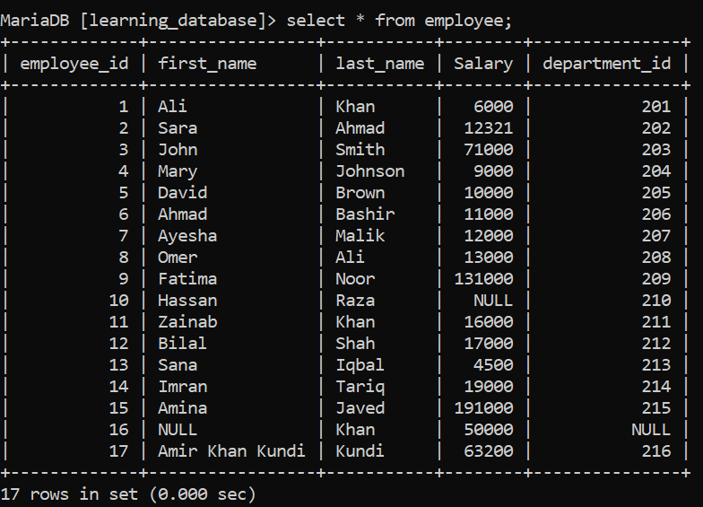
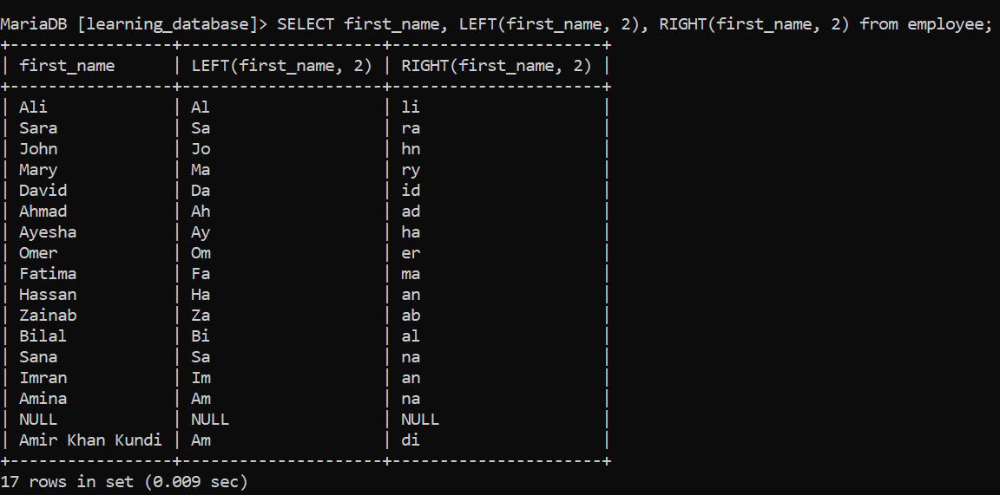

# String Functions in SQL:

SQL string functions help manipulate and format text data efficiently. They are widely used for cleaning, comparing and extracting meaningful information from textual fields.

  - Improve query flexibility when working with textual data.
  - Help prepare data for analysis and presentation.

> For this lesson we will use the employees table so, we can practice the string functions.



> The following are commonly used SQL String Functions:

---

# 1. CONCAT():

 The CONCAT() function combines two or more strings into a single string, making it useful for creating full names, addresses, or any other concatenated text.

 ***Query:**
```sql
SELECT CONCAT(first_name, ' ', last_name) AS FullName FROM employee;
```

***Output:**

-output.png)

  - Combines multiple strings into one.
  - Useful for creating full names or addresses.

---

# 2. CHAR_LENGTH() / CHARACTER_LENGTH():

The CHAR_LENGTH() or LENGTH() function returns the length of a string in characters. It’s essential for validating or manipulating text data, especially when you need to know how many characters a string contains.

**Query:**
```sql
SELECT first_name, CHAR_LENGTH(first_name) AS NameLength FROM employee;
```

**Output:**

-output.png)

  - Returns the number of characters in a string.
  - Useful for validating or manipulating text data.

> **NOTE:** CHAR_LENGTH() and CHARACTER_LENGTH() are synonyms and can be used interchangeably.
> And when this encounter NULL values, it returns NULL.

---

# 3. UPPER() and LOWER():

These UPPER() and LOWER() functions convert the text to uppercase or lowercase, respectively. They are useful for normalizing the case of text in a database.

**Query:**
```sql
SELECT first_name, UPPER(first_name) AS UpperCaseName, LOWER(first_name) AS LowerCaseName FROM employee;
```

**Output:**

-and-LOWER()-output.png)

  - UPPER() converts text to uppercase.
  - LOWER() converts text to lowercase.
  - Useful for case-insensitive comparisons or formatting.

> **NOTE:** When these functions encounter NULL values, they return NULL.

---

# 4. REPLACE():

The REPLACE() function replaces occurrences of a substring within a string with another substring. This is useful for cleaning up data, such as replacing invalid characters or formatting errors.

**Query:**
```sql
SELECT first_name, REPLACE(first_name, 'a', '@') AS ReplacedName FROM employee;
```

**Output:**

-output.png)

  - Replaces occurrences of a substring with another substring.
  - Useful for cleaning or formatting text data.

> **NOTE:** When this function encounters NULL values, it returns NULL.

---

# 5. SUBSTRING() / SUBSTR():

The SUBSTRING() or SUBSTR() function extracts a portion of a string based on specified starting position and length. This is useful for retrieving specific parts of text data, such as area codes, prefixes, or any substring.

**Query:**
```sql
SELECT first_name, SUBSTRING(first_name, 1, 3) AS SubstringName FROM employee;
```

**Output:**

-output.png)

  - Extracts a portion of a string based on starting position and length.
  - Useful for retrieving specific parts of text data.

> **NOTE:** SUBSTRING() and SUBSTR() are synonyms and can be used interchangeably. When either function encounters a NULL value, it will return NULL.

---

# 6. LEFT() and RIGHT():

The LEFT() and RIGHT() functions allow you to extract a specified number of characters from the left or right side of a string, respectively. It is used for truncating strings for display.

**Query:**

```sql
SELECT first_name, LEFT(first_name, 2), RIGHT(first_name, 2) from employee;
```

**Output:**



  - LEFT extract from left side of the string whatever charaters we want.
  - Right extract from Right side of the string whatever charaters we want.

> **NOTE:** When both encounter NULL then return as it is.

---

# 7. INSTR():

The INSTR() function is used to find the position of the first occurrence of a substring within a string. It returns the position (1-based index) of the substring. If the substring is not found, it returns 0.

**Query:**

```sql
SELECT first_name, instr(first_name, "A") as full_name from employee;
```

**Output:**

-Output.png)

  - This give us the first occurance of letter A in the first_name.

> **NOTE:** When encounter NULL then this as it is.

---

# 8. ASCII():

The ASCII() function returns the ASCII value of a single character. This is helpful when we need to find the numeric code corresponding to a character, often used in encoding and decoding text.

**Query:**

```sql
SELECT first_name, ASCII(first_name) as ASCII_OF_First_letter from employee;
```

**Output:**

-Output.png)

  - This give us the first letter ASCII Code in the first_name.

> **NOTE:** When encounter the NULL then this ASCII will return this as it is.

---

**NOTE:** This guide covers only selected string functions. Additional SQL string functions include CONCAT_WS(), SPACE(), REVERSE(), and more.

> If you want to explore more string functions, you can visit the GeeksforGeeks website using the link below, or use any resource of your choice to learn the specific functions you need: 


---

[← Back to main README](./README.md) | [← Previous Day (Day 53)](./Day-53-Date-Functions.md) | [Next Day (Day 55) →](./Day-55-Numeric_Functions.md)