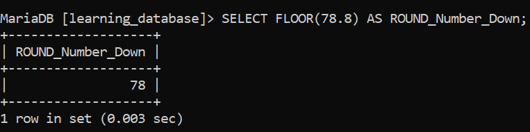

# Numeric Functions in SQL:

SQL Numeric Functions are built-in operations used to perform mathematical calculations on numeric data. They simplify tasks in reporting, finance and data analysis by handling numbers efficiently.


---

# 1. ABS() – Absolute Value:

The ABS() function returns the absolute value of a number, which is the number without its sign (i.e., it converts negative numbers to positive).

**Syntax:**

```sql
SELECT ABS(number);
```

**Query:**

```sql
SELECT ABS(-231) as Positive_Number;
``` 

**Output:**

-Output.png)

  - This convert the Negative number to Positive number.

--- 

# 2. CEIL() or CEILING() – Round Number Up:

The CEIL() (or CEILING()) function rounds a number up to the nearest integer, regardless of whether the decimal part is greater than or less than 0.5.

**Syntax:**

```sql
SELECT CEIL(number);
```

**Query:**

```sql
SELECT CEIL(43.2) AS ROUND_UP;
```

**Output:**

-Output.png)

  - This Round Up the value in the case the value become 44.

---

# 3. FLOOR() – Round Number Down:

The FLOOR() function rounds a number down to the nearest integer, ignoring the decimal part.

**Syntax:**

```sql
SELECT FLOOR(number);
```

**Query:**

```sql
SELECT FLOOR(78.8) AS ROUND_Number_Down;
```

**Output:**



  - The FLOOR will Round Number Down in this case the number become 78.

---

# 4. ROUND() – Round a Number to a Specified Decimal Place:

The ROUND() function rounds a number to a specified number of decimal places. It is very useful for financial calculations or whenever precise rounding is necessary.

**Syntax:**

```sql
SELECT ROUND(number, decimal_place) AS Round;
```

**Output:**

-Output.png)

---

# 5. MOD() – Modulo or Remainder:

The MOD() function returns the remainder of a division operation (i.e., it computes the modulus). This function is useful for tasks like determining even/odd numbers or finding remainders in mathematical operations.

**Syntax:**

```sql
SELECT MOD(dividend, divisor);
```

**Query:**

```sql
SELECT MOD(1234, 3) AS Remainder;
```

**Output:**

-Output.png)

---

# 6. POWER() – Raise a Number to the Power of Another:

The POWER() function is used to raise a number to the power of another number. It is often used in mathematical calculations like compound interest or growth rate.

**Syntax:**
```sql
SELECT POWER(base, exponent);
```

**Query:**

```sql
SELECT POWER(3, 3) AS Power;
```

**Output:**


-Output.png)

---

# 7. LOG() – Logarithm:

The LOG() function returns the natural logarithm (base e) of a number. You can also use LOG(base, number) to calculate the logarithm of a number with a custom base.

**Syntax:**

```sql
SELECT LOG(number);
SELECT LOG(base, number);
```

**Query:**

```sql
SELECT LOG(200) AS Logarithm;
```

**Output:**

-Output.png)

---

> If you want to explore more numeric functions, you can visit the GeeksforGeeks website using the link below, or use any resource of your choice to learn the specific functions you need: 


---

[← Back to main README](./README.md) | [← Previous Day (Day 54)](./Day-54-String-Functions.md) | [Next Day (Day 56) →](./Day-56-Statistical_Functions.md)