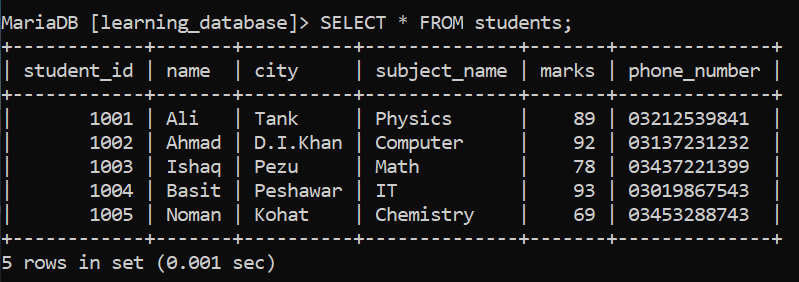
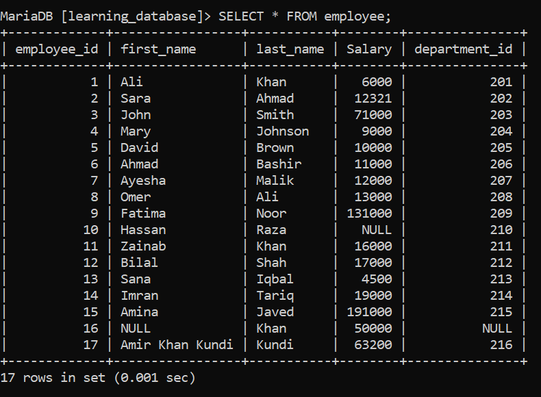
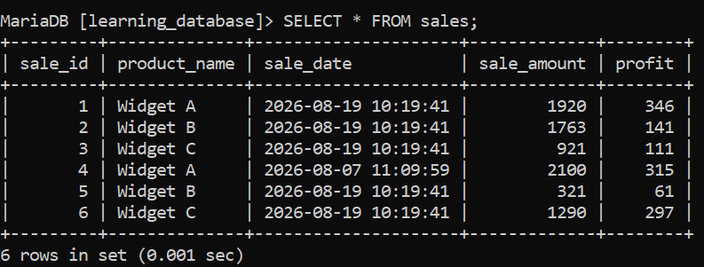
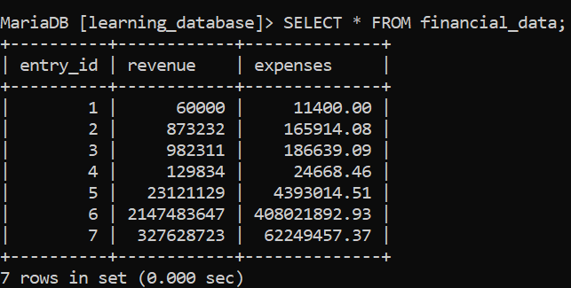

# Statistical Functions in SQL

SQL statistical functions are built-in functions that help analyze numeric data by performing calculations such as averages, totals, and variations. They are widely used to extract meaningful insights from database records.

- Perform calculations like AVG, SUM, COUNT, MIN, and MAX
- Help measure data spread using STDDEV and VAR
- Used for quick data analysis and reporting

---

> We use the following tables for the statistical practice examples below:

## Student Table



## Employee Table



## Sales Table



## Financial Data Table



---

> Here are some common statistical functions in SQL:

| Function                 | Output                                                                 |
|--------------------------|-------------------------------------------------------------------------|
| AVG()                    | Calculates the average value of a numeric column.                       |
| SUM()                    | Calculates the sum of values in a numeric column.                       |
| COUNT()                  | Counts the number of rows in a result set or the number of non-null values in a column. |
| STDDEV() / STDDEV_POP()  | Calculates the population standard deviation of a numeric column.       |
| MAX()                    | Returns the maximum value in a column.                                   |

---

# 1. AVG() Function

`AVG()` calculates the average, or arithmetic mean, of a group of numbers in a numeric column.

**Syntax:**

```sql
SELECT AVG(column_name) FROM table_name;
```

**Query:**

```sql
SELECT AVG(marks) AS AVERAGE FROM students;
```

**Output:**

-Output.png)

---

# 2. SUM() Function

The `SUM()` function returns the total of all numeric values in a column.

**Syntax:**

```sql
SELECT SUM(column_name) FROM table_name;
```

**Query:**

```sql
SELECT SUM(Salary) AS Sum_Of_All_Employees_Salary FROM employee;
```

**Output:**

-Output.png)

---

# 3. COUNT() Function

The `COUNT()` function counts the number of rows in a result set, or the number of non-NULL values in a column.

**Syntax:**

```sql
SELECT COUNT(*) FROM table_name;
SELECT COUNT(column_name) FROM table_name;
```

**Query:**

```sql
SELECT COUNT(*) AS Total_Sale FROM sales;
```

**Output:**

-Output-1.png)

```sql
SELECT COUNT(sale_amount) AS Total_Sale_Amount FROM sales;
```

**Output:**

-Output-2.png)

---

# 4. STDDEV() / STDDEV_POP() Function

The `STDDEV()` / `STDDEV_POP()` functions calculate the standard deviation of numeric data, measuring how much the values deviate from the average.

**Syntax:**

```sql
SELECT STDDEV(column_name) FROM table_name;
```

**Query:**

```sql
SELECT STDDEV(marks) AS STDDEV_Marks FROM students;
```

**Output:**

-Output.png)

---

# 5. MAX() Function

The `MAX()` function returns the largest value from a numeric or date column.

**Syntax:**

```sql
SELECT MAX(column_name) FROM table_name;
```

**Query:**

```sql
SELECT MAX(expenses) AS Highest_Expense FROM financial_data;
```

**Output:**

-Output.png)

---

> If you want to explore more statistical functions, you can visit [GeeksforGeeks](https://www.geeksforgeeks.org/sql/statistical-functions-in-sql), or use any resource of your choice to learn the specific functions you need.

---

[← Back to main README](./README.md) | [← Previous Day (Day 55)](./Day-55-Numeric_Functions.md) | [Next Day (Day 57) →](./Day-57-Working_With_JSON_In_SQL.md)