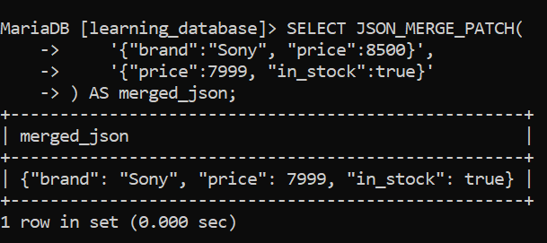
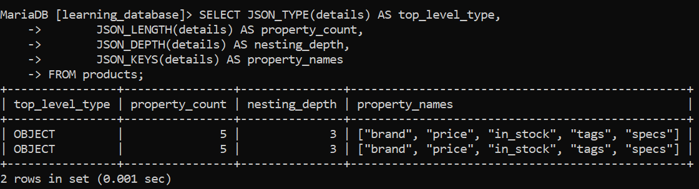
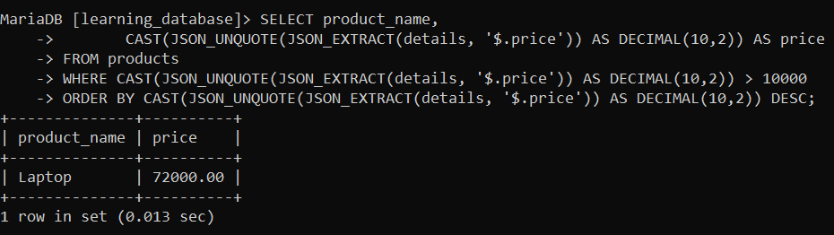

# JSON in SQL:

JSON (JavaScript Object Notation) is a text format for structured data made of objects and arrays. MySQL and MariaDB both ship JSON functions to store, validate, search, update, and reshape JSON — without moving that work into application code. This guide covers the full topic: the data type, paths, every major function category, indexing, and exactly which engine/version supports what.

---

## 1. What JSON Looks Like:

An **object** holds key-value pairs; an **array** holds an ordered list of values.

```json
{
  "name": "Asha",
  "active": true,
  "skills": ["SQL", "Python"],
  "address": { "city": "Delhi", "postal_code": 110001 }
}
```

JSON supports strings, numbers, `true`, `false`, `null`, objects, and arrays. Property names must be double-quoted (`"name"`). A full JSON document is normally wrapped in single quotes as a SQL string literal: `'{"name": "Asha"}'`.

---

## 2. The JSON Data Type:

| | MySQL | MariaDB |
|---|---|---|
| `JSON` column | Native binary type, introduced in 5.7. Documents are parsed and stored in an optimized binary form. | `JSON` is an **alias for `LONGTEXT`**. MariaDB does not implement a native binary JSON type; it stores the document as text and enforces JSON validity via an automatic `CHECK` constraint. |
| Validity enforcement | Enforced by the column type itself. | Enforced by an implicit `CHECK (JSON_VALID(...))` added when the column is declared `JSON`. |

**Query:**

```sql
CREATE TABLE products (
    product_id   INT PRIMARY KEY AUTO_INCREMENT,
    product_name VARCHAR(100) NOT NULL,
    details      JSON NOT NULL,
    created_at   TIMESTAMP DEFAULT CURRENT_TIMESTAMP
) AUTO_INCREMENT = 1001;

INSERT INTO products (product_name, details) VALUES
('Laptop', '{
    "brand": "Lenovo", "price": 75000, "in_stock": true,
    "tags": ["computer", "work"],
    "specs": {"ram_gb": 16, "storage_gb": 512}
}'),
('Headphones', '{
    "brand": "Sony", "price": 8500, "in_stock": false,
    "tags": ["audio", "wireless"],
    "specs": {"battery_hours": 30}
}');
```

If you store JSON in a plain `TEXT`/`VARCHAR` column rather than `JSON`, add the validity check explicitly:

**Query:**

```sql
CREATE TABLE customer_profiles (
    customer_id INT PRIMARY KEY,
    profile     LONGTEXT NOT NULL,
    CHECK (JSON_VALID(profile))
);
```

*(All examples below use the `products` table.)*

---

## 3. JSON Paths:

| Path | Meaning |
|---|---|
| `$` | The whole document |
| `$.brand` | A top-level property |
| `$.specs.ram_gb` | A nested property |
| `$.tags[0]` | First array element (0-indexed) |
| `$.tags[*]` | Every array element |
| `$.*` | Every top-level value |
| `$**.price` | Recursive search at any depth |
| `$.tags[last]`, `$.tags[last-1]` | Last / Nth-from-last element |
| `$.tags[0 to 2]` | A range of array elements |

Quote keys with spaces or special characters: `$."product name"`.

---

## 4. Reading Values:

**Important:** the `->` and `->>` shorthand operators are **not** a safe cross-engine assumption. MySQL has supported them since 5.7. MariaDB did **not** support them at all until **MariaDB 13.1** — every widely-deployed MariaDB version (10.2 through 11.x) requires the function form, `JSON_EXTRACT()` / `JSON_UNQUOTE(JSON_EXTRACT())`.

| Function / operator | Purpose |
|---|---|
| `JSON_EXTRACT(doc, path)` | Extract a value; result keeps JSON quoting on strings |
| `col -> path` | Shorthand for `JSON_EXTRACT()` |
| `JSON_UNQUOTE(json_val)` | Strip JSON quotes from a string result |
| `col ->> path` | Shorthand for `JSON_UNQUOTE(JSON_EXTRACT())` |
| `JSON_VALUE(doc, path)` | Extract a **scalar** directly, already unquoted |

**Query:**

```sql
SELECT product_name,
       JSON_EXTRACT(details, '$.brand') AS brand_json
FROM products;
```

**Output:**

-Output.png)

**Query:**

```sql
SELECT product_name,
       JSON_UNQUOTE(JSON_EXTRACT(details, '$.brand')) AS brand
FROM products;
```

**Output:**

-Output.png)

Numeric work needs an explicit cast:

**Query:**

```sql
SELECT product_name,
       CAST(JSON_UNQUOTE(JSON_EXTRACT(details, '$.price')) AS DECIMAL(10,2)) AS price
FROM products;
```

**Output:**

-Output.png)

`JSON_VALUE()` returns a scalar directly, already unquoted — no separate `JSON_UNQUOTE()` step needed:

**Query:**

```sql
SELECT product_name, JSON_VALUE(details, '$.brand') AS brand 
FROM products;
```

**Output:**

-Output.png)

> **Portable pattern:** default to `JSON_EXTRACT()` / `JSON_UNQUOTE(JSON_EXTRACT())` plus `CAST()`. It runs unmodified on every MySQL and MariaDB version. Only reach for `->`/`->>` if you know your MariaDB target is 13.1 or newer, or you're on MySQL exclusively.

---

## 5. Testing Documents:

| Function | Purpose |
|---|---|
| `JSON_CONTAINS_PATH(doc, 'one'\|'all', path...)` | Does a path (or all of several paths) exist? |
| `JSON_CONTAINS(doc, val[, path])` | Does the document contain this value? |
| `JSON_OVERLAPS(doc1, doc2)` | Do two documents share a key-value pair or array element? (MySQL 8.0.17+, MariaDB 10.9+) |

**Query:**

```sql
SELECT product_name FROM products
WHERE JSON_CONTAINS_PATH(details, 'all', '$.brand', '$.price');
```

**Output:**

-Output.png)

**Query:**

```sql
SELECT product_name FROM products
WHERE JSON_CONTAINS(details, '"Lenovo"', '$.brand');
```

**Output:**

-Output.png)

---

## 6. Modifying Documents:

| Function | Behavior |
|---|---|
| `JSON_SET(doc, path, val, ...)` | Insert if missing, replace if present |
| `JSON_INSERT(doc, path, val, ...)` | Insert only; ignores existing paths |
| `JSON_REPLACE(doc, path, val, ...)` | Replace only; ignores missing paths |
| `JSON_REMOVE(doc, path, ...)` | Delete data at one or more paths |
| `JSON_ARRAY_APPEND(doc, path, val)` | Append to the end of an array |
| `JSON_ARRAY_INSERT(doc, path, val)` | Insert before a given array index |
| `JSON_MERGE_PATCH(doc1, doc2)` | RFC 7396 merge; `doc2` keys overwrite, `null` deletes |
| `JSON_MERGE_PRESERVE(doc1, doc2)` | Merge that concatenates arrays instead of replacing |

**Query:**

```sql
UPDATE products SET details = JSON_SET(details, '$.price', 72000)
WHERE product_id = 1001;

UPDATE products
SET details = JSON_SET(details, '$.in_stock', true, '$.specs.warranty_years', 2)
WHERE product_id = 1001;

UPDATE products SET details = JSON_REMOVE(details, '$.specs.storage_gb')
WHERE product_id = 1001;

UPDATE products
SET details = JSON_ARRAY_APPEND(details, '$.tags', JSON_QUOTE('sale'))
WHERE product_id = 1001;

SELECT JSON_MERGE_PATCH(
    '{"brand":"Sony", "price":8500}',
    '{"price":7999, "in_stock":true}'
) AS merged_json;
```

**Output:**



`JSON_QUOTE(str)` turns a plain SQL string into a JSON string value — needed whenever a modification function expects JSON but you have ordinary text.

> `JSON_MERGE()` still works on both engines but is the older, deprecated-in-name-only alias of `JSON_MERGE_PRESERVE()`. Prefer `JSON_MERGE_PATCH()` for ordinary "overwrite these keys" updates and `JSON_MERGE_PRESERVE()` only when you specifically want arrays combined rather than replaced.

---

## 7. Building JSON Values:

| Function | Purpose |
|---|---|
| `JSON_ARRAY(val, ...)` | Build a JSON array |
| `JSON_OBJECT(key, val, ...)` | Build a JSON object |

**Query:**

```sql
SELECT JSON_OBJECT(
    'name', 'Keyboard', 'price', 2500, 'wireless', true,
    'colors', JSON_ARRAY('black', 'white')
) AS product_json;
```

**Output:**

-Output.png)

---

## 8. Validating, Inspecting, and Formatting:

| Function | Purpose |
|---|---|
| `JSON_VALID(val)` | 1 if valid JSON, else 0 |
| `JSON_TYPE(val)` | Top-level type (`OBJECT`, `ARRAY`, `STRING`, ...) |
| `JSON_LENGTH(doc[, path])` | Number of elements/members |
| `JSON_DEPTH(doc)` | Maximum nesting depth |
| `JSON_KEYS(doc[, path])` | Array of top-level (or path) keys |
| `JSON_SEARCH(doc, 'one'\|'all', val)` | Path(s) where a string value occurs |
| `JSON_PRETTY(val)` | Human-readable formatting |

### 1. JSON_VALID(val):

**Query:**

```sql
SELECT JSON_VALID('{"valid": true}') AS ok, JSON_VALID('{"valid": }') AS bad;
```

**Output:**

-Output.png)

### 2. JSON_TYPE(val) & JSON_LENGTH(doc[, path]) & JSON_DEPTH(doc) & JSON_KEYS(doc[, path]):

**Query:**

```sql
SELECT JSON_TYPE(details) AS top_level_type,
       JSON_LENGTH(details) AS property_count,
       JSON_DEPTH(details) AS nesting_depth,
       JSON_KEYS(details) AS property_names
FROM products;
```

**Output:**



### 3. JSON_PRETTY(val):

Useful for reading a document in a query result — not intended as a storage format.

**Query:**

```sql
SELECT JSON_PRETTY(details) FROM products;  
```

**Output:**

-Output.png)

---

## 9. Filtering and Sorting by JSON Values:

Always extract, cast to a real SQL type, and only then compare or sort:

**Query:**

```sql
SELECT product_name,
       CAST(JSON_UNQUOTE(JSON_EXTRACT(details, '$.price')) AS DECIMAL(10,2)) AS price
FROM products
WHERE CAST(JSON_UNQUOTE(JSON_EXTRACT(details, '$.price')) AS DECIMAL(10,2)) > 10000
ORDER BY CAST(JSON_UNQUOTE(JSON_EXTRACT(details, '$.price')) AS DECIMAL(10,2)) DESC;
```

**Output:**



Never compare numeric JSON text as a plain string — `'9000'` sorts **after** `'10000'` alphabetically even though it's numerically smaller.

---

## 10. Indexing JSON Properties:

JSON paths are not indexed automatically. For any property used often in `WHERE`/`JOIN`/`ORDER BY`, materialize it as a **generated column** and index that column — supported on both engines.

```sql
-- Text property
ALTER TABLE products
ADD COLUMN brand VARCHAR(100)
    GENERATED ALWAYS AS (JSON_UNQUOTE(JSON_EXTRACT(details, '$.brand'))) STORED,
ADD INDEX idx_products_brand (brand);

-- Numeric property (generate a numeric type so comparisons are numeric, not lexical)
ALTER TABLE products
ADD COLUMN price DECIMAL(10,2)
    GENERATED ALWAYS AS (CAST(JSON_UNQUOTE(JSON_EXTRACT(details, '$.price')) AS DECIMAL(10,2))) STORED,
ADD INDEX idx_products_price (price);
```

---

## 11. MySQL vs. MariaDB: Summary:

| Topic | MySQL | MariaDB |
|---|---|---|
| Storage | Native binary `JSON` type (5.7+) | `JSON` = `LONGTEXT` alias, text storage |
| `->` / `->>` operators | 5.7+ | **13.1+ only** — not in 10.2–11.x |
| `JSON_VALUE()` | 8.0.21+ | 10.2.3+ |
| `JSON_OVERLAPS()` | 8.0.17+ | 10.9+ |

**Functions that behave identically on both engines at every supported version**, safe for portable code: `JSON_EXTRACT()`, `JSON_UNQUOTE()`, `JSON_SET()`, `JSON_INSERT()`, `JSON_REPLACE()`, `JSON_REMOVE()`, `JSON_ARRAY_APPEND()`, `JSON_ARRAY_INSERT()`, `JSON_ARRAY()`, `JSON_OBJECT()`, `JSON_MERGE_PATCH()`, `JSON_CONTAINS()`, `JSON_CONTAINS_PATH()`, `JSON_KEYS()`, `JSON_LENGTH()`, `JSON_DEPTH()`, `JSON_TYPE()`, `JSON_SEARCH()`, `JSON_VALID()`, `JSON_PRETTY()`. Note that `->` and `->>` are **not** on this list — they only became portable once MariaDB 13.1 shipped.

Always confirm version-sensitive functions against the exact server version before deploying.

---

## 12. Best Practices:

- Store only valid JSON; validate external input before saving it.
- Keep frequently filtered/joined/sorted data in ordinary relational columns; use JSON for flexible, sparsely-queried, or payload-style data.
- Default to `JSON_EXTRACT()`/`JSON_UNQUOTE()` over `->`/`->>` unless you know every target server is MySQL, or MariaDB 13.1+.
- Extract and cast values to real SQL types before comparing or sorting numerically or by date.
- Add generated columns and indexes for any JSON property used regularly in queries.
- Never store secrets (passwords, API keys) inside JSON without proper encryption/access control.
- Test JSON syntax and version-dependent functions against the exact MySQL or MariaDB version in production — do not assume feature parity between engines or versions.

---

## 13. References:

If you want to study more about JSON in SQL, you can visit the documentation and blogs below, or choose your own preferred resources to further enhance your SQL understanding.

- [GeeksforGeeks](https://www.geeksforgeeks.org/sql/working-with-json-in-sql)
- [MySQL JSON Function Reference](https://dev.mysql.com/doc/refman/8.0/en/json-function-reference.html)
- [MariaDB JSON Functions Documentation](https://mariadb.com/kb/en/json-functions/)
- [MariaDB 13.1 JSON Operators (-> / ->>)](https://mariadb.org/mariadb-13-1-feature-in-focus-json-operators-and-json_table-improvements/)

---

[← Back to main README](./README.md) | [← Previous Day (Day 56)](./Day-56-Statistical_Functions.md) | [Next Day (Day 58) →](./Day-58-Conversion-Function-in-SQL.md)