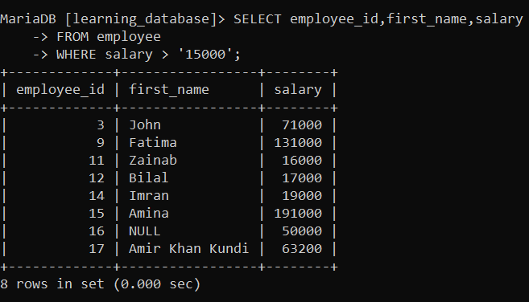

# Conversion Function in SQL:

SQL provides data type conversion functions to transform data between different formats such as numbers, text, and dates. These functions help ensure accurate query results and proper data handling.

- Converts data between different types like string, numeric, and date.
- Ensures accurate and compatible query results.

---

## Types of Data Type Conversion:

There are two main types of data type conversion in SQL.

- **Implicit Data Type Conversion:** This conversion is done by the SQL engine automatically.

- **Explicit Data Type Conversion:** This conversion is done by the developer intentionally, using a conversion function, to meet a specific requirement.

---

## Implicit Data Type Conversion:

MySQL and MariaDB automatically convert values between types when an expression mixes them — most commonly when a string is compared against a number, or a string that looks like a date is compared against a date/time column.

| From | To | When it happens |
|---|---|---|
| `VARCHAR`/`CHAR` | Number | A quoted numeric string is compared against, or used in arithmetic with, a numeric column |
| `VARCHAR`/`CHAR` | `DATE`/`DATETIME` | A quoted date string is compared against a date/time column |
| Number | `VARCHAR`/`CHAR` | A number is concatenated with a string, e.g. `CONCAT(101, ' units')` |
| `DATE`/`DATETIME` | `VARCHAR`/`CHAR` | A date value is used somewhere a string is expected |

### Example of Implicit Data Type Conversion:

In this query, we provide the value `'15000'` as a string, and SQL automatically converts it to a number to match the column's data type.

**Query:**

```sql
SELECT employee_id, first_name, salary
FROM employees
WHERE salary > '15000';
```

**Output:**



- Retrieves `employee_id`, `first_name`, and `salary` from the `employees` table.
- Filters to include only employees with a salary greater than 15,000.
- The string `'15000'` is automatically converted to a number for the comparison.

> Relying on implicit conversion is convenient but risky: it can silently produce wrong results (a string that doesn't parse cleanly as a number is truncated at the first non-numeric character rather than raising an error) and it can prevent MySQL/MariaDB from using an index on the compared column. Prefer explicit conversion whenever the types genuinely differ.

---

## Explicit Data Type Conversion:

Explicit data type conversion (type casting) is the manual conversion of a value from one data type to another using a conversion function. It's used when automatic conversion isn't possible, isn't reliable, or when precise control over how data is processed is required — for example, converting a `VARCHAR` column to `DECIMAL` before doing math on it, or formatting a `DATETIME` into a specific display string.


MySQL and MariaDB provide the following functions for explicit type conversion:

| Function | Purpose
|---|---|---|---|
| `CAST(expr AS type)` | Converts an expression to a specified type using ANSI SQL syntax
| `CONVERT(expr, type)` | Same purpose as `CAST()`, with an alternate argument order; also supports character-set conversion via `CONVERT(expr USING charset)`
| `STR_TO_DATE(str, format)` | Converts a string to a `DATE`/`DATETIME` using a custom format
| `DATE_FORMAT(date, format)` | Converts a `DATE`/`DATETIME` to a formatted string
| `FORMAT(number, decimals)` | Converts a number to a string with thousands separators and a fixed number of decimal places
| `TO_CHAR(expr[, fmt])` | Oracle-style: converts a date/time value to a string using Oracle-style format tokens
| `TO_DATE(str, fmt)` | Oracle-style: converts a string to a date using Oracle-style format tokens
| `TO_NUMBER(str[, fmt])` | Oracle-style: converts a string to a numeric value using Oracle-style format tokens

> Note: `TO_CHAR()`, `TO_DATE()`, and `TO_NUMBER()` are Oracle-compatibility functions added to MariaDB only, and only in very recent versions. MySQL does not have any of the three. `CAST()`, `CONVERT()`, `STR_TO_DATE()`, `DATE_FORMAT()`, and `FORMAT()` are the functions to use for code that must run on both engines.

### 1. `CAST()`:

Converts a value to a target type using standard SQL syntax: `CAST(expr AS type)`.

**Query:**

```sql
SELECT CAST('150' AS DECIMAL(10,2)) AS salary_number,
       CAST(150 AS CHAR) AS salary_text,
       CAST('2026-01-15' AS DATE) AS hire_date;
```

**Output:**

-Output.png)

Common target types: `CHAR`, `DATE`, `DATETIME`, `TIME`, `DECIMAL(M,D)`, `SIGNED` (integer), `UNSIGNED`, `BINARY`, and `JSON` (MySQL 5.7.8+ / MariaDB 10.2.7+).

### 2. `CONVERT()`:

Does the same job as `CAST()`, with a different argument order, and also converts between character sets:

**Query:**

```sql
SELECT CONVERT('150', DECIMAL(10,2)) AS salary_number,
       CONVERT('Straße' USING utf8mb4) AS text_in_utf8;
```

**Output:**

-Output.png)

> MariaDB's `CONVERT()` does not accept `NUMERIC` as a target type name — use `DECIMAL` instead on both engines for portable code.

### 3. `STR_TO_DATE()` and `DATE_FORMAT()`:

`STR_TO_DATE()` parses a string into a date using a custom format; `DATE_FORMAT()` does the reverse — formatting a date/datetime as a string:

**Query:**

```sql
SELECT STR_TO_DATE('15-01-2026', '%d-%m-%Y') AS parsed_date,
       DATE_FORMAT(NOW(), '%Y-%m-%d %H:%i:%s') AS formatted_now;
```

**Output:**

-Output.png)

### 4. `FORMAT()`:

Formats a number as a string with thousands separators, rounded to a given number of decimal places — useful for display, not for further calculation:

**Query:**

```sql
SELECT FORMAT(75000, 2) AS formatted_price;
```

**Output:**

-Output.png)

---

## Best Practices:

- Prefer explicit conversion (`CAST()`/`CONVERT()`) over relying on implicit conversion, especially in `WHERE` clauses, so comparisons behave predictably and indexes can still be used.
- Use `CAST()` for portable, ANSI-standard code; reach for `CONVERT()` when you specifically need its character-set conversion syntax.
- Use `STR_TO_DATE()`/`DATE_FORMAT()` for date-string conversions rather than string concatenation or implicit parsing — explicit formats avoid locale and format ambiguity.
- Use `FORMAT()` only for display purposes; cast the underlying value to a numeric type first if you still need to do arithmetic with it.
- Avoid `TO_CHAR()`/`TO_DATE()`/`TO_NUMBER()` in code meant to run on both MySQL and MariaDB — they're MariaDB-only, recently added, and absent from MySQL entirely.
- Always verify a conversion function's exact version requirement against your target server before deploying it.

---

## References:

If you want to study more about Conversion in SQL, you can visit the documentation and blogs below, or choose your own preferred resources to further enhance your SQL understanding.

- [GEEKSFORGEEKS](https://www.geeksforgeeks.org/sql/sql-conversion-function)

- [MySQL Cast Functions and Operators](https://dev.mysql.com/doc/refman/8.0/en/cast-functions.html)

- [MariaDB CAST Function](https://mariadb.com/docs/server/reference/sql-functions/string-functions/cast)

- [MariaDB CONVERT Function](https://mariadb.com/docs/server/reference/sql-functions/string-functions/convert)

- [MariaDB Type Conversion Rules](https://mariadb.com/docs/server/reference/sql-functions/string-functions/type-conversion)

---

[← Back to main README](./README.md) | [← Previous Day (Day 57)](./Day-57-Working_With_JSON_In_SQL.md) | [Next Day (Day 59) →](./Day-59-SQL-LTRIM()-Function.md)
