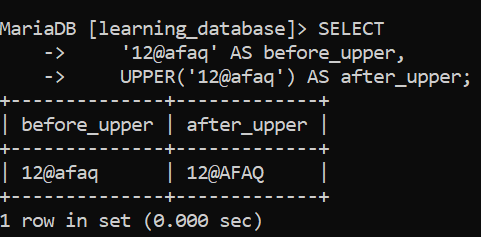

# SQL UPPER() Function:

The `UPPER()` function is a commonly used SQL string function that converts all lowercase letters in a string to uppercase. It helps maintain consistent text formatting and is useful when performing case-insensitive string comparisons.

- Converts all alphabetic characters in a string to CAPITAL letters.

- Numbers and special characters (like `@`, `-`, `/`, `&`) remain unchanged.

- `UPPER()` and `UCASE()` perform the same operation — `UCASE()` is simply a synonym for `UPPER()` in both MySQL and MariaDB.

- This function works across most SQL databases and is easy to use.

---

## Syntax:

```sql
UPPER(input_text);

-- OR

UPPER(column_name);
```

---

**Query:**

```sql
SELECT UPPER('afaq ahmad') AS upper_case;
```

**Output:**

-Output.png)

- Converts the string `'afaq ahmad'` into uppercase letters.

- Displays the result with the column alias `upper_case`.

---

## Examples:

Let's look at a few examples of the `UPPER()` function to understand it better.

### Example 1: Convert a String to Uppercase:

In this example, the word "Microsoft" is displayed as-is in the first column, and converted to uppercase in the second column using `UPPER()`.

**Query:**

```sql
SELECT
    'Microsoft' AS before_upper,
    UPPER('Microsoft') AS after_upper;
```

**Output:**

-Output-1.png)

- Displays the original text value.

- Converts the text to uppercase using `UPPER()`.

### Example 2: Using UPPER() on a Mixed Character String:

In this example, the value `'12@tEsla'` is shown as-is in the first column, and converted to uppercase in the second column. Only alphabetic characters are changed; numbers and special characters remain unchanged.

**Query:**

```sql
SELECT
    '12@afaq' AS before_upper,
    UPPER('12@afaq') AS after_upper;
```

**Output:**



- Displays the original mixed string.

- Converts only the letters to uppercase while keeping numbers and symbols unchanged.

### Example 3: Combine UPPER() with Other String Functions:

`UPPER()` is most often applied to text columns names, cities, product codes, and similar values not to numeric identifiers, since a number has no letters to convert. It's also commonly combined with other string functions, such as `CONCAT()`, to build a normalized label:

**Query:**

```sql
SELECT CONCAT(UPPER('new'), ' ', UPPER('york')) AS normalized_city;
```

**Output:**

-Output.png)

- Each part of the string is uppercased individually with `UPPER()`.

- `CONCAT()` then joins the uppercased parts into a single normalized value — a common pattern when standardizing text data (city names, country codes, status labels) before storing or comparing it.

---

## Notes:

- `UPPER()` has no effect on binary string types (`BINARY`, `VARBINARY`, `BLOB`); to change the case of a binary string, convert it to a non-binary character set first with `CONVERT(... USING charset)`.

- The result of `UPPER()` depends on the column's character set and collation for accented or non-Latin characters, make sure the character set supports the case conversion you expect.

- `UPPER()` and `UCASE()` are supported identically in both MySQL and MariaDB.

---

## References:

- [GEEKS FOR GEEKS](https://www.geeksforgeeks.org/sql/upper-function-in-sql)

- [MySQL String Functions — UPPER()](https://dev.mysql.com/doc/refman/8.0/en/string-functions.html#function_upper)

- [MariaDB UPPER Function](https://mariadb.com/docs/server/reference/sql-functions/string-functions/upper)

- [MariaDB UCASE Function](https://mariadb.com/docs/server/reference/sql-functions/string-functions/ucase)


---

[← Back to main README](./README.md) | [← Previous Day (Day 59)](./Day-59-SQL-LTRIM-Function.md) | [Next Day (Day 61) →](./Day-61-SQL-RTRIM-Function.md)