# Regular Expressions in SQL:

Regular expressions (regex) are powerful tools used to search, match, extract, and replace text based on specific patterns. In SQL, regex helps manage and manipulate textual data more efficiently than simple string functions, making it useful for handling complex data-processing tasks.

---

> We use the following table below for the Demostration:

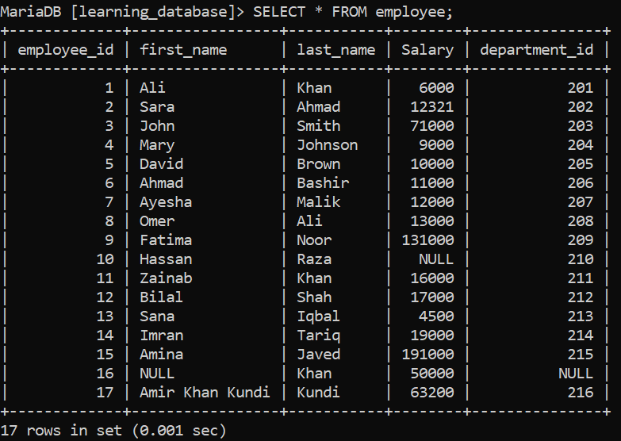

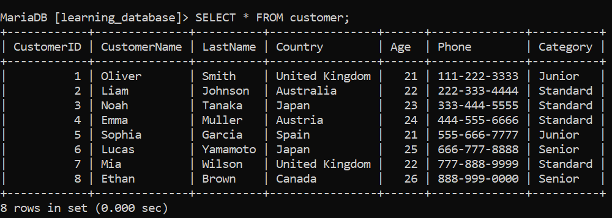

**Example:**

```sql
SELECT user_email
FROM users
WHERE user_email REGEXP '^[A-Za-z0-9._%+-]+@[A-Za-z0-9.-]+\\.[A-Za-z]{2,}$';
```

**Output:**

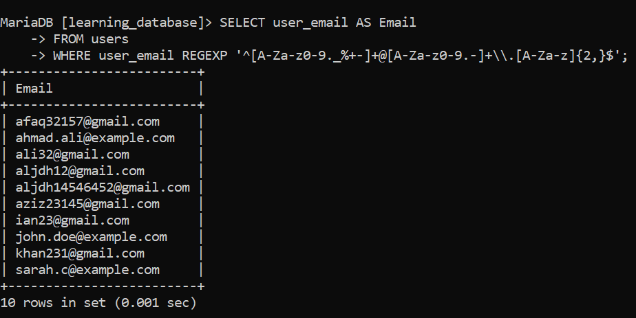

This query retrieves all emails from the `users` table that match the regex pattern for a valid email address.

> **Engine note:** MySQL and MariaDB both support regex matching, but their function sets differ in one important way — MySQL added `REGEXP_LIKE()` as a dedicated function (8.0.4+), while MariaDB has no `REGEXP_LIKE()` function at all. In MariaDB, boolean pattern matching is done with the `REGEXP` (or `RLIKE`, its synonym) **operator** instead: `expr REGEXP pattern`. That same operator/synonym also works in MySQL, so `column REGEXP 'pattern'` is the safest, portable way to write a boolean regex match across both engines.

---

## Types of Regular Expression Matching in SQL:

MySQL and MariaDB provide the following tools for working with regular expressions:

| Tool | Purpose
|---|---|
| `expr REGEXP pattern` / `expr RLIKE pattern` | Returns 1/0 (true/false) if `expr` matches `pattern`|
| `REGEXP_LIKE(expr, pattern[, match_type])` | Function form of the same boolean match, with an optional match-type flag|
| `REGEXP_REPLACE(expr, pattern, replace)` | Replaces text matching a pattern with a replacement string|
| `REGEXP_SUBSTR(expr, pattern)` | Extracts the substring that matches a pattern|
| `REGEXP_INSTR(expr, pattern)` | Returns the starting position of a pattern match|

> MySQL's `REGEXP_REPLACE()`, `REGEXP_SUBSTR()`, and `REGEXP_INSTR()` also accept optional trailing arguments — `pos`, `occurrence`, and `match_type` — to control the starting search position, which match to target, and case sensitivity. **MariaDB's versions of these functions do not accept those extra arguments**; they take only the string and pattern (plus, for `REGEXP_REPLACE()`, the replacement text). Code written for MySQL's extended signatures will not run unmodified on MariaDB.

### `expr REGEXP pattern` (portable) / `LIKE()` (MySQL only):

Checks whether a string matches a given regular expression and returns 1 (true) or 0 (false). Commonly used in `WHERE` clauses to filter rows by pattern.

**Query (portable works on both engines):**

```sql
SELECT first_name
FROM employee
WHERE first_name REGEXP '^A';
```

**Output:**

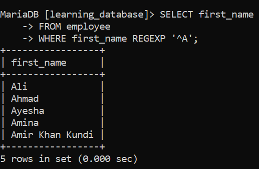

**Query (MySQL only):**

```sql
SELECT first_name
FROM employee
WHERE first_name LIKE 'A%';
```

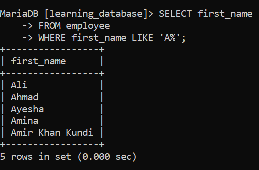

Both return every product name that starts with the letter `A`.

### `REGEXP_REPLACE()`:

Finds a pattern in a string and replaces it with another value. It helps clean and format data by removing or changing unwanted characters.

**Query:**

```sql
SELECT REGEXP_REPLACE(Phone, '[^0-9]', '') AS cleaned_number
FROM customer;
```

**Output:**

-Output.png)

This removes every character that is *not* a digit from the `Phone` column.

> **Replacement syntax differs between engines.** When a replacement string needs to reference part of the match (a backreference), MySQL's ICU engine expects `$1`, `$2`, etc., while MariaDB's PCRE engine expects `\1`, `\2`, etc. A replacement pattern written for one engine's backreference syntax will not work on the other.

### `REGEXP_SUBSTR()`:

Extracts the part of a string that matches a given regular expression useful for pulling out specific patterns like email domains or numbers.

**Query:**

```sql
SELECT REGEXP_SUBSTR(user_email, '@[^.]+') AS domain
FROM users;
```

-Output.png)

This extracts the `@domain` portion (up to, but not including, the first dot) from each email address.

---

## Basic Regular Expression Syntax Table:

The following table lists common regex symbols, their meaning, and an example. These metacharacters are supported by both MySQL's ICU engine and MariaDB's PCRE engine.

| Pattern | Description | Example | Matches |
|---|---|---|---|
| `.` | Matches any single character (except newline) | `h.t` | hat, hit, hot |
| `^` | Matches the start of a string | `^A` | Apple, Apricot |
| `$` | Matches the end of a string | `ing$` | sing, bring |
| `\|` | Acts as logical OR | `cat\|dog` | cat, dog |
| `*` | Zero or more of the previous character | `ab*` | a, ab, abb |
| `+` | One or more of the previous character | `ab+` | ab, abb |
| `?` | Zero or one of the previous character | `colou?r` | color, colour |
| `{n}` | Exactly n times | `a{3}` | aaa |
| `{n,}` | n or more times | `a{2,}` | aa, aaa |
| `{n,m}` | Between n and m times | `a{2,4}` | aa, aaa, aaaa |
| `[abc]` | Any one character inside | `[aeiou]` | a, e, i, o, u |
| `[^abc]` | Any character not inside | `[^aeiou]` | any non-vowel |
| `[a-z]` | Character range | `[0-9]` | 0–9 |
| `\` | Escapes a special character | `\.` | a literal `.` |
| `\b` | Word boundary | `\bcat\b` | cat (not scatter) |
| `\B` | Non-word boundary | `\Bcat` | scatter |
| `(abc)` | Grouping | `(ha)+` | ha, haha |
| `\1` | Back-reference (inside the pattern) | `(ab)\1` | abab |

---

## A Critical Escaping Rule: Backslashes Are Doubled:

Both MySQL and MariaDB parse a quoted string literal *before* handing the resulting text to the regex engine. Because both engines treat `\` as their own string-escape character, **a literal backslash inside a pattern must be written twice** — once for the SQL string parser, once for the regex engine underneath it.

This matters most with `\.` (escaping a dot to mean a literal period). Written as a single backslash, `'\.'`, the SQL string parser can strip the backslash before the regex engine ever sees it, silently turning your "literal dot" into "any character" — the pattern still runs without an error, it just matches more loosely than intended. Write it as `'\\.'` instead:

```sql
-- Risky: the string parser can drop the backslash, weakening '.' to "any character"

SELECT user_email FROM users WHERE user_email REGEXP '^[A-Za-z0-9._%+-]+@[A-Za-z0-9.-]+\.[A-Za-z]{2,}$';
```

**Output:**

-Output.png)

```sql
-- Correct: the doubled backslash survives string parsing as a literal '\.' for the regex engine

SELECT user_email FROM users WHERE user_email REGEXP '^[A-Za-z0-9._%+-]+@[A-Za-z0-9.-]+\\.[A-Za-z]{2,}$';
```

**Output:**

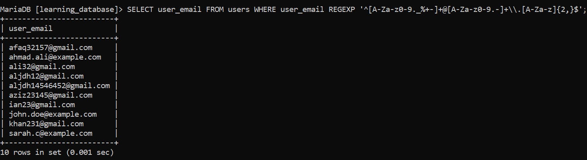

An alternative that sidesteps the issue entirely is to put the character inside a one-item character class, which needs no escaping at all: `[.]` instead of `\\.`. The same doubling rule applies to `\b`, `\d`, `\n`, and any other backslash-led token you write inside a pattern string.

---

## Common Regex Patterns:

| Pattern | Description | Example | Matches |
|---|---|---|---|
| `^[A-Za-z0-9._%+-]+@[A-Za-z0-9.-]+\\.[A-Za-z]{2,}$` | Validates an email address | `john.doe@gmail.com` | Valid email addresses |
| `^[0-9]+$` | Matches a numeric string only | `123456` | 123, 456, 7890 |
| `https?://[^ ]+` | Matches a URL starting with `http` or `https` | `https://example.com/` | URLs |
| `^[A-Za-z0-9]+$` | Matches alphanumeric strings | `User123` | abc123, xyz789 |

---

## Regular Expression Use Cases:

- **Data Validation:** Checks if data follows a required format (email, phone number, numeric string).

- **Data Cleaning:** Removes unwanted characters or extra spaces.

- **Data Extraction:** Pulls out useful parts of a string, like a domain from an email or a URL from a block of text.

---

## Examples of Regular Expressions:

Here's how regular expressions can solve common data-processing tasks in SQL. These examples use inline string values so they can be run as-is, without first needing a table.

### Example 1: Extracting a URL from Text:

Extracts a URL from a block of text by matching a link that starts with `http://` or `https://`.

**Query:**

```sql
SELECT REGEXP_SUBSTR('Check this out: https://example.com/page and reply', 'https?://[^ ]+') AS url;
```

**Output:**

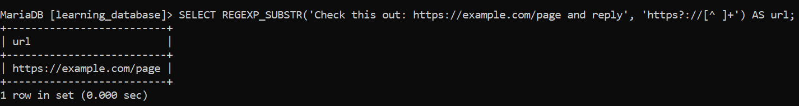

### Example 2: Validating an Email Address:

Checks whether a string matches the standard email format.

**Query:**

```sql
SELECT 'john.doe@gmail.com' REGEXP '^[A-Za-z0-9._%+-]+@[A-Za-z0-9.-]+\\.[A-Za-z]{2,}$' AS is_valid_email;
```

**Output:**

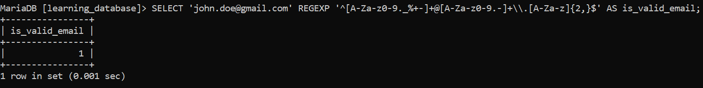

```sql
SELECT 'john.doegmail.com' REGEXP '^[A-Za-z0-9._%+-]+@[A-Za-z0-9.-]+\\.[A-Za-z]{2,}$' AS is_valid_email;
```

**Output:**

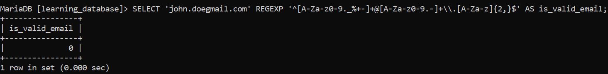

### Example 3: Cleaning Up a Phone Number:

Removes all non-numeric characters from a phone number, leaving only digits.

**Query:**

```sql
SELECT REGEXP_REPLACE('+1 (555) 123-4567', '[^0-9]', '') AS cleaned_number;
```

**Output:**

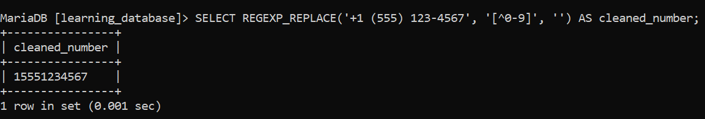

- `[^0-9]` matches any character that is not a digit.

- The empty string `''` replaces each non-numeric character, effectively deleting it.

### Example 4: Finding Values That Contain Digits:

Checks whether a string contains at least one digit — useful for flagging product names, usernames, or codes that mix letters and numbers.

**Query:**

```sql
SELECT 'Model X200' REGEXP '[0-9]' AS contains_digit;
```

**Output:**

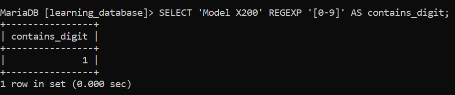


### Example 5: Extracting a Subdomain:

Extracts everything before the first dot in a URL or hostname.

**Query:**

```sql
SELECT REGEXP_SUBSTR('blog.example.com', '^[^.]+') AS subdomain;
```

**Output:**

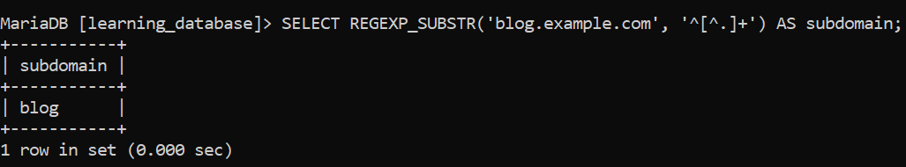

- `^[^.]+` matches all characters from the start of the string up to (but not including) the first `.`.

### Example 6: Validating a Numeric String:

Checks whether a value consists entirely of digits, with nothing else mixed in.

**Query:**

```sql
SELECT '20260117' REGEXP '^[0-9]+$' AS is_all_digits;
```

**Output:**

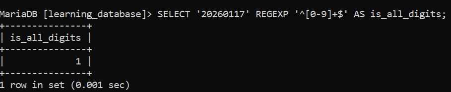

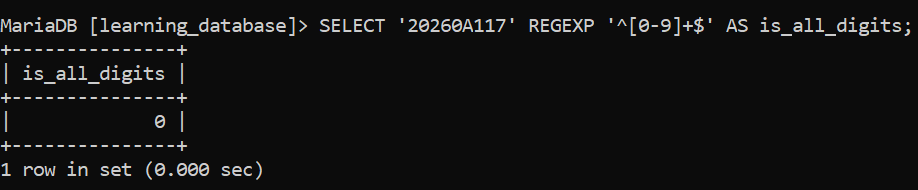

- `^[0-9]+$` matches strings that consist entirely of digits, from start to end.

---

## References

- [GEEKS FOR GEEKS](https://www.geeksforgeeks.org/sql/regular-expressions-in-sql)

- [MySQL Regular Expressions Reference](https://dev.mysql.com/doc/refman/8.0/en/regexp.html)

- [MariaDB Regular Expressions Functions](https://mariadb.com/docs/server/reference/sql-functions/string-functions/regular-expressions-functions)

- [MariaDB REGEXP_REPLACE Function](https://mariadb.com/docs/server/reference/sql-functions/string-functions/regular-expressions-functions/regexp_replace)

- [MariaDB REGEXP_SUBSTR Function](https://mariadb.com/docs/server/reference/sql-functions/string-functions/regular-expressions-functions/regexp_substr)

---

[← Back to main README](./README.md) | [← Previous Day (Day 61)](./Day-61-SQL-RTRIM-Function.md) | [Next Day (Day 63) →](../SQL-Data-Constraints/Day-63-SQL-NOT-NULL-Constraint.md)