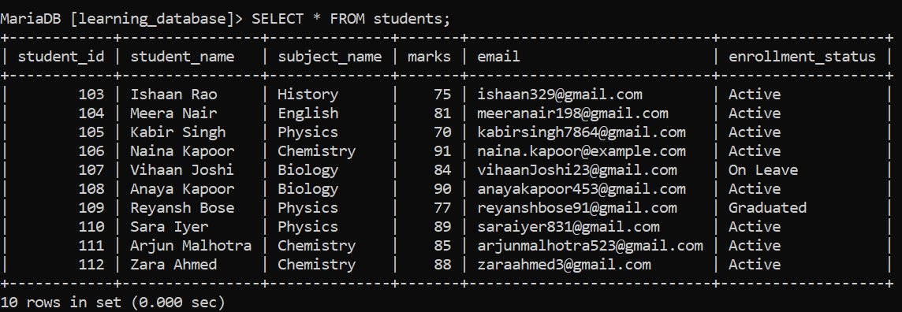
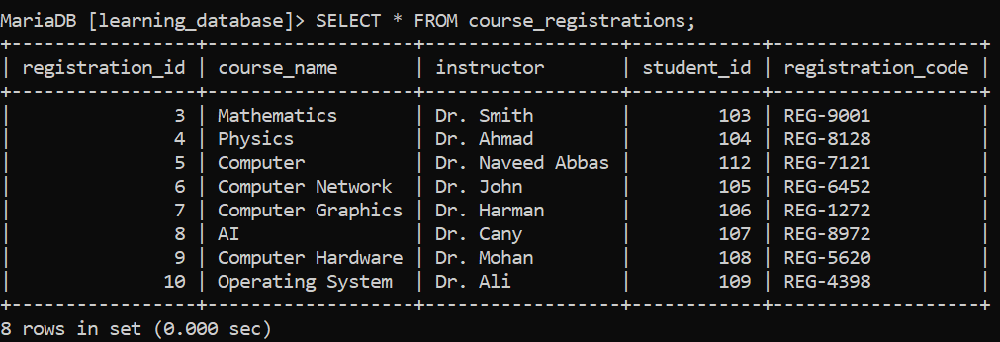
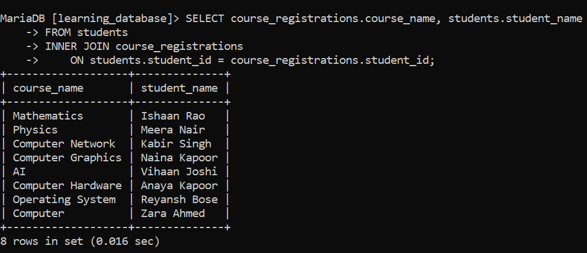
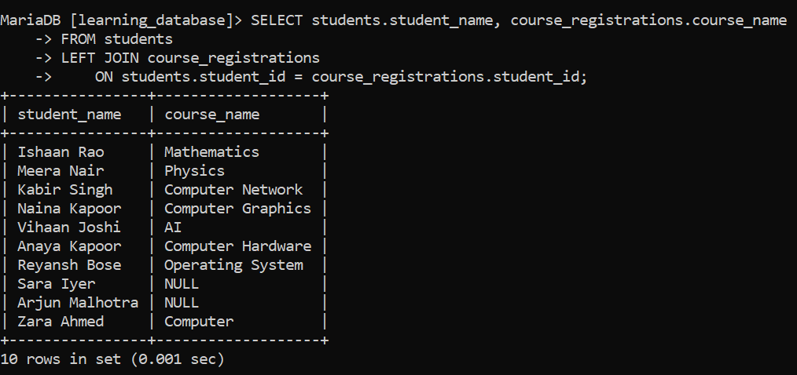
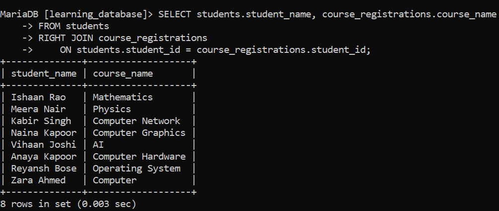
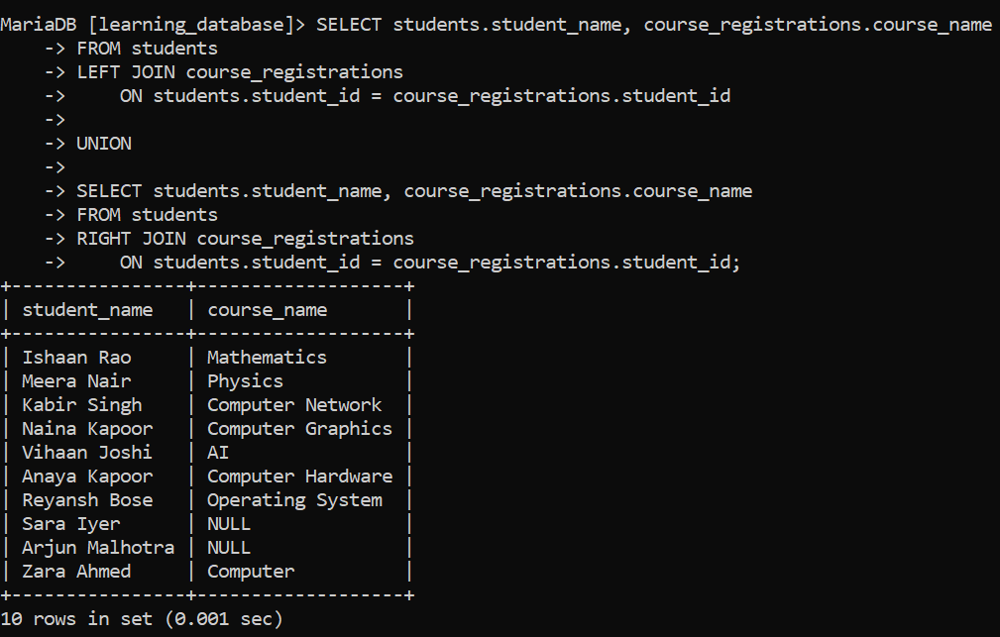
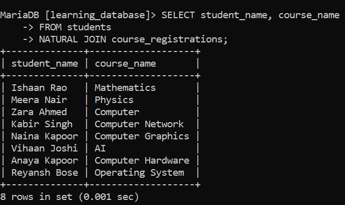

# SQL Joins (Inner, Left, Right, and Full Join):

SQL Joins are used to combine data from two or more tables based on a related column. They help in:

- Retrieving connected data stored across multiple tables.

- Matching records using common columns.

- Improving data analysis by combining related information.

- Creating meaningful result sets from separate tables.

---

## Setting Up: `students` and `course_registrations`:

We'll reuse the `students` and `course_registrations` tables from earlier in `learning_database`, which already share a `student_id` column and a real `FOREIGN KEY` relationship (`course_registrations.student_id` references `students.student_id`). We'll add one extra student who hasn't registered for any course yet, so the join examples below have something interesting to show on the "unmatched" side.





> **Note:** because `course_registrations.student_id` has a `FOREIGN KEY` constraint pointing at `students.student_id`, there can never be a registration row referencing a student that doesn't exist. This matters for the join results below it guarantees the "unmatched" side of any join here can only ever appear on the `students` side (a student with no registration), never on the `course_registrations` side (a registration with no student).

---

## Types of SQL Joins:

### 1. INNER JOIN:

`INNER JOIN` retrieves only the rows where a matching value exists in both tables. It:

- Combines records based on a related column.

- Returns only matching rows from both tables.

- Excludes non-matching data from the result set.

**Syntax:**

```sql
SELECT table1.column1, table1.column2, table2.column1, ...
FROM table1
INNER JOIN table2 ON table1.matching_column = table2.matching_column;
```

> `JOIN` on its own means exactly the same thing as `INNER JOIN` the keyword `INNER` is optional in both MySQL and MariaDB.

**Query find students who are enrolled in a course:**

```sql
SELECT course_registrations.course_name, students.student_name
FROM students
INNER JOIN course_registrations
    ON students.student_id = course_registrations.student_id;
```

**Output:**



- `Priya Nair` (student 114) does not appear, since she has no row in `course_registrations` — `INNER JOIN` only keeps rows present in *both* tables.

---

### 2. LEFT JOIN:

`LEFT JOIN` retrieves all rows from the left table, plus any matching rows from the right table. Where there's no match, the right table's columns come back as `NULL`. It:

- Returns every record from the left table, matched or not.

- Shows matching data from the right table where available.

- Is also known as a `LEFT OUTER JOIN`, `LEFT JOIN` and `LEFT OUTER JOIN` mean the same thing.

**Syntax:**

```sql
SELECT table1.column1, table1.column2, table2.column1, ...
FROM table1
LEFT JOIN table2 ON table1.matching_column = table2.matching_column;
```

**Query:**

```sql
SELECT students.student_name, course_registrations.course_name
FROM students
LEFT JOIN course_registrations
    ON students.student_id = course_registrations.student_id;
```

**Output:**



- Every student appears, including `Sara Iyer` and `Arjun Malhotra`, who has no course registration her `course_name` comes back as `NULL` instead of the row being dropped.

---

### 3. RIGHT JOIN:

`RIGHT JOIN` is the mirror image of `LEFT JOIN`: it retrieves all rows from the right table, plus any matching rows from the left table. It:

- Returns every record from the right-hand table, matched or not.

- Shows matching data from the left-hand table where available.

- Is also known as a `RIGHT OUTER JOIN` — the two names mean the same thing.

**Syntax:**

```sql
SELECT table1.column1, table1.column2, table2.column1, ...
FROM table1
RIGHT JOIN table2 ON table1.matching_column = table2.matching_column;
```

**Query:**

```sql
SELECT students.student_name, course_registrations.course_name
FROM students
RIGHT JOIN course_registrations
    ON students.student_id = course_registrations.student_id;
```

**Output:**



- This result looks identical to the `INNER JOIN` above and in this schema, that's not a coincidence. Because `course_registrations.student_id` is protected by a `FOREIGN KEY`, every registration is guaranteed to have a matching student, so there's never an "extra" right-side row for `RIGHT JOIN` to surface with a `NULL` on the left. A `RIGHT JOIN` only produces visibly different results from an `INNER JOIN` when the right table can legitimately contain rows with no match on the left which this particular foreign-key relationship rules out by design.

---

### 4. FULL JOIN:

A `FULL JOIN` (or `FULL OUTER JOIN`) returns every row from both tables — matched rows appear together, and unmatched rows from either side still appear, with `NULL` filling in for the columns that have no counterpart.

> **Neither MySQL nor MariaDB supports the `FULL JOIN` or `FULL OUTER JOIN` keyword at all** — this isn't a version difference, it's a permanent gap in both engines' SQL dialect (unlike, say, PostgreSQL or SQL Server, which do support it directly). Writing `FULL JOIN` in a MySQL or MariaDB query fails with a syntax error; it does not run, and there is no output to show for it.

To get the same result on either engine, a full join has to be **emulated** by combining a `LEFT JOIN` and a `RIGHT JOIN` with `UNION`:

**Query:**

```sql
SELECT students.student_name, course_registrations.course_name
FROM students
LEFT JOIN course_registrations
    ON students.student_id = course_registrations.student_id

UNION

SELECT students.student_name, course_registrations.course_name
FROM students
RIGHT JOIN course_registrations
    ON students.student_id = course_registrations.student_id;
```

**Output:**



- The `LEFT JOIN` half contributes every student, including the unmatched `Sara Iyer` and `Arjun Malhotra`.

- The `RIGHT JOIN` half contributes every registration (all of which happen to already be matched, per the foreign-key note above).

- `UNION` merges the two result sets and automatically removes the duplicate rows that both halves produced in common leaving exactly the full-join result: everything from both sides, matched or not.

- If you specifically need duplicate rows preserved rather than removed, `UNION ALL` can be used instead of `UNION` just be aware it will then double up every genuinely matching row, since both halves of the query return it.

---

## 5. Natural Join:

A `NATURAL JOIN` is a form of `INNER JOIN` that automatically joins two tables using every column they have in common by name rather than requiring an explicit `ON` clause.

- It joins tables using common columns with the same name (and compatible type).

- It returns only rows where the values in those shared columns match.

- Each shared column appears only once in the result, instead of once per table.

**Syntax:**

```sql
SELECT column_names
FROM table1
NATURAL JOIN table2;
```

**Query:**

```sql
SELECT student_name, course_name
FROM students
NATURAL JOIN course_registrations;
```

**Output:**



- `students` and `course_registrations` share exactly one column name, `student_id`, so `NATURAL JOIN` uses that automatically equivalent to writing `INNER JOIN ... ON students.student_id = course_registrations.student_id` by hand.

- `NATURAL JOIN` is convenient, but risky on tables that might gain a new shared column name later (like `created_at` on both sides) an unrelated column suddenly joining on its name too can silently change the result. For that reason, most style guides recommend spelling out the `ON` condition explicitly rather than relying on `NATURAL JOIN` in production code.

---

## References:

- [GeeksforGeeks: SQL Joins](https://www.geeksforgeeks.org/sql/sql-join-set-1-inner-left-right-and-full-joins)

- [MySQL JOIN Syntax](https://dev.mysql.com/doc/refman/8.0/en/join.html)

- [MariaDB JOIN Syntax](https://mariadb.com/docs/server/reference/sql-statements/data-manipulation/selecting-data/join-syntax)

---

[← Back to main README](./README.md) | [← Previous Day (Day 70)](../SQL-Data-Constraints/Day-70-SQL-DEFAULT-Constraint.md) | [Next Day (Day 72) →](./Day-72-SQL-Outer-Join.md)