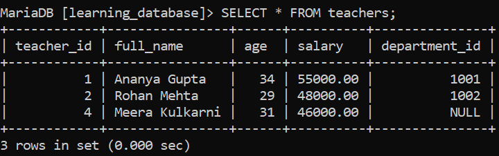
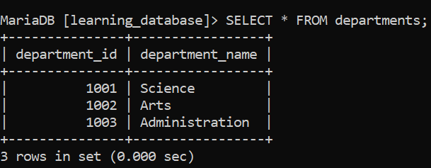

# SQL Outer Join:

SQL provides `OUTER JOIN` to return both matching and non-matching rows from two tables. It includes unmatched records by filling the missing side's columns with `NULL`. This makes it more inclusive than `INNER JOIN`, which drops unmatched rows entirely.

---

## Setting Up: `teachers` and `departments`:

We'll extend the `teachers` table from earlier in `learning_database` with a `department_id` column, and add a new `departments` table for it to reference. To make the outer join examples meaningful, we'll deliberately include a teacher with no department, and a department with no teacher.

**Query:**

```sql
CREATE TABLE departments (
    department_id   INT PRIMARY KEY,
    department_name VARCHAR(50)
);

INSERT INTO departments (department_id, department_name)
VALUES
    (1, 'Science'),
    (2, 'Arts'),
    (3, 'Administration');
-- 'Administration' deliberately has no teacher assigned yet

ALTER TABLE teachers
ADD COLUMN department_id INT NULL,
ADD CONSTRAINT fk_teacher_dept
    FOREIGN KEY (department_id) REFERENCES departments(department_id);

UPDATE teachers SET department_id = 1 WHERE teacher_id = 1; -- Ananya Gupta -> Science
UPDATE teachers SET department_id = 2 WHERE teacher_id = 2; -- Rohan Mehta -> Arts

INSERT INTO teachers (teacher_id, full_name, age, salary, department_id)
VALUES (4, 'Meera Kulkarni', 31, 46000, NULL); -- not yet assigned to a department
```






> `department_id` in `teachers` is nullable, so `Meera Kulkarni` can have `NULL` there without violating the `FOREIGN KEY` constraint MySQL and MariaDB only check a foreign key column when it's non-`NULL`; a `NULL` value is always allowed through regardless of whether anything in `departments` matches it. This is what makes it possible to have a genuinely unassigned teacher in this example.

---

## References:

- [Geeks for Geeks: SQL Outer Join](https://www.geeksforgeeks.org/sql/sql-left-join)

- [MySQL JOIN Syntax](https://dev.mysql.com/doc/refman/8.0/en/join.html)

- [MySQL FOREIGN KEY Constraints — NULL handling](https://dev.mysql.com/doc/refman/8.0/en/create-table-foreign-keys.html)

- [MariaDB JOIN Syntax](https://mariadb.com/docs/server/reference/sql-statements/data-manipulation/selecting-data/join-syntax)


---

[← Back to main README](./README.md) | [← Previous Day (Day 71)](./Day-71-SQL-Joins-Introduction.md) | [Next Day (Day 73) →](./Day-73-SQL-LEFT-JOIN.md)