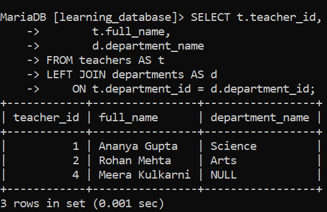
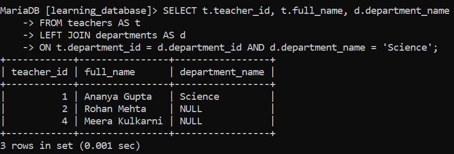
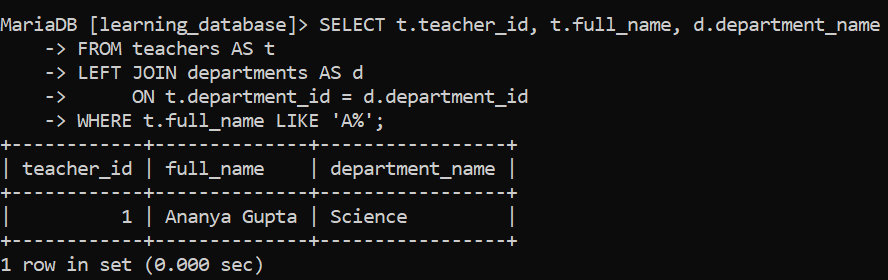
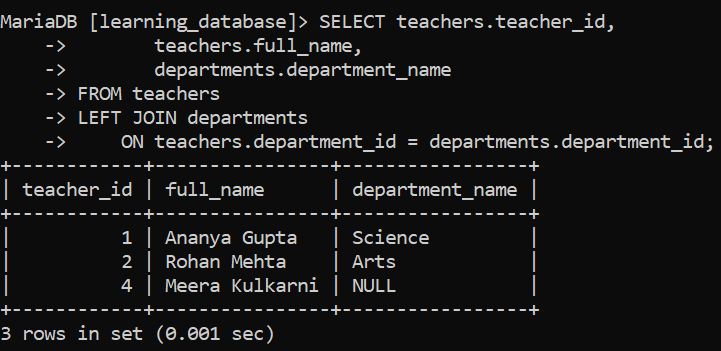

# SQL LEFT JOIN:

In SQL, the `LEFT JOIN` (also called `LEFT OUTER JOIN`) retrieves all records from the left table and only the matching records from the right table. If no match is found, `NULL` values are returned for the right table's columns.

---

## Syntax:

```sql
SELECT column_name(s)
FROM tableA
LEFT JOIN tableB ON tableA.column_name = tableB.column_name;
```

- `SELECT column_name(s)`: specifies the columns to retrieve from the tables.

- `FROM tableA`: defines the left table, from which every row will be returned.

- `LEFT JOIN tableB`: joins the right table onto the left table.

- `ON tableA.column_name = tableB.column_name`: specifies the matching condition between the two tables.

---

## Examples of SQL LEFT JOIN:

We'll reuse the `teachers` and `departments` tables from earlier in `learning_database`. As a reminder, `teachers` is the left table here, it includes `Meera Kulkarni`, who has no `department_id` assigned yet.


### Example 1: Performing a LEFT JOIN:

**Query:**

```sql
SELECT t.teacher_id,
       t.full_name,
       d.department_name
FROM teachers AS t
LEFT JOIN departments AS d
    ON t.department_id = d.department_id;
```

**Output:**



- All teachers (the left table) are included, regardless of whether they have a matching department.

- `Ananya Gupta` and `Rohan Mehta` have a `department_id`, so their department details come through from the right table.

- `Meera Kulkarni` has no department assigned, so `department_name` come back `NULL` for her row instead of it being dropped.

### Example 2: SQL LEFT JOIN with a WHERE Clause

Filtering the joined result to only teachers whose department is `'Science'`:

**Query:**

```sql
SELECT t.teacher_id,
       t.full_name,
       d.department_name
FROM teachers AS t
LEFT JOIN departments AS d
    ON t.department_id = d.department_id
WHERE d.department_name = 'Science';
```

**Output:**


- Only `Ananya Gupta` remains, since `Science` is the only matched department in the result.

> **Important caveat:** putting a condition on a *right-table* column in the `WHERE` clause as `d.department_name = 'Science'` does here quietly cancels out the "outer" part of a `LEFT JOIN`. `Meera Kulkarni`'s row had `d.department_name = NULL` after the join, and `NULL = 'Science'` is never `TRUE`, so her row gets filtered out along with any other genuinely non-matching department. In effect, a `WHERE` filter on the right table's columns turns the query into the same result an `INNER JOIN` would give. If you need to filter the right table's values *while still keeping every left-table row* (including the ones with no match), the condition has to go in the `ON` clause instead of `WHERE`:
>
> ```sql
> SELECT t.teacher_id, t.full_name, d.department_name
> FROM teachers AS t
> LEFT JOIN departments AS d
>     ON t.department_id = d.department_id AND d.department_name = 'Science';
> ```

**Output:**



> This version still returns `Meera Kulkarni`, with a `NULL` department column, because the department-name filter only affects *which department rows are allowed to match* it doesn't remove teacher rows that didn't match at all.

> **This risk is specific to right-table columns, not left-table ones.** Filtering on a *left*-table column in `WHERE` for example, `WHERE t.full_name LIKE 'A%'` is perfectly safe and doesn't cancel the outer join, because every column from the left table is guaranteed to already have a real, non-`NULL` value on every row (that's what "return all rows from the left table" means). There's no unmatched-row case to accidentally filter out on that side:
>
> ```sql
> SELECT t.teacher_id, t.full_name, d.department_name
> FROM teachers AS t
> LEFT JOIN departments AS d
>     ON t.department_id = d.department_id
> WHERE t.full_name LIKE 'A%';
> ```

**Output:**



> This still correctly returns any unmatched teacher whose name starts with `'A'`, with a `NULL` department column because the filter never touches a column that a `LEFT JOIN` could have set to `NULL` in the first place. The rule of thumb: a `WHERE` condition on a *right-table* column needs to move into `ON` if you want to preserve unmatched rows; a `WHERE` condition on a *left-table* column never has that problem.

### Example 3: Why Table Aliases Matter:

Examples 1 and 2 already used `AS t` and `AS d` as short aliases for `teachers` and `departments`. Here's the same query as Example 1, written out **without** aliases, to see why they're worth using:

**Query (no aliases works, but verbose):**

```sql
SELECT teachers.teacher_id,
       teachers.full_name,
       departments.department_name
FROM teachers
LEFT JOIN departments
    ON teachers.department_id = departments.department_id;
```

**Output:**



**Query (with aliases same result, shorter and easier to scan):**

```sql
SELECT t.teacher_id,
       t.full_name,
       d.department_name
FROM teachers AS t
LEFT JOIN departments AS d
    ON t.department_id = d.department_id;
```

**Output:**


- Both queries return the exact same result set aliasing doesn't change behavior at all, it's purely about readability.

- The benefit grows with every additional joined table and every additional column referenced: repeating `teachers.` and `departments.` in full, over and over, gets noticeably harder to read once a query joins three or four tables.

- The `AS` keyword itself is optional in both MySQL and MariaDB `FROM teachers t` works identically to `FROM teachers AS t` but writing `AS` explicitly is generally considered clearer, since it makes it visually obvious that `t` is an alias and not, say, a second table name.

---

## References:

- [GeeksforGeeks: SQL LEFT Join](https://www.geeksforgeeks.org/sql/sql-left-join)

- [MySQL JOIN Syntax](https://dev.mysql.com/doc/refman/8.0/en/join.html)

- [MariaDB JOIN Syntax](https://mariadb.com/docs/server/reference/sql-statements/data-manipulation/selecting-data/join-syntax)

---

[← Back to main README](./README.md) | [← Previous Day (Day 72)](./Day-72-SQL-Outer-Join.md) | [Next Day (Day 74) →](./Day-74-SQL-RIGHT-JOIN.md)