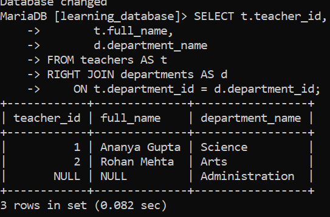
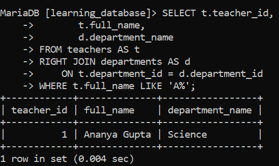
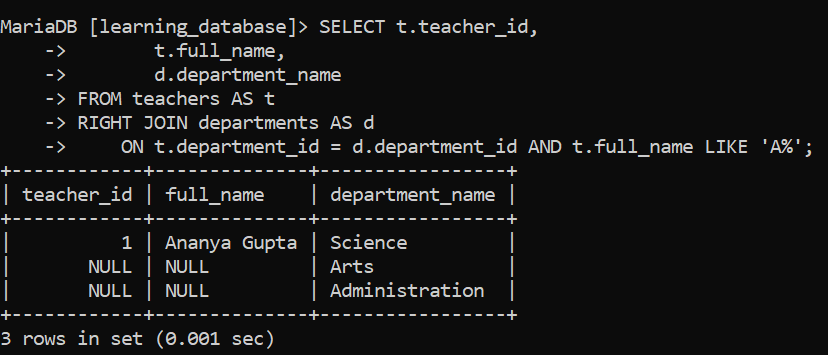

# SQL RIGHT JOIN:

In SQL, the `RIGHT JOIN` (also called `RIGHT OUTER JOIN`) is used to combine rows from two tables based on a related column. It returns all records from the right table and only the matching records from the left table. If there is no match in the left table, the result shows `NULL` values for the left table's columns.

---

## Syntax:

```sql
SELECT column_name(s)
FROM tableA
RIGHT JOIN tableB
    ON tableA.column_name = tableB.column_name;
```

- `SELECT column_name(s)`: specifies the columns to retrieve from the tables.

- `FROM tableA`: defines the left table.

- `RIGHT JOIN tableB`: defines the right table every row from *this* table is returned, matched or not.

- `ON tableA.column_name = tableB.column_name`: specifies the matching condition between the two tables.

---

## Example of SQL RIGHT JOIN:

We'll reuse the `teachers` and `departments` tables from earlier in `learning_database`. `departments` is the right table here, and it includes `Administration`, which has no teacher assigned to it yet.


**Query:**

```sql
SELECT t.teacher_id,
       t.full_name,
       d.department_name
FROM teachers AS t
RIGHT JOIN departments AS d
    ON t.department_id = d.department_id;
```

**Output:**



- The `RIGHT JOIN` ensures every department is listed.

- Since `Administration` has no teacher assigned, `teacher_id` and `full_name` show `NULL` for that row instead of it being dropped.

- Departments that do have a teacher show the proper match.

> **`RIGHT JOIN` is just `LEFT JOIN` with the tables swapped.** The query above produces the exact same result as writing `FROM departments AS d LEFT JOIN teachers AS t ON t.department_id = d.department_id` (just with the columns in a different order in the output). Because of this, many style guides skip `RIGHT JOIN` entirely and always write `LEFT JOIN`, listing whichever table needs "all rows" first it's one join keyword to remember instead of two, with no loss of capability.

---

## The Same WHERE-Clause Caveat, Mirrored:

Just like `LEFT JOIN`, a `RIGHT JOIN` can have its "outer" behavior silently cancelled by a `WHERE` clause but for `RIGHT JOIN`, the risky side is the **left** table, not the right one, since it's the left table's columns that come back `NULL` for unmatched rows.

**Query (breaks the outer join):**

```sql
SELECT t.teacher_id,
       t.full_name,
       d.department_name
FROM teachers AS t
RIGHT JOIN departments AS d
    ON t.department_id = d.department_id
WHERE t.full_name LIKE 'A%';
```

**Output:**




- Before `WHERE` is applied, the `RIGHT JOIN` produces three rows: `Ananya Gupta`/`Science`, `Rohan Mehta`/`Arts`, and `NULL`/`Administration`.

- `Rohan Mehta` is filtered out for an ordinary reason his name simply doesn't start with `'A'`, nothing to do with the join.

- `Administration`'s row is filtered out for the caveat's reason: `t.full_name = NULL` after the join, and `NULL LIKE 'A%'` is never `TRUE` so it's silently dropped even though the whole point of `RIGHT JOIN` was to keep it, no matter whether any teacher matched the name filter.

- The result is a single row: `Ananya Gupta`/`Science`. Both filters are stacking here, which is exactly why this bug is easy to miss in practice the row count looks like ordinary filtering did its job, when part of what actually happened is the outer join quietly breaking underneath it.

- To filter the left table's values *while still keeping every right-table row*, move the condition into `ON` instead:


```sql
SELECT t.teacher_id,
       t.full_name,
       d.department_name
FROM teachers AS t
RIGHT JOIN departments AS d
    ON t.department_id = d.department_id AND t.full_name LIKE 'A%';
```

**Output:**



- This version still returns `Administration`, with `NULL` teacher columns, since the name filter only controls *which teacher rows are allowed to match* it doesn't remove department rows that had no match at all.

- Filtering on a *right*-table column (e.g., `WHERE d.department_name = 'Science'`) is safe in a `RIGHT JOIN`, for the same reason filtering on a left-table column was safe in a `LEFT JOIN` the right table's columns are guaranteed non-`NULL` on every row, since `RIGHT JOIN` returns all of them by definition.

---

## Applications of SQL RIGHT JOIN:

- **Merging Data:** combines related data from different tables.

- **Ensuring Completeness:** guarantees all records from the right table are included, matched or not.

- **Handling Missing Values:** surfaces records on the right side that have no corresponding match on the left.

- **Analyzing Relationships:** helps detect data gaps and dependencies across tables like a department with no staff, as in the example above.

---

## References:

- [GeeksforGeeks: SQL RIGHT JOIN](https://www.geeksforgeeks.org/sql/sql-right-join)

- [MySQL JOIN Syntax](https://dev.mysql.com/doc/refman/8.0/en/join.html)

- [MariaDB JOIN Syntax](https://mariadb.com/docs/server/reference/sql-statements/data-manipulation/selecting-data/join-syntax)

---

[← Back to main README](./README.md) | [← Previous Day (Day 73)](./Day-73-SQL-LEFT-JOIN.md) | [Next Day (Day 75) →](./Day-75-SQL-FULL-JOIN.md)