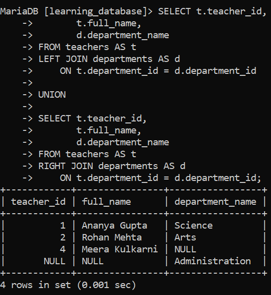
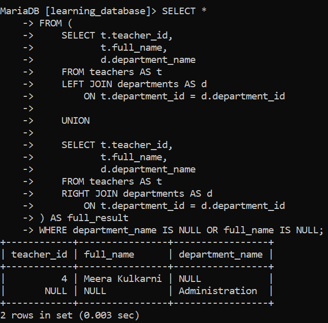

# SQL FULL JOIN:

The `FULL JOIN` (or `FULL OUTER JOIN`) in SQL returns all rows from both tables combining matched rows, and filling unmatched rows with `NULL` values on whichever side has no counterpart. It is essentially the combination of a `LEFT JOIN` and a `RIGHT JOIN` in a single result set.

> **Read this before anything else: neither MySQL nor MariaDB supports the `FULL JOIN` / `FULL OUTER JOIN` keyword.** This is not a version limitation that a newer release fixes it is a permanent gap in both engines' SQL dialect. Writing `FULL JOIN` in a query on MySQL or MariaDB produces a **syntax error**; the query does not run and returns no output at all.
>
> `FULL JOIN` is standard SQL and does work directly on other engines such as PostgreSQL, SQL Server, and Oracle. On MySQL/MariaDB it has to be **emulated** using `LEFT JOIN` + `UNION` + `RIGHT JOIN`, which is what the rest of this document shows.

---

## Standard Syntax (for reference not runnable on MySQL/MariaDB)

```sql
SELECT columns
FROM table1
FULL JOIN table2
    ON table1.column = table2.column;
```

**Parameters:**

- `SELECT columns`: specifies the columns to retrieve.
- `FROM table1`: the first (left) table to be joined.
- `FULL JOIN table2`: the second (right) table to join with the first.
- `ON table1.column = table2.column`: defines the condition used to match rows between the two tables.

On an engine that supports it, this retrieves all records from both `table1` and `table2`, returning `NULL` wherever there is no match.

---

## The MySQL/MariaDB Equivalent:

```sql
SELECT columns
FROM table1
LEFT JOIN table2 ON table1.column = table2.column

UNION

SELECT columns
FROM table1
RIGHT JOIN table2 ON table1.column = table2.column;
```

- The `LEFT JOIN` half contributes every row from `table1`, including those with no match in `table2`.

- The `RIGHT JOIN` half contributes every row from `table2`, including those with no match in `table1`.

- `UNION` merges the two result sets and **removes duplicates** which matters, because every genuinely matching row is produced by *both* halves. Using `UNION ALL` instead would double up all matched rows, so `UNION` (not `UNION ALL`) is what makes this behave like a true full outer join.

- Both `SELECT` lists must have the same number of columns, in the same order, with compatible types a `UNION` requirement, not a join one.

---

## Example 1: Emulating a FULL JOIN:

We'll use the `teachers` and `departments` tables from earlier in `learning_database`. This pair is well suited to demonstrating a full join, because each table has an unmatched row: `Meera Kulkarni` has no department, and `Administration` has no teacher.


**Query:**

```sql
SELECT t.teacher_id,
       t.full_name,
       d.department_name
FROM teachers AS t
LEFT JOIN departments AS d
    ON t.department_id = d.department_id

UNION

SELECT t.teacher_id,
       t.full_name,
       d.department_name
FROM teachers AS t
RIGHT JOIN departments AS d
    ON t.department_id = d.department_id;
```

**Output:**



- Every teacher appears including `Meera Kulkarni`, whose `department_name` is `NULL` because she has no department assigned.

- Every department appears including `Administration`, whose `teacher_id` and `full_name` are `NULL` because no teacher is assigned to it.

- The two matched rows (`Ananya Gupta`/`Science` and `Rohan Mehta`/`Arts`) were produced by *both* halves of the query, but appear only once each that deduplication is `UNION` doing its job.

---

## Example 2: FULL JOIN with a WHERE Clause:

Filtering an emulated full join needs more care than filtering an ordinary join, because there are two separate `SELECT` statements involved. The cleanest and least error-prone approach is to wrap the whole emulation in a **derived table** (a subquery in the `FROM` clause) and apply the `WHERE` to that:

**Query:**

```sql
SELECT *
FROM (
    SELECT t.teacher_id,
           t.full_name,
           d.department_name
    FROM teachers AS t
    LEFT JOIN departments AS d
        ON t.department_id = d.department_id

    UNION

    SELECT t.teacher_id,
           t.full_name,
           d.department_name
    FROM teachers AS t
    RIGHT JOIN departments AS d
        ON t.department_id = d.department_id
) AS full_result
WHERE department_name IS NULL OR full_name IS NULL;
```

**Output:**



- This filter isolates exactly the **unmatched** rows on either side a teacher with no department, and a department with no teacher.

- Surfacing gaps like these is one of the most common practical reasons to want a full join in the first place.

- The derived table must be given an alias (`AS full_result` here) MySQL and MariaDB both require every derived table to be named, and omitting it raises an error.

> **Why the derived table matters:** if you instead append `WHERE ...` directly to the second `SELECT` of the `UNION`, the filter applies *only to that half* of the query, leaving the first half completely unfiltered. That silently produces a result that is neither a filtered full join nor an unfiltered one. Wrapping the union in a derived table guarantees the condition is applied once, to the complete combined result which is what you almost always actually want.

---

## A Note on Joining More Than Two Tables:

Emulating a full join across three or more tables gets considerably more involved than the two-table case each additional table multiplies the number of `LEFT`/`RIGHT` combinations needed to guarantee every unmatched row from every table appears. In practice, if you find yourself needing a genuine multi-table full outer join on MySQL or MariaDB, it's usually clearer to either:

- build the result in stages using derived tables, checking the row counts at each step, or

- reconsider whether a full join is really needed often what's actually wanted is a `LEFT JOIN` from one primary table, plus a separate query to find the orphaned rows.

---

## References:

- [Geeks for Geeks: FULL OUTER JOIN](https://www.geeksforgeeks.org/sql/sql-full-join)

- [MySQL JOIN Syntax](https://dev.mysql.com/doc/refman/8.0/en/join.html)

- [MySQL UNION Clause](https://dev.mysql.com/doc/refman/8.0/en/union.html)

- [MariaDB JOIN Syntax](https://mariadb.com/docs/server/reference/sql-statements/data-manipulation/selecting-data/join-syntax)

---

[← Back to main README](./README.md) | [← Previous Day (Day 74)](./Day-74-SQL-RIGHT-JOIN.md) | [Next Day (Day 76) →](./Day-76-SQL-CROSS-JOIN.md)