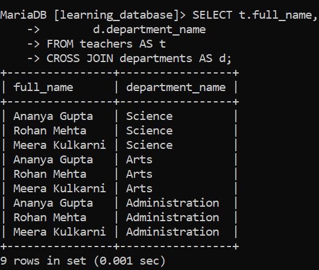
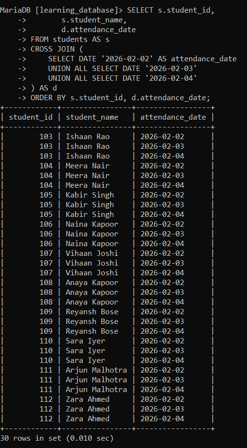
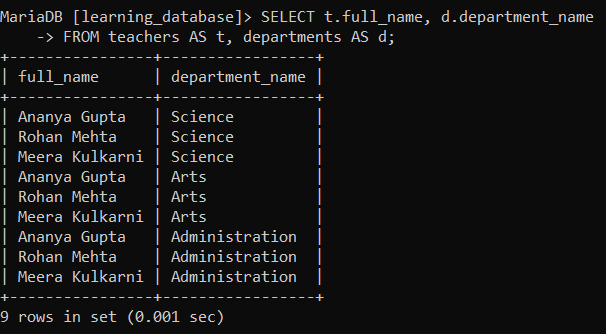

# SQL CROSS JOIN:

SQL `CROSS JOIN` combines every row from one table with every row from another table. It produces a **Cartesian product**, meaning each row of the first table is paired with every row of the second table.

- Does not require a join condition.

- If one table has *m* rows and the other has *n* rows, the result contains *m × n* rows.

---

## Syntax:

```sql
SELECT *
FROM table1
CROSS JOIN table2;
```

> **A MySQL/MariaDB quirk worth knowing:** in both engines, `CROSS JOIN` is syntactically equivalent to `INNER JOIN` they can replace each other. In standard SQL they are not equivalent: `INNER JOIN` is used with an `ON` clause, and `CROSS JOIN` is used without one. This means MySQL and MariaDB will accept `CROSS JOIN ... ON ...` (behaving like an inner join), and will equally accept `INNER JOIN` with no `ON` clause (producing a Cartesian product). Writing `CROSS JOIN` without a condition is still the clearest way to signal "I intended a Cartesian product here" to anyone reading the query later.

---

## Example 1: A Basic CROSS JOIN:

We'll use the `teachers` and `departments` tables from earlier in `learning_database`. Each has 3 rows, so the cross join returns 3 × 3 = **9 rows**.


**Query:**

```sql
SELECT t.full_name,
       d.department_name
FROM teachers AS t
CROSS JOIN departments AS d;
```

**Output:**



- Every teacher is paired with every department 3 × 3 = 9 rows.

- Note that this ignores the actual `department_id` relationship entirely. `Ananya Gupta` really belongs to `Science`, but a `CROSS JOIN` pairs her with `Arts` and `Administration` too, because no join condition is applied.

- `Meera Kulkarni`, who has `NULL` for `department_id`, still appears three times a `CROSS JOIN` doesn't care whether a matching relationship exists.

---

## Example 2: A Practical Use Generating All Combinations:

A Cartesian product is rarely what you want by accident, but it's genuinely useful when you deliberately need **every possible combination** of two sets. A common case is building a complete grid before filling in real data.

Suppose we want a skeleton attendance sheet listing every student against every school day in a given week:

**Query:**

```sql
SELECT s.student_id,
       s.student_name,
       d.attendance_date
FROM students AS s
CROSS JOIN (
    SELECT DATE '2026-02-02' AS attendance_date
    UNION ALL SELECT DATE '2026-02-03'
    UNION ALL SELECT DATE '2026-02-04'
) AS d
ORDER BY s.student_id, d.attendance_date;
```



- This produces one row per student per date exactly the grid an attendance form needs, with no gaps.

- With 5 students and 3 dates, the result is 5 × 3 = 15 rows.

- The same pattern works for report templates, price-tier matrices, or any "every X paired with every Y" requirement.

- The derived table needs an alias (`AS d`), which MySQL and MariaDB both require for any subquery in the `FROM` clause.

---

## The Main Risk: Accidental Cartesian Products:

The most common way people encounter a cross join is **by mistake** forgetting a join condition and getting a result far larger than expected.

```sql
-- Intended an inner join, but forgot the ON clause entirely
SELECT t.full_name, d.department_name
FROM teachers AS t, departments AS d;
```



- This comma-separated form is semantically equivalent to `INNER JOIN` with no join condition both produce a Cartesian product between the specified tables. It runs without any error or warning.

- With small tables the mistake is easy to spot (9 rows instead of 3). With realistic data it isn't: two tables of 10,000 rows each produce **100 million rows**, which can exhaust memory or hang the server.

- If a query returns far more rows than expected, a missing or mistyped join condition is the first thing to check.

> MySQL also warns that the precedence of the comma operator is lower than that of `INNER JOIN`, `CROSS JOIN`, `LEFT JOIN`, and so on. Mixing comma joins with other join types when a join condition is present can raise an error such as `Unknown column 'col_name' in 'on clause'`. Sticking to explicit `JOIN` keywords instead of comma-separated tables avoids this class of problem entirely.

---

## References:

-[Geeks for Geeks: SQL CROSS JOIN](https://www.geeksforgeeks.org/sql/sql-cross-join)

- [MySQL JOIN Clause](https://dev.mysql.com/doc/refman/8.0/en/join.html)

- [MariaDB JOIN Syntax](https://mariadb.com/docs/server/reference/sql-statements/data-manipulation/selecting-data/join-syntax)

---

[← Back to main README](./README.md) | [← Previous Day (Day 75)](./Day-74-SQL-RIGHT-JOIN.md) | [Next Day (Day 77) →](./Day-77-SQL-Self-Join.md)