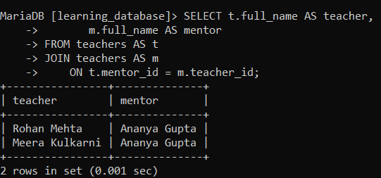
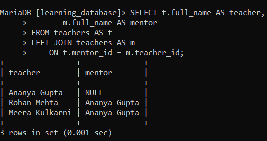
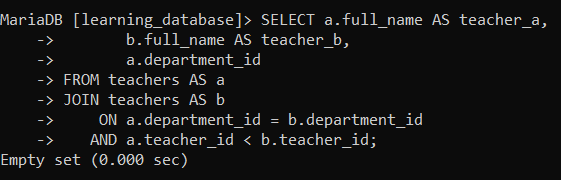
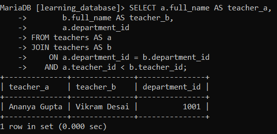

# SQL Self Join:

A **Self Join** is used when a table needs to be joined with itself to compare rows within the same table. It finds relationships between records in a single table by treating it as two separate instances, distinguished by table aliases.

> **A self join is not a separate join type.** It's an ordinary `JOIN`, `LEFT JOIN`, or `INNER JOIN` that happens to reference the same table twice. The only thing that makes it "self" is that both sides point at the same table which is exactly why aliases aren't optional here.

---

## Syntax:

```sql
SELECT columns
FROM table AS alias1
JOIN table AS alias2
    ON alias1.column = alias2.related_column;
```

- `columns`: the columns to retrieve in the result.

- `alias1`: the first reference (alias) of the table.

- `alias2`: the second reference (alias) of the same table.

- `related_column`: the condition linking rows within the same table.

**Aliases are mandatory in a self join.** Without them, MySQL and MariaDB have no way to tell which instance of the table a column belongs to, and the query fails with `ERROR 1066 (42000): Not unique table/alias`. This is different from ordinary joins, where aliases are just a readability convenience.

---

## Setting Up: A Self-Referencing Column:

We'll extend the `teachers` table from `learning_database` with a `mentor_id` column that points back at `teacher_id` in the same table senior teachers mentor junior ones.

**Query:**

```sql
ALTER TABLE teachers
ADD COLUMN mentor_id INT NULL,
ADD CONSTRAINT fk_teacher_mentor
    FOREIGN KEY (mentor_id) REFERENCES teachers(teacher_id);

UPDATE teachers SET mentor_id = 1 WHERE teacher_id = 2;  -- Rohan is mentored by Ananya
UPDATE teachers SET mentor_id = 1 WHERE teacher_id = 4;  -- Meera is mentored by Ananya
-- Ananya (teacher_id = 1) is the most senior, so her mentor_id stays NULL

SELECT * FROM teachers;
```


> A foreign key can reference its own table this is a legitimate self-referencing constraint, and both MySQL and MariaDB support it. The column must be nullable, since the top of any hierarchy has no parent to point at.

---

## Example 1: Pairing Each Teacher With Their Mentor:

**Query:**

```sql
SELECT t.full_name AS teacher,
       m.full_name AS mentor
FROM teachers AS t
JOIN teachers AS m
    ON t.mentor_id = m.teacher_id;
```

**Output:**



- The table is joined to itself: `t` represents the teacher, `m` represents the mentor.

- Each teacher's `mentor_id` is matched against a mentor's `teacher_id`.

- `Ananya Gupta` appears in the `mentor` column, but **not in the `teacher` column** because her `mentor_id` is `NULL`, and `NULL` never matches anything in a join condition.

### Keeping the Top of the Hierarchy:

That last point is the most common self-join mistake. A plain `JOIN` silently drops every row at the top of the hierarchy exactly the rows that are often most important. Use `LEFT JOIN` to keep them:

**Query:**

```sql
SELECT t.full_name AS teacher,
       m.full_name AS mentor
FROM teachers AS t
LEFT JOIN teachers AS m
    ON t.mentor_id = m.teacher_id;
```

**Output:**



- Now all three teachers appear.

- `Ananya Gupta` shows `NULL` for `mentor`, correctly indicating she has no mentor rather than being excluded from the results entirely.

---

## Example 2: Comparing Rows Within the Same Table:

Self joins are equally useful for comparing rows against each other rather than following a hierarchy. Here we find pairs of teachers who work in the same department:

**Query:**

```sql
SELECT a.full_name AS teacher_a,
       b.full_name AS teacher_b,
       a.department_id
FROM teachers AS a
JOIN teachers AS b
    ON a.department_id = b.department_id
   AND a.teacher_id < b.teacher_id;
```



- `a.department_id = b.department_id` finds teachers sharing a department.

- `a.teacher_id < b.teacher_id` does two jobs at once: it stops a row from matching **itself** (which `=` on the department alone would allow), and it prevents each pair appearing twice in mirrored order (`A,B` and `B,A`).

- Using `<` rather than `<>` is the key detail here `<>` would exclude self-matches but still return both mirrored copies of every pair.

With the current data this returns no rows, since no two teachers share a department. Add another teacher to the Science department and the pair appears:

```sql
INSERT INTO teachers (teacher_id, full_name, age, salary, department_id)
VALUES (5, 'Vikram Desai', 38, 52000, 1);

SELECT a.full_name AS teacher_a,
       b.full_name AS teacher_b,
       a.department_id
FROM teachers AS a
JOIN teachers AS b
    ON a.department_id = b.department_id
   AND a.teacher_id < b.teacher_id;
```

**Output:**



---

## Applications of SQL Self Join:

- **Hierarchical Data:** representing structures like teacher–mentor, employee–manager, category–subcategory, or any parent–child relationship.

- **Finding Relationships:** linking related records in the same table, such as friendships in a social network or task dependencies.

- **Data Comparison:** comparing rows against one another, like finding teachers in the same department or employees with similar salaries.

- **Detecting Duplicates:** joining a table to itself on the columns that define a duplicate, to surface repeated records.

- **Sequential Data Analysis:** comparing a row with the one before or after it, useful for trend and time-series analysis.

> For sequential comparisons specifically, modern window functions (`LAG()` and `LEAD()`) are usually clearer and faster than a self join. Both are available in **MySQL 8.0+** and **MariaDB 10.2+**. A self join remains the right tool on older servers, and for hierarchy and duplicate-detection work.

---

## References:

- [Geeks for Geeks: SQL Self Join](https://www.geeksforgeeks.org/sql/sql-self-join)

- [MySQL JOIN Clause](https://dev.mysql.com/doc/refman/8.0/en/join.html)

- [MariaDB JOIN Syntax](https://mariadb.com/docs/server/reference/sql-statements/data-manipulation/selecting-data/join-syntax)

---

[← Back to main README](./README.md) | [← Previous Day (Day 76)](./Day-76-SQL-CROSS-JOIN.md) | [Next Day (Day 78) →](./Day-78-UPDATE-with-JOIN-in-SQL.md)