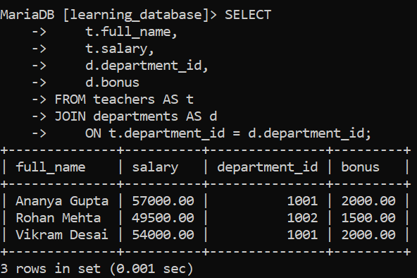
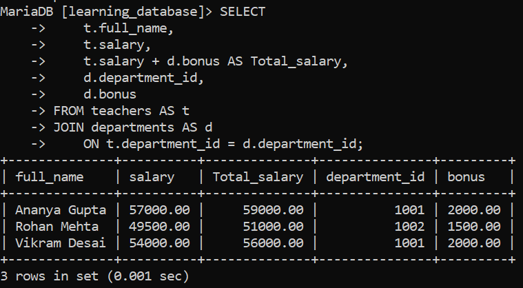
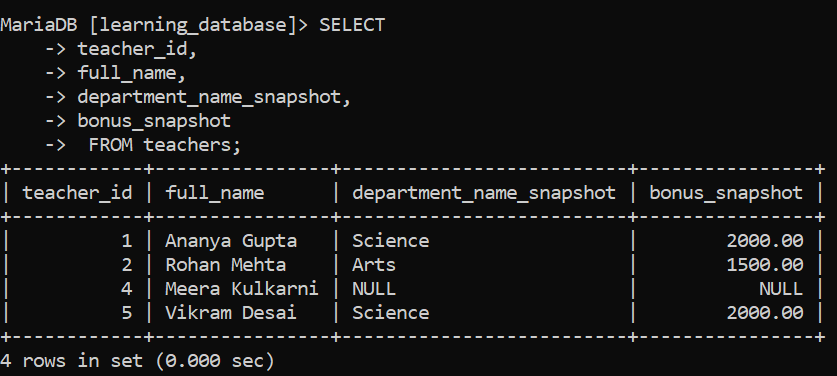
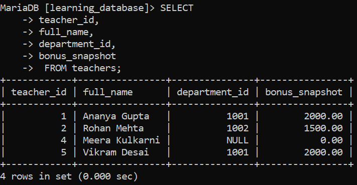

# UPDATE with JOIN in SQL:

`UPDATE` with `JOIN` allows updating records in one table using related data from another table, through a join condition. It's useful for syncing data, correcting values, or modifying columns based on matching rows across tables.

> **Important this is where MySQL/MariaDB and SQL Server genuinely diverge.** A lot of "UPDATE with JOIN" material online (and a common source of copy-paste errors) uses SQL Server's syntax: `UPDATE target_table SET col = ... FROM target_table JOIN source_table ON ...`. That pattern, with a separate `FROM` clause after `SET`, **does not work on MySQL or MariaDB at all** it raises a syntax error on both. MySQL and MariaDB instead put the join directly in the `UPDATE` clause itself, with no separate `FROM`. Everything below uses the syntax that actually runs on these two engines.

---

## Syntax (MySQL/MariaDB):

```sql
UPDATE table1
JOIN table2 ON table1.matching_column = table2.matching_column
SET table1.column_name = table2.column_name
WHERE condition;
```

- `table1`: the table whose rows are actually modified.

- `JOIN table2 ON ...`: brings in matching rows from a second table `INNER JOIN`/`JOIN` (equivalent here) only touches rows from `table1` that have a match in `table2`; `LEFT JOIN` also lets you update rows with no match.

- `SET`: specifies which column(s) to update, and what to set them to, this can reference either table's columns.

- `WHERE`: optional; further restricts which rows are updated.

Only `table1`'s rows are changed by this statement joining in `table2` supplies data to compute the new values, but doesn't modify `table2` itself. (MySQL/MariaDB *can* update more than one of the joined tables in a single statement, but that's a separate, more advanced case from what's shown here.)

---

## Example 1: Applying a Department Bonus to Salaries:

We'll extend the `departments` table from `learning_database` with a `bonus` column, then give every teacher a raise equal to their department's bonus.

**Query:**

```sql
ALTER TABLE departments
ADD COLUMN bonus DECIMAL(10,2) DEFAULT 0;

UPDATE departments SET bonus = 2000 WHERE department_name = 'Science';
UPDATE departments SET bonus = 1500 WHERE department_name = 'Arts';

UPDATE teachers t
JOIN departments d ON t.department_id = d.department_id
SET t.salary = t.salary + d.bonus;

SELECT 
    t.full_name,
    t.salary,
    d.department_id,
    d.bonus
FROM teachers AS t
JOIN departments AS d
    ON t.department_id = d.department_id;
```

**Before:**



**After:**



- `t.salary = t.salary + d.bonus` adds each teacher's department bonus onto their existing salary.

- Only teachers with a matching department are updated `Meera Kulkarni`, whose `department_id` is `NULL`, is untouched, since a plain `JOIN` here behaves like an `INNER JOIN` and skips rows with no match.

---

## Example 2: Updating Multiple Columns, Restricted by WHERE:

`UPDATE ... JOIN` can set several columns at once, and a `WHERE` clause can restrict it to a specific subset of matched rows. Suppose we want to record each teacher's department name and bonus directly on the `teachers` row, but only for teachers in departments `1` and `2`:

**Query:**

```sql
ALTER TABLE teachers
ADD COLUMN department_name_snapshot VARCHAR(50),
ADD COLUMN bonus_snapshot DECIMAL(10,2);

UPDATE teachers t
JOIN departments d ON t.department_id = d.department_id
SET t.department_name_snapshot = d.department_name,
    t.bonus_snapshot = d.bonus
WHERE t.department_id IN (1001, 1002);

SELECT
teacher_id,
full_name,
department_name_snapshot,
bonus_snapshot
 FROM teachers;
```

**Output:**



- The `JOIN` matches rows in `teachers` and `departments` on `department_id`.

- Two columns are set in a single `SET` clause, both pulling values from the joined `departments` row.

- `WHERE t.department_id IN (1001, 1002)` restricts the update to only those two departments `Meera Kulkarni` (no department) is excluded both by the join and, redundantly, by this filter.

---

## SQL UPDATE with JOIN Using LEFT JOIN:

Sometimes you want to update every row in the target table, even the ones with no match in the joined table, using a default value for the unmatched rows instead of leaving them untouched. That's what `LEFT JOIN` is for here.

**Syntax:**

```sql
UPDATE table1
LEFT JOIN table2 ON table1.matching_column = table2.matching_column
SET table1.column_name = IFNULL(table2.column_name, default_value);
```

> `ISNULL()` is a SQL Server function, not a MySQL/MariaDB one using it here will fail with `FUNCTION ISNULL does not exist`. The MySQL/MariaDB equivalent is `IFNULL(expr, default)`, or the more portable, ANSI-standard `COALESCE(expr, default)` (which also works on SQL Server, Oracle, and PostgreSQL, unlike `IFNULL`).

**Query:** give every teacher a `bonus_snapshot`, defaulting to `0` for anyone with no department:

```sql
UPDATE teachers t
LEFT JOIN departments d ON t.department_id = d.department_id
SET t.bonus_snapshot = IFNULL(d.bonus, 0);

SELECT
teacher_id,
full_name,
department_id,
bonus_snapshot
 FROM teachers;
```

**Output:**



- Rows with a matching department get the real bonus value from `departments`.

- `Meera Kulkarni`, who has no department, still gets updated `IFNULL(d.bonus, 0)` substitutes `0` since `d.bonus` comes back `NULL` for her under the `LEFT JOIN`.

- Without the `LEFT JOIN` (i.e., with a plain `JOIN`), `Meera Kulkarni`'s row would simply not be touched at all, keeping whatever value `bonus_snapshot` already had.

> `RIGHT JOIN` can be used the same way by swapping the table order, though `LEFT JOIN` is generally preferred for readability it keeps the table actually being updated (`table1`) written first, matching how `UPDATE table1 ...` already reads.

---

## References:

- [Geeks for Geeks: SQL UPDATE with JOIN](https://www.geeksforgeeks.org/sql/sql-update-with-join)

- [MySQL UPDATE Statement](https://dev.mysql.com/doc/refman/8.0/en/update.html)

- [MariaDB UPDATE Statement](https://mariadb.com/docs/server/reference/sql-statements/data-manipulation/update)

- [MySQL Control Flow Functions IFNULL()](https://dev.mysql.com/doc/refman/8.0/en/flow-control-functions.html#function_ifnull)

---

[← Back to main README](./README.md) | [← Previous Day (Day 77)](./Day-77-SQL-Self-Join.md) | [Next Day (Day 79) →](./Day-79-SQL-DELETE-JOIN.md)