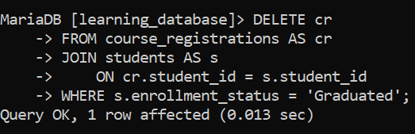
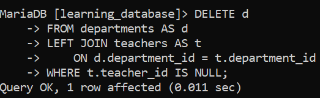
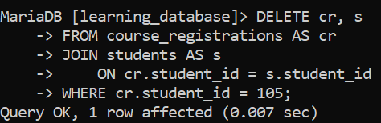
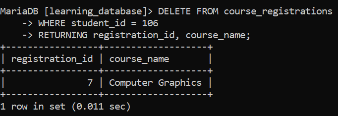

# SQL DELETE JOIN:

The SQL `DELETE` with `JOIN` allows you to delete rows from one table based on matching conditions in another related table. It's useful for managing linked data across multiple tables while keeping the database consistent.

- Deletes rows from only the table(s) explicitly named, even when multiple tables are joined for filtering.

- Uses joins to apply conditions based on related-table data.

- Supports `INNER JOIN`, `LEFT JOIN`, and other join types permitted in a `SELECT`.

- Allows precise deletion using the `WHERE` clause.

---

## Syntax (MySQL/MariaDB):

MySQL and MariaDB both support two equivalent forms of multi-table `DELETE`:

**Form 1 table(s) to delete from listed right after `DELETE`:**

```sql
DELETE table_1
FROM table_1
JOIN table_2
    ON table_1.column_name = table_2.column_name
WHERE condition;
```

**Form 2 using `USING` instead:**

```sql
DELETE FROM table_1
USING table_1
JOIN table_2
    ON table_1.column_name = table_2.column_name
WHERE condition;
```

- `table_1`: the table whose rows are actually deleted only tables named here (or after `FROM` in Form 1 / after `DELETE FROM` in Form 2) are modified.

- `table_2`: used purely for matching/filtering its rows are never touched unless it's also listed as a delete target.

- `ON`: specifies the join condition.

- `WHERE`: optional; further restricts which rows are deleted.

Both forms produce identical results which one you use is a matter of preference. Note that a plain multi-table `DELETE` doesn't support `ORDER BY` or `LIMIT` on either engine (MariaDB lifted this restriction starting in 11.8.1; MySQL still doesn't support it as of 8.0/9.x).

---

## Example 1: Deleting Rows Based on a Related Table's Condition:

We'll reuse `students` and `course_registrations` from `learning_database`. Suppose a student's `enrollment_status` becomes `'Graduated'`, and we want to clear out their active course registrations.

**Query:**

```sql
UPDATE students SET enrollment_status = 'Graduated' WHERE student_id = 110;

DELETE cr
FROM course_registrations AS cr
JOIN students AS s
    ON cr.student_id = s.student_id
WHERE s.enrollment_status = 'Graduated';
```

**Output:**



- Joins `course_registrations` with `students` on `student_id`.

- Deletes registration rows belonging to any student whose `enrollment_status` is `'Graduated'`.

- Only `course_registrations` is modified `students` itself is untouched, since it's used purely for filtering here.

---

## Example 2: Cleaning Up Rows With No Match, Using LEFT JOIN:

`LEFT JOIN` combined with an `IS NULL` check on the right table is the standard pattern for deleting rows that have **no** corresponding match elsewhere commonly called cleaning up orphaned records.

Suppose instead we want to identify (and could delete) any department in `departments` that currently has no teacher assigned like `Administration`:

**Query:**

```sql
DELETE d
FROM departments AS d
LEFT JOIN teachers AS t
    ON d.department_id = t.department_id
WHERE t.teacher_id IS NULL;
```

**Output:**



- `LEFT JOIN` keeps every department, matched or not, filling `t.teacher_id` with `NULL` for any department with no teacher.

- `WHERE t.teacher_id IS NULL` then isolates exactly those unmatched departments.

- `Administration` would be deleted by this statement, since it has no teacher; `Science` and `Arts` are left alone, since they do.

> **Run a `SELECT` first.** Before running a multi-table `DELETE`, it's good practice to run the equivalent `SELECT` using the same `JOIN`/`WHERE` logic, to confirm exactly which rows would be affected. Swapping `DELETE d` for `SELECT d.*` in the query above (and dropping the `FROM`/alias rearrangement) lets you preview the damage before committing to it.

---

## Deleting From Both Joined Tables at Once:

Both tables named before `FROM` (or after `DELETE FROM` in the `USING` form) get their matching rows deleted in a single statement useful for removing paired records together in one atomic operation. For example, deleting both a course registration and, hypothetically, a matching row in some `registration_audit` table at once would look like:

```sql
DELETE cr, s
FROM course_registrations AS cr
JOIN students AS s 
    ON cr.student_id = s.student_id
WHERE cr.student_id = 105;
```

**Output:**



Only `course_registrations` and `students` rows are removed here. Any third table joined purely to filter results (by joining it without listing its alias after DELETE) remains completely untouched.

---

## A MariaDB-Only Addition: DELETE ... RETURNING:

MariaDB (from 10.0.5+) supports a `RETURNING` clause on `DELETE`, which returns the rows that were just deleted handy for logging or confirmation, without a separate `SELECT` beforehand. This is **not available in MySQL**, and MariaDB explicitly does not allow it on multi-table deletes only single-table ones:

```sql
-- MariaDB only, single-table DELETE only
DELETE FROM course_registrations
WHERE student_id = 106
RETURNING registration_id, course_name;
```

**Output:**



---

## References:

- [GeeksforGeeks: SQL DELETE JOIN](https://www.geeksforgeeks.org/sql/sql-delete-join)

- [MySQL DELETE Statement](https://dev.mysql.com/doc/refman/8.0/en/delete.html)

- [MariaDB DELETE Statement](https://mariadb.com/docs/server/reference/sql-statements/data-manipulation/changing-deleting-data/delete)

---

[← Back to main README](./README.md) | [← Previous Day (Day 78)](./Day-78-UPDATE-with-JOIN-in-SQL.md) | [Next Day (Day 80) →](./Day-80-Recursive-Join-in-SQL.md)