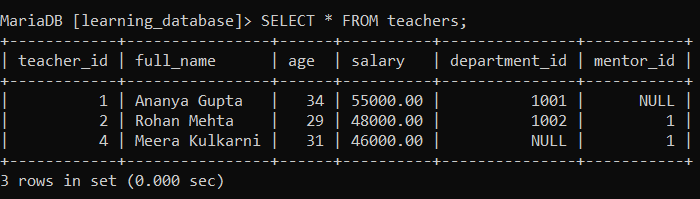
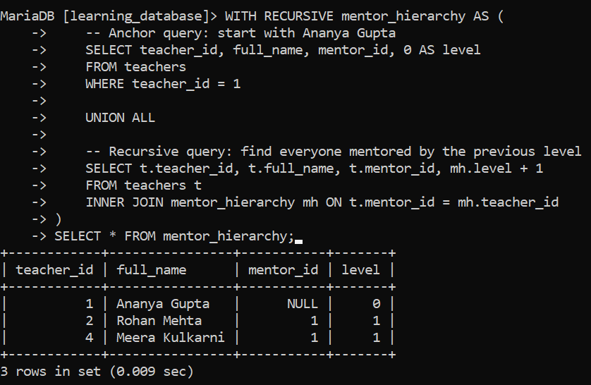

# Recursive Join in SQL:

SQL provides recursive joins using recursive CTEs to work with hierarchical data, such as employee-manager or parent-child relationships.

- Used to handle hierarchical or tree-structured data.

- Repeatedly joins a table with itself, layer by layer, until no more matches are found.

- Implemented using a recursive Common Table Expression (`WITH RECURSIVE`).

> **Version requirement:** `WITH RECURSIVE` requires **MySQL 8.0.1+** or **MariaDB 10.2.2+**. On any earlier version of either engine, this syntax doesn't exist at all the statement fails with a parse error, not a silently-ignored feature. If you're on an older server, recursive hierarchy traversal has to be done with a stored procedure/loop, or a fixed number of manually chained joins, instead.

---

## Syntax:

```sql
WITH RECURSIVE cte_name AS (
    -- Anchor query: selects the root/starting row(s)
    SELECT columns
    FROM table_name
    WHERE condition

    UNION ALL

    -- Recursive query: joins the table with the CTE itself to fetch the next level
    SELECT t.columns
    FROM table_name t
    INNER JOIN cte_name cte ON t.column = cte.column
)
SELECT * FROM cte_name;
```

- **Anchor query:** runs once, and defines the starting point(s) of the recursion.

- **Recursive query:** runs repeatedly, each time joining the base table against the *rows produced by the previous run*, until a run produces no new rows at which point recursion stops automatically.

- `UNION ALL` (not `UNION`) is used between them, this matters for performance, since `UNION` would deduplicate on every iteration, which is unnecessary overhead if the hierarchy has no genuine duplicate rows to remove.

---

## Example: Traversing the Teacher-Mentor Hierarchy:

We'll reuse the `teachers` table from earlier in `learning_database`, which already has a self-referencing `mentor_id` column from the Self Join document: `Ananya Gupta` has no mentor (the top of the hierarchy), while `Rohan Mehta` and `Meera Kulkarni` are both mentored by her.

**Output:**



**Query:** starting from `Ananya Gupta` (`teacher_id = 1`), find everyone in her mentorship chain, including a `level` column to show how far removed each person is:

```sql
WITH RECURSIVE mentor_hierarchy AS (
    -- Anchor query: start with Ananya Gupta
    SELECT teacher_id, full_name, mentor_id, 0 AS level
    FROM teachers
    WHERE teacher_id = 1

    UNION ALL

    -- Recursive query: find everyone mentored by the previous level
    SELECT t.teacher_id, t.full_name, t.mentor_id, mh.level + 1
    FROM teachers t
    INNER JOIN mentor_hierarchy mh ON t.mentor_id = mh.teacher_id
)
SELECT * FROM mentor_hierarchy;
```

**Output:**



- The anchor query selects `Ananya Gupta` as the starting point, at `level 0`.

- The recursive query then finds everyone whose `mentor_id` matches a `teacher_id` already in the result on the first pass, that's `Rohan Mehta` and `Meera Kulkarni`, both at `level 1`.

- The process repeats on each new set of rows; here it stops after one pass, since no one has `mentor_id = 2` or `mentor_id = 4`. In a deeper hierarchy, this would continue level by level until a pass added no new rows.

---

## Guarding Against Runaway Recursion:

If the underlying data ever contains a cycle (for example, a data-entry error where two rows end up mentoring each other), a recursive CTE without a safeguard could try to loop indefinitely. Both engines protect against this automatically, but under **different setting names**:

| Engine | System variable | Default limit |
|---|---|---|
| MySQL | `cte_max_recursion_depth` | 1000 |
| MariaDB | `max_recursive_iterations` | 1000 |

If a recursive CTE needs to go deeper than the default (for example, traversing a genuinely large hierarchy), the corresponding variable can be raised for the current session:

```sql
-- MySQL
SET SESSION cte_max_recursion_depth = 5000;

-- MariaDB
SET SESSION max_recursive_iterations = 5000;
```

It's still good practice to include an explicit stopping condition in the recursive query's `WHERE` clause (such as a `level < max_depth` check) rather than relying solely on the server's default limit to catch a runaway query.

---

## Applications of Recursive Joins:

- **Hierarchical Data Representation:** organizational charts, employee-manager or mentor-mentee relationships, and bills of materials.

- **Parent-Child Relationships:** categories and subcategories in a product catalog, or comment threads with nested replies.

- **Graph Traversal:** navigating networks such as social graphs or transportation routes, where a recursive join can follow connections outward from a starting node.

---

## References:

- [Geeks for Geeks: Recursive Join in SQL](https://www.geeksforgeeks.org/sql/recursive-join-in-sql)

- [MySQL WITH (Common Table Expressions)](https://dev.mysql.com/doc/refman/8.0/en/with.html)

- [MariaDB Recursive Common Table Expressions Overview](https://mariadb.com/docs/server/reference/sql-statements/data-manipulation/selecting-data/with)

---

[← Back to main README](./README.md) | [← Previous Day (Day 79)](./Day-79-SQL-DELETE-JOIN.md) | [Next Day (Day 81) →](../SQL-Views/Day-81-Introduction-to-SQL-Views.md)