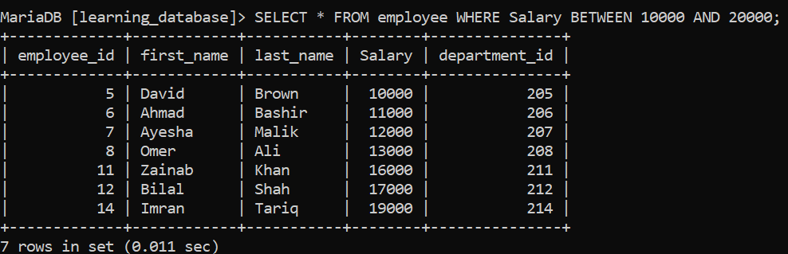
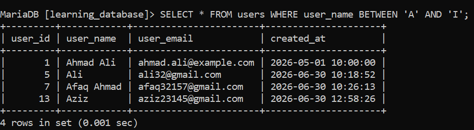

# Special Operator: BETWEEN

This operator is used to filter values that fall within a given range. For example, if we want students whose marks fall between 67 and 89, the `BETWEEN` operator gives us this functionality very well. Both 67 and 89 are included (the range is **inclusive** on both ends).

---

```sql
SELECT * FROM student WHERE marks BETWEEN 67 AND 89;
```

---

For this, we will use the `employees` table, which contains the following columns: `employee_id`, `first_name`, `last_name`, `salary`, and `department_id`.

**Employee Table:**


> **Key Scenarios:**
> Where the `BETWEEN` operator is used.

## 1. Numeric Range

Used to filter numeric values and return the records that fall within the given range.

**SQL Query:**
```sql
SELECT * FROM employee WHERE Salary BETWEEN 10000 AND 20000;
```

**Result:**


## 2. Date Ranges

Filters data within a specific time range.

**SQL Query:**
```sql
SELECT * FROM users WHERE created_at BETWEEN '2026-05-01' AND '2026-06-01';
```

**Result:**


**Note:**
If your column is a `DATETIME` or `TIMESTAMP` (e.g., `2026-03-31 14:30:00`), querying `BETWEEN '2026-01-01' AND '2026-03-31'` converts the upper bound to `'2026-03-31 00:00:00'`. Any record created later in the day on March 31st will be missed!

**Best practice for DATETIME:**
```sql
SELECT * FROM users WHERE created_at >= '2026-05-01' AND created_at < '2026-06-01';
```

## 3. String / Alphabetical Ranges

This filters names, cities, and similar text columns that fall within the specified range.

**SQL Query:**
```sql
SELECT * FROM users WHERE user_name BETWEEN 'A' AND 'I';
```



**Note:**
SQL uses lexicographical (dictionary) ordering based on character encoding values, comparing each character in the string from left to right. So filtering is done based on this lexicographical order.

Because of this, `BETWEEN 'A' AND 'I'` will **not** include a name like `"Ibrahim"` fully as expected if there's a name like `"Izhar"` — since `'I'` alone is treated as `'I'` followed by nothing, and any string starting with `"I"` and having more characters (like `"Izhar"`) is actually *greater* than the boundary `'I'`. To reliably include all names starting with "I", it's safer to write:

```sql
SELECT * FROM users WHERE user_name BETWEEN 'A' AND 'J';
```

## 4. NOT BETWEEN

The `NOT BETWEEN` operator returns records that fall **outside** the given range (exclusive of both boundaries as valid matches).

**SQL Query:**
```sql
SELECT * FROM employee WHERE Salary NOT BETWEEN 10000 AND 20000;
```

This returns all employees whose salary is either less than 10000 or greater than 20000.

## 5. BETWEEN with Other Clauses

`BETWEEN` can be combined with `AND`, `OR`, and other conditions to build more precise filters.

**SQL Query:**
```sql
SELECT * FROM employee 
WHERE Salary BETWEEN 10000 AND 20000 
AND department_id = 3;
```

## 6. Things to Keep in Mind

- `BETWEEN` is inclusive of both the lower and upper bounds.
- The lower bound must be written before the upper bound (`col BETWEEN low AND high`); if reversed, most databases will return no results.
- `BETWEEN` works with numeric, date/time, and string (character) data types.
- For `DATETIME`/`TIMESTAMP` columns, prefer `>=` and `<` over `BETWEEN` to avoid accidentally excluding records with a time component on the end date.
- `BETWEEN` is essentially shorthand for `col >= low AND col <= high`, so it doesn't offer a performance advantage over writing the equivalent `AND` condition manually — it's mainly for readability.

---

[← Back to main README](./README.md) | [← Previous Day (Day 39)](../Day-39-SQL-Bitwise-Operators.md) | [Next Day (Day 41) →](./Day-40-Special_Operator_BETWEEN.md)