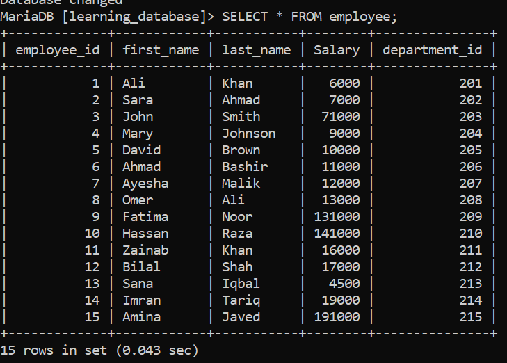
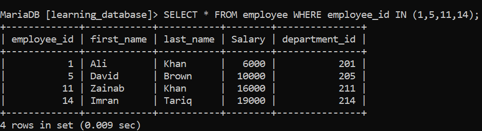
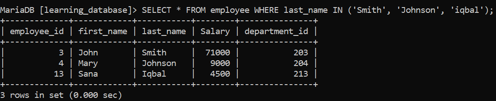
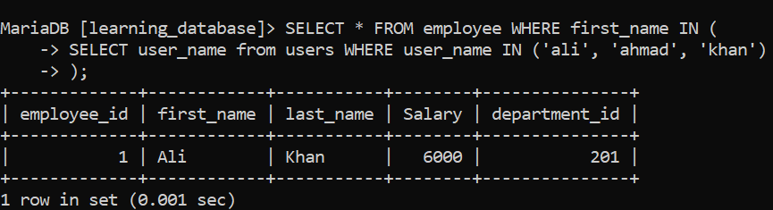
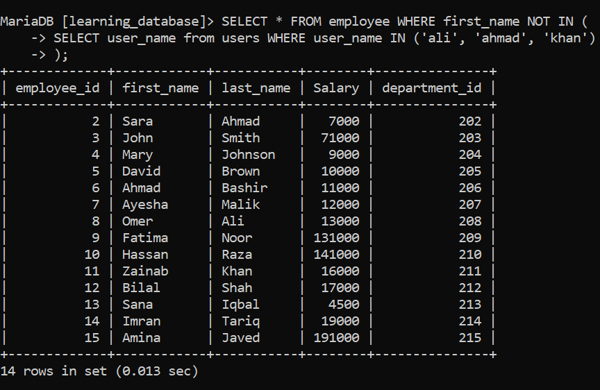
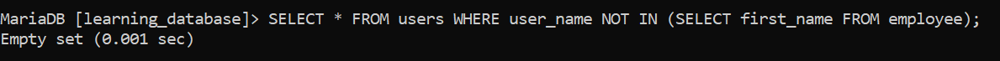
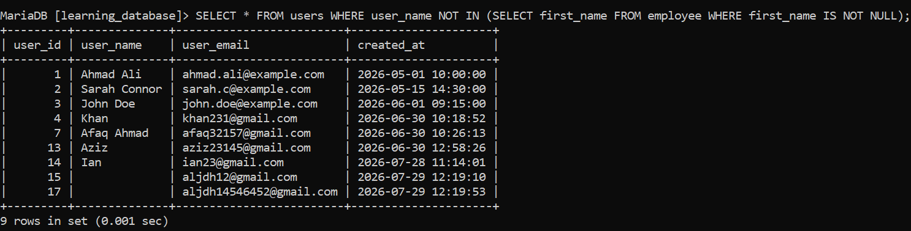

# Special Operator: IN

The `IN` operator is a logical operator used to filter data based on a specified list of values. It allows you to quickly check whether a column's value matches **any** value in a given list or in the result of a subquery.

Using `IN` simplifies your SQL statements and eliminates the need to chain multiple `OR` conditions together.

---

**Syntax:**
```sql
SELECT column_name(s)
FROM table_name
WHERE column_name IN (value1, value2, value3, ...);
```

---

For this, we will use the `employee` table, which contains the following columns: `employee_id`, `first_name`, `last_name`, `salary`, and `department_id`.

**Employee Table:**



---

# 1. Filtering by Numeric Values

Retrieve records where a numeric column matches any value in a defined list.

**Syntax:**
```sql
SELECT * FROM employee WHERE employee_id IN (1, 5, 11, 14);
```

**Explanation:**
```
This query fetches all employees who employee_id in 1, 5, 11, or 14.
```

**Output:**



---

# 2. Filtering by String / Text Values

Filter text data (e.g., first names, last names) against a list of specific target strings.

**SQL Query:**
```sql
SELECT * FROM employee WHERE last_name IN ('Smith', 'Johnson', 'Iqbal');
```

**Output:**



**Note:**
```
Case-Sensitivity Note: Depending on your Database Management System (DBMS) configuration (e.g., PostgreSQL vs. MySQL default collations), string matching inside IN (...) may be case-sensitive.
```
---

# 3. Using IN with Subqueries (Dynamic Lists)

Instead of hardcoding a list of values, you can pass a subquery inside the `IN` operator to filter dynamically based on data in another table.

**SQL Query:**
```sql
SELECT * FROM employee WHERE first_name IN (
    SELECT user_name FROM users WHERE user_name IN ('ali', 'ahmad', 'khan')
);
```

**Output:**



**Explanation:**
```
This query automatically finds all employees whose names are Ali, Ahmad, or Khan.
```

---

> Advanced Rules & Complementary Operators

# 4. The Inverse: NOT IN

To select records whose column values do not match any item in the list, use the `NOT IN` operator.

**SQL Query:**
```sql
SELECT * FROM employee WHERE first_name NOT IN (
    SELECT user_name FROM users WHERE user_name IN ('ali', 'ahmad', 'khan')
);
```

**Output:**



**Explanation:**
```
This fetches all employees except those whose names are on the list, such as Ali, Ahmad, and Khan.
```

---

# 5. The Critical NULL Gotcha with NOT IN

Be extremely careful when combining `NOT IN` with a list that contains, or might contain, a `NULL` value.

If the list includes `NULL`, `NOT IN` will return zero rows for the entire query.

**Example Problem:**
```sql
SELECT * FROM users WHERE user_name NOT IN (SELECT first_name FROM employee);
```



---

> Why does this happen?
```
In SQL logic, x NOT IN (10, NULL) expands to:

x <> 10 AND x <> NULL

Since any comparison with NULL yields UNKNOWN, the entire WHERE condition evaluates to UNKNOWN,
causing SQL to drop all results.
```
**NOTE:**
```
<> and != are equivalent in SQL.
<> is the older standard.
!= is the more commonly used, newer syntax.

```

---

> **Best Practice:** Always exclude NULL values when writing subqueries used inside `NOT IN`.

```sql
SELECT * FROM users WHERE user_name NOT IN (
    SELECT first_name FROM employee WHERE first_name IS NOT NULL
);
```



---

> **Performance Tip: IN vs. EXISTS:**

```

While IN is ideal for static lists or small subqueries, using IN with large subqueries
(containing thousands of rows) can lead to slow execution. In those scenarios, EXISTS or JOIN
is usually much faster, since the database engine can stop evaluating as soon as it finds a matching row.

```

---

[← Back to main README](./README.md) | [← Previous Day (Day 40)](./Day-40-Special_Operator_BETWEEN.md) | [Next Day (Day 42) →](./Day-42-Special-Operatpor_EXISTS.md)