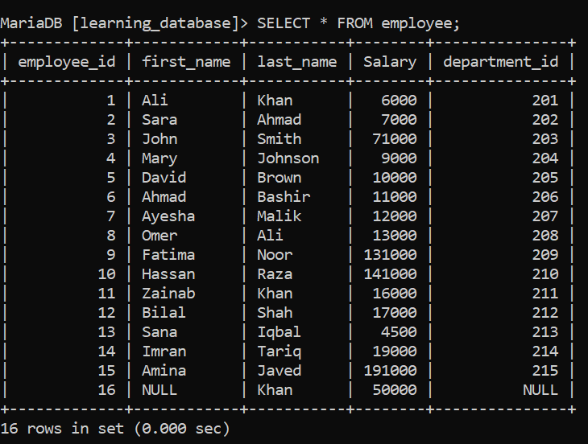
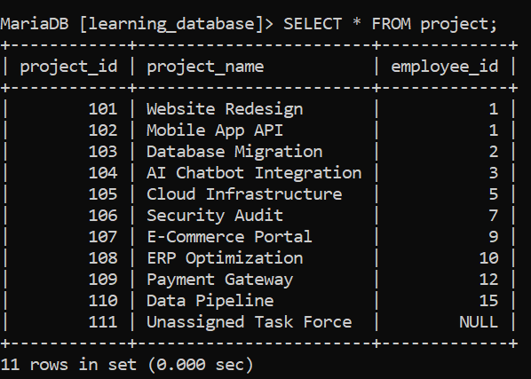
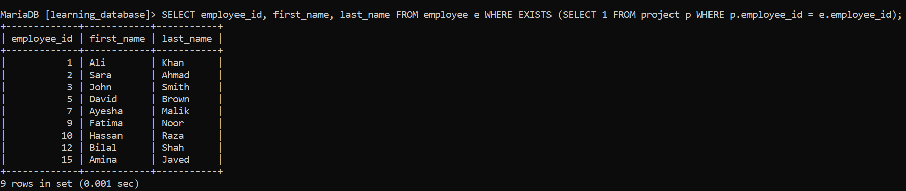
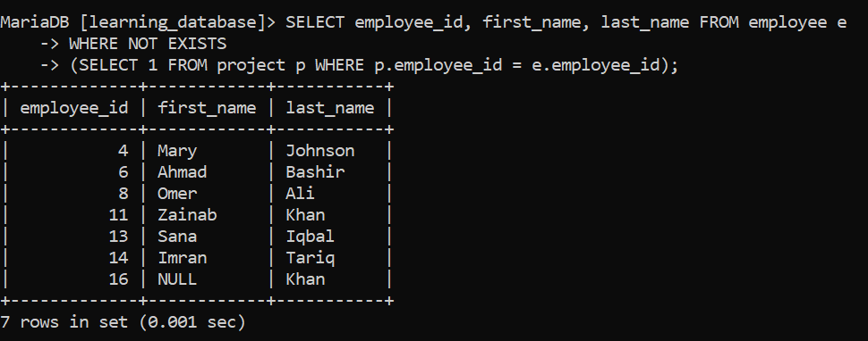
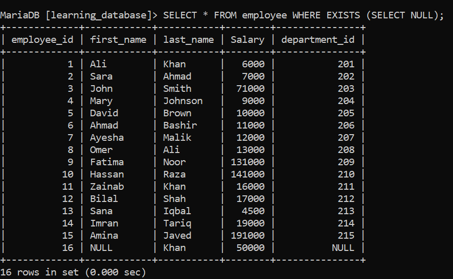

# Special Operator: EXISTS

The `EXISTS` operator is a logical operator used to test for the **existence of any record** in a subquery. It evaluates to `TRUE` as soon as the subquery returns at least one row, and `FALSE` if the subquery returns no rows.

Unlike operators that compare specific column values (like `=` or `IN`), `EXISTS` checks whether matching records **exist** at all — it doesn't care about the actual values returned.

---

### Syntax

```sql
SELECT column_name(s)
FROM table_name
WHERE EXISTS (
    SELECT 1
    FROM another_table
    WHERE condition
);
```

---

**Performance Tip:** You can write `SELECT 1` or `SELECT *` inside the `EXISTS` subquery. The database engine ignores the selected columns entirely because it only cares whether at least one row is returned. Writing `SELECT 1` is standard practice, since it makes it clear to anyone reading the query that the actual column values don't matter.

---

> For the practice examples below, we will use two related tables:

- `employee`: `employee_id`, `first_name`, `last_name`, `salary`, `department_id`



- `project`: `project_id`, `project_name`, `employee_id`



---

**Key Use Cases:**

## 1. Correlated Subqueries (Filtering Based on Related Records)

The most common use of `EXISTS` is with a **correlated subquery** — a subquery that references a column from the outer query.

**SQL Query:** Find all employees who are assigned to at least one project.

```sql
SELECT employee_id, first_name, last_name
FROM employee e
WHERE EXISTS (
    SELECT 1
    FROM project p
    WHERE p.employee_id = e.employee_id
);
```

**Output:**



**Explanation:**

How SQL executes this:

1. SQL picks the first employee row (e.g., `employee_id = 101`).
2. It passes `101` into the subquery and checks if any matching rows exist in `project`.
3. As soon as it finds one project for `101`, the subquery returns `TRUE` (short-circuiting further search in `project`), and `101` is added to the final output.
4. It repeats this process for every employee row.

## 2. The Inverse: NOT EXISTS

To find records in the outer table that do **not** have corresponding entries in another table, use `NOT EXISTS`.

**SQL Query:** Find all employees who are not assigned to any project.

```sql
SELECT employee_id, first_name, last_name
FROM employee e
WHERE NOT EXISTS (
    SELECT 1
    FROM project p
    WHERE p.employee_id = e.employee_id
);
```

**Output:**



---

> **Advanced Rules & Gotchas**

## 3. How EXISTS Handles NULL Values (Safe Against NULL)

One of the biggest advantages of `EXISTS` over `IN` is how safely it handles `NULL` values.

- **With `IN` / `NOT IN`:** If a subquery returns a `NULL`, `NOT IN` will fail silently and return zero rows for the entire outer query — a very common and dangerous bug.
- **With `EXISTS` / `NOT EXISTS`:** `EXISTS` only checks for the presence of a row. Even if a row consists entirely of `NULL` values, the row still exists, so `EXISTS` returns `TRUE`.

```sql
SELECT * FROM employee
WHERE EXISTS (SELECT NULL);
```

**Output:**



**Note:**
> **Rule of Thumb:** Always prefer `NOT EXISTS` over `NOT IN` when working with subqueries that might contain `NULL` values.

## 4. How EXISTS Evaluates (Short-Circuit Behavior)

`EXISTS` uses short-circuit evaluation.

If a subquery matches 1,000 rows in a target table, `EXISTS` does not process all 1,000 rows. The moment it finds the first matching row, it stops scanning and immediately returns `TRUE`. This makes `EXISTS` highly efficient for large datasets.

## 5. EXISTS vs. IN vs. JOIN: When to Use Which?

| Scenario | Recommended Operator | Why? |
| :--- | :--- | :--- |
| Checking existence in a large subquery | `EXISTS` | Stops searching at the first match (short-circuiting). |
| Subquery might contain `NULL` values | `NOT EXISTS` | Safe against `NULL` logic traps (unlike `NOT IN`). |
| Checking against a small, static list | `IN (1, 2, 3)` | Cleaner and easier to write. |
| You need columns from both tables in the final output | `INNER JOIN` | `EXISTS` can only select columns from the main (outer) table. |

## 6. Usage in Other Clauses

`EXISTS` is primarily used in `WHERE` clauses, but it can also be used in conditional control-flow statements in procedural database languages (like PL/SQL or T-SQL):

```sql
IF EXISTS (SELECT 1 FROM employee WHERE salary > 100000)
BEGIN
    PRINT 'High earners exist in the company.';
END;
```

## 7. Things to Keep in Mind

- `EXISTS` returns a boolean (`TRUE`/`FALSE`); it never returns actual data from the subquery itself.
- Correlated subqueries (where the inner query references the outer query's columns) are what make `EXISTS` powerful — without correlation, it just checks whether the subquery returns any row at all, regardless of the outer row.
- `EXISTS` can be combined with `AND`/`OR` and other conditions in the same `WHERE` clause, just like any other boolean expression.
- For large datasets with a proper index on the join column (e.g., `project.employee_id`), `EXISTS` is typically faster than `IN` because of its short-circuiting behavior.
- Some database engines (like PostgreSQL and modern MySQL/SQL Server versions) automatically rewrite `EXISTS`, `IN`, and `JOIN` into semantically equivalent execution plans when possible — so performance differences can vary depending on the engine, indexing, and data size. Always check the execution plan when performance really matters.

---

[← Back to main README](./README.md) | [← Previous Day (Day 41)](./Day-41-Special_Operator_IN.md) | [Next Day (Day 43) →](./Day-43-Special_Operator_LIKE.md)