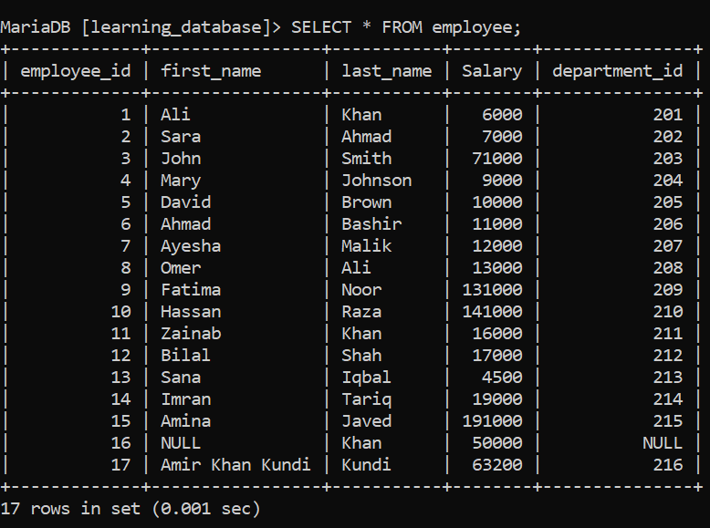
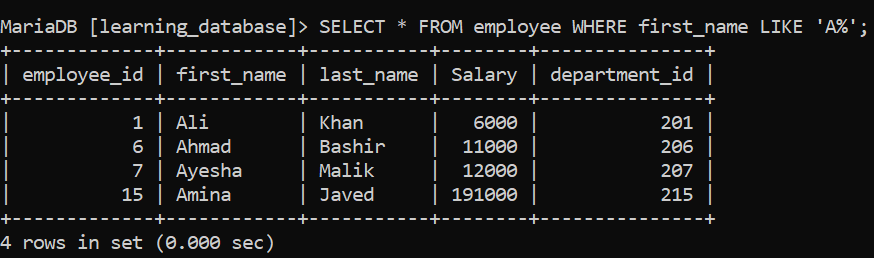
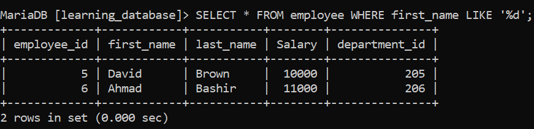
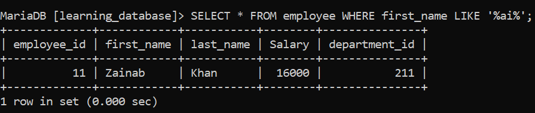
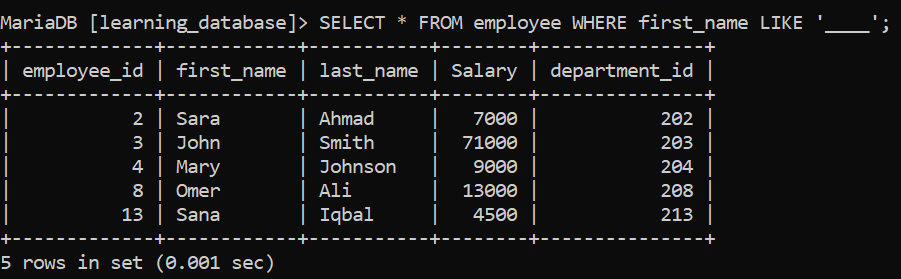
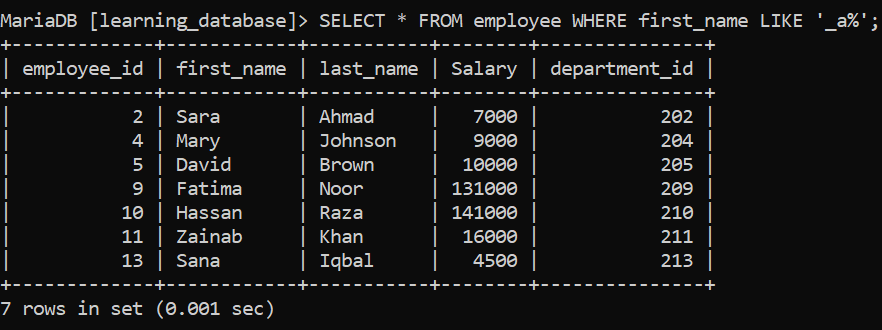
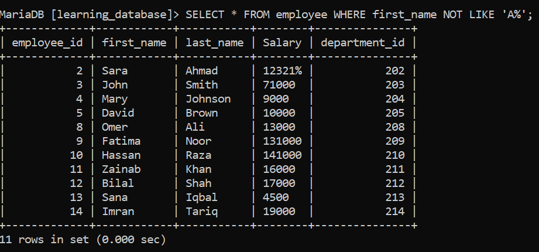

# Special Operator: LIKE

The `LIKE` operator is used in a `WHERE` clause to search for a specified pattern in a column. It performs **pattern matching** on string/text data using special wildcard characters.

Unlike exact equality (`=`), which requires an exact string match, `LIKE` allows you to find partial matches, specific prefixes, suffixes, or substrings.

---

### Syntax

```sql
SELECT column_name(s)
FROM table_name
WHERE column_name LIKE 'pattern';
```

---

> For the practice examples below, we will use the following table:

- `employee`: `employee_id`, `first_name`, `last_name`, `salary`, `department_id`



---

## 1. Match Strings Starting with Specific Characters (Percent Sign):

To find values that begin with a specific letter or substring, place the `%` wildcard at the end.

**SQL Query:** Find all employees whose `first_name` starts with `'A'`.

```sql
SELECT * FROM employee WHERE first_name LIKE 'A%';
```

**Output:**



## 2. Match Strings Ending with Specific Characters (Percent Sign):

To find values that end with a specific letter or substring, place the `%` wildcard at the beginning.

**SQL Query:** Find all employees whose `first_name` ends with `'d'`.

```sql
SELECT * FROM employee WHERE first_name LIKE '%d';
```

**Output:**



## 3. Match Strings Containing Specific Characters (Percent Sign):

To find values that contain a specific substring anywhere inside them, surround the text with `%` wildcards on both sides.

**SQL Query:** Find all employees whose `first_name` contains `'ai'`.

```sql
SELECT * FROM employee WHERE first_name LIKE '%ai%';
```

**Output:**



---

**Percent Sign (`%`):**

Represents zero, one, or multiple characters.

- Placed at the start, like `'A%'`, it matches any string that **starts** with the letter A, regardless of what follows or how long it is.
- Placed at the end, like `'%i'`, it matches any string that **ends** with the letter i, regardless of what comes before or how long it is.
- Placed on both sides, like `'A%i'`, it matches any string that **starts** with A and **ends** with i, regardless of length or the characters in between.

---

## 4. Match Specific Length / Positions (`_` Underscore):

**`_` (Underscore):** Represents exactly one single character.

Use the `_` wildcard to match an exact number of characters, or to pin down a character at a specific position.

**SQL Query 1:** Find all employees whose `first_name` is exactly 4 characters long.

```sql
SELECT * FROM employee WHERE first_name LIKE '____';
```

**Output:**



**SQL Query 2:** Find all employees whose `first_name` has `'a'` as the second character.

```sql
SELECT * FROM employee WHERE first_name LIKE '_a%';
```

**Output:**



---

## 5. NOT LIKE:

To find rows that do **not** match a given pattern, use `NOT LIKE`.

**SQL Query:** Find all employees whose `first_name` does not start with `'A'`.

```sql
      SELECT * FROM employee WHERE first_name NOT LIKE 'A%';
```

**Output:**

   

---

## 6. Escaping Wildcard Characters:

Since `%` and `_` are special characters to `LIKE`, you need to escape them if you actually want to search for a literal `%` or `_` in the data (e.g., a column that stores values like `"50%_discount"`).

**SQL Query:** Find records where the value literally contains a `%` character.

```sql
      SELECT * FROM discounts WHERE code LIKE '%50\%%' ESCAPE '\';
```

Here, `\` is defined as the escape character, so `\%` is treated as a literal percent sign instead of a wildcard. The escape character can be any character you choose, as long as you declare it with the `ESCAPE` clause.

---

## 7. Case Sensitivity:

Whether `LIKE` is case-sensitive depends on the database engine and the column's collation:

- **MySQL:** By default, `LIKE` is usually case-**insensitive** (depends on the collation of the column).
- **PostgreSQL:** `LIKE` is case-**sensitive** by default. Use `ILIKE` for case-insensitive matching.
- **SQL Server:** Case sensitivity depends on the database collation setting.

Always test on your specific database engine rather than assuming behavior.

---

## 8. Performance Considerations:

- A pattern with a wildcard only at the end (e.g., `'A%'`) can typically still use an index, so it performs well on large tables.
- A pattern with a leading wildcard (e.g., `'%d'` or `'%ai%'`) usually **cannot** use a standard index, since the database can't know where the match starts. This forces a full table scan and can be slow on large datasets.
- For frequent substring searches on large tables, consider full-text search features (like `FULLTEXT` indexes in MySQL or `tsvector` in PostgreSQL) instead of `LIKE '%text%'`.

---

[← Back to main README](./README.md) | [← Previous Day (Day 42)](./Day-42-Special-Operatpor_EXISTS.md) | [Next Day (Day 44) →](./Day-43-Special_Operator_LIKE.md)