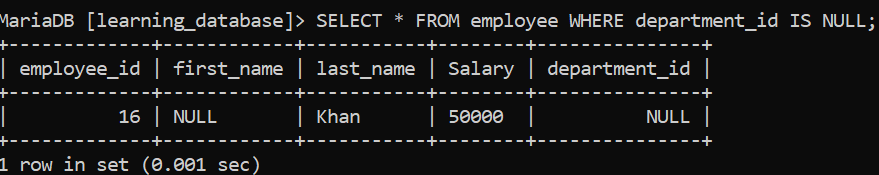
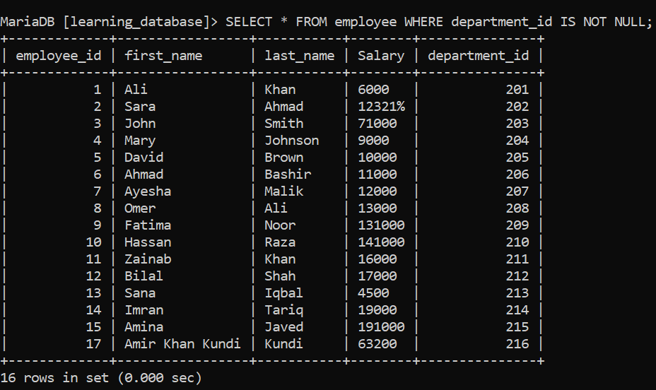

# IS NULL and IS NOT NULL Operators:

`NULL` represents a **missing, unassigned, or unknown value**, it is not the same as zero, an empty string, or any other value. The `IS NULL` and `IS NOT NULL` operators are used specifically to check for the presence or absence of `NULL` in a column.

Standard equality (`= NULL`) does **not** work in SQL, because `NULL` represents an unknown state rather than a specific value and comparing anything to "unknown" always yields "unknown," never `TRUE`. So you must use `IS NULL` instead of `= NULL`, and `IS NOT NULL` instead of `!= NULL` or `<> NULL`.

> For the practice examples below, we will use the following table:

- `employee`: `employee_id`, `first_name`, `last_name`, `salary`, `department_id`


### Syntax

```sql
SELECT column_name(s)
FROM table_name
WHERE column_name IS NULL;
```

```sql
SELECT column_name(s)
FROM table_name
WHERE column_name IS NOT NULL;
```

---

## 1. Find All Employees with NULL Values in the `department_id` Column:

**SQL Query:** Find all employees whose `department_id` is NULL.

```sql
SELECT * FROM employee WHERE department_id IS NULL;
```

**Output:**



---

## 2. Find All Employees with Non-NULL Values in the `department_id` Column:

**SQL Query:** Find all employees whose `department_id` is NOT NULL.

```sql
SELECT * FROM employee WHERE department_id IS NOT NULL;
```

**Output:**



---

## 3. Combining with Other Conditions:

`IS NULL` and `IS NOT NULL` can be combined with `AND`/`OR` just like any other condition.

**SQL Query:** Find all employees with no department assigned and a salary above 50,000.

```sql
SELECT * FROM employee
WHERE department_id IS NULL
AND salary > 50000;
```

---

## 4. Replacing NULL with a Default Value:

Instead of just filtering out `NULL`s, you often want to display a fallback value in their place. Use `COALESCE()` (standard SQL, works across most databases) or database-specific functions like `IFNULL()` (MySQL) / `ISNULL()` (SQL Server).

**SQL Query:** Show department IDs, replacing any NULL with `'Not Assigned'`.

```sql
SELECT employee_id, first_name, COALESCE(department_id, 'Not Assigned') AS department_id
FROM employee;
```

---

## 5. NULL in Aggregate Functions:

Aggregate functions like `SUM()`, `AVG()`, `COUNT()`, `MIN()`, and `MAX()` **ignore `NULL` values** by default (except `COUNT(*)`, which counts all rows regardless of `NULL`s).

```sql
SELECT COUNT(*) AS total_rows, COUNT(department_id) AS non_null_departments
FROM employee;
```

Here, `COUNT(*)` returns the total number of rows, while `COUNT(department_id)` returns only the count of rows where `department_id` is **not** `NULL`.

---

## 6. NULL and Sorting (ORDER BY):

How `NULL` values are positioned when sorting depends on the database engine:

- **MySQL:** `NULL` values are treated as the smallest possible value, so they appear first in ascending order (`ORDER BY column_name ASC`) and last in descending order.
- **PostgreSQL:** `NULL` values sort **last** in ascending order and **first** in descending order by default. Use `NULLS FIRST` or `NULLS LAST` to control this explicitly.
- **SQL Server:** Similar to MySQL, `NULL`s are treated as the lowest value by default.

**SQL Query (PostgreSQL):** Force NULLs to appear at the end regardless of sort order.

```sql
SELECT * FROM employee ORDER BY department_id ASC NULLS LAST;
```

---

## 7. Things to Keep in Mind:

- `NULL` is not equal to anything not even another `NULL`. `NULL = NULL` evaluates to unknown, not `TRUE`.
- Never use `= NULL` or `!= NULL` in a `WHERE` clause; they will silently return no matching rows instead of an error.
- Most aggregate functions ignore `NULL`s automatically, which can skew results if you're not aware of it always check whether `NULL`s should be included or excluded from a calculation.
- Use `COALESCE()` when you want to display or calculate with a fallback value instead of `NULL`.

---

[← Back to main README](./README.md) | [← Previous Day (Day 43)](./Day-43-Special_Operator_LIKE.md) | [Next Day (Day 45) →](./Day-45-Special_Operator_ALL.md)