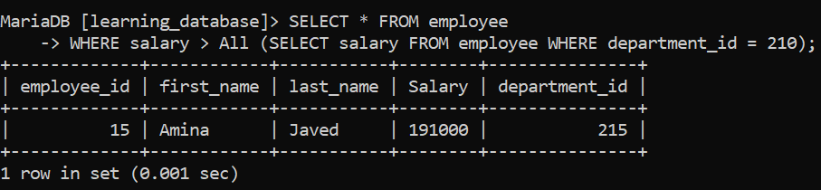
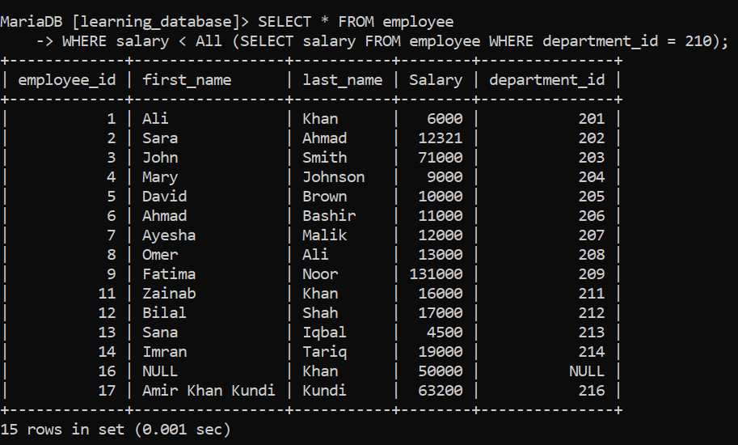
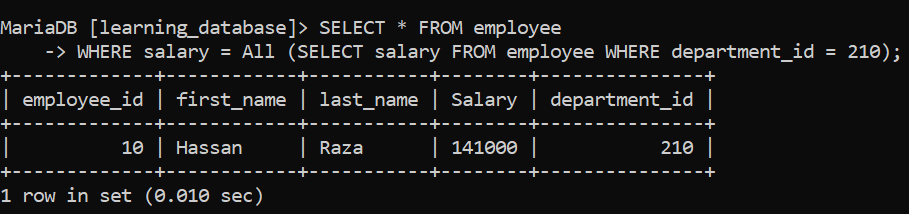
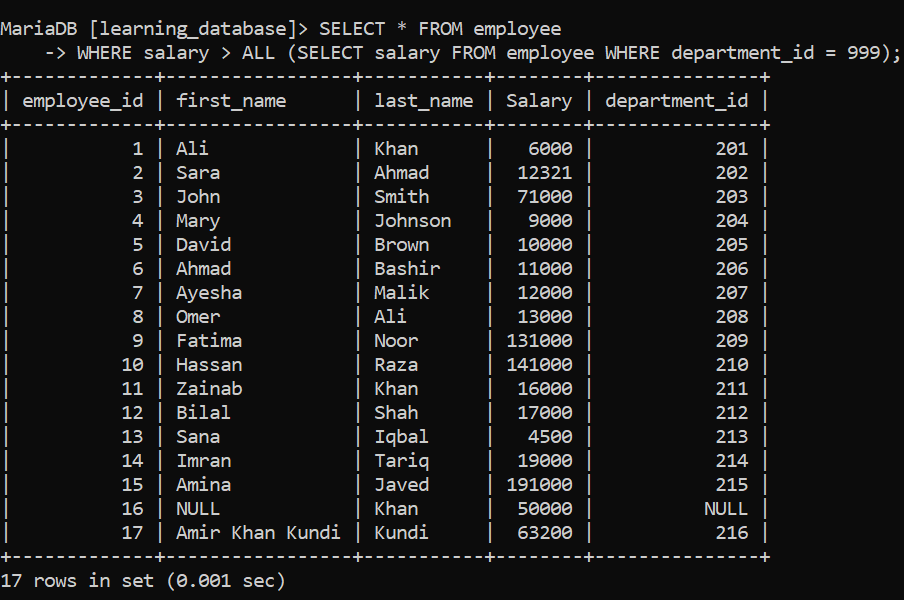
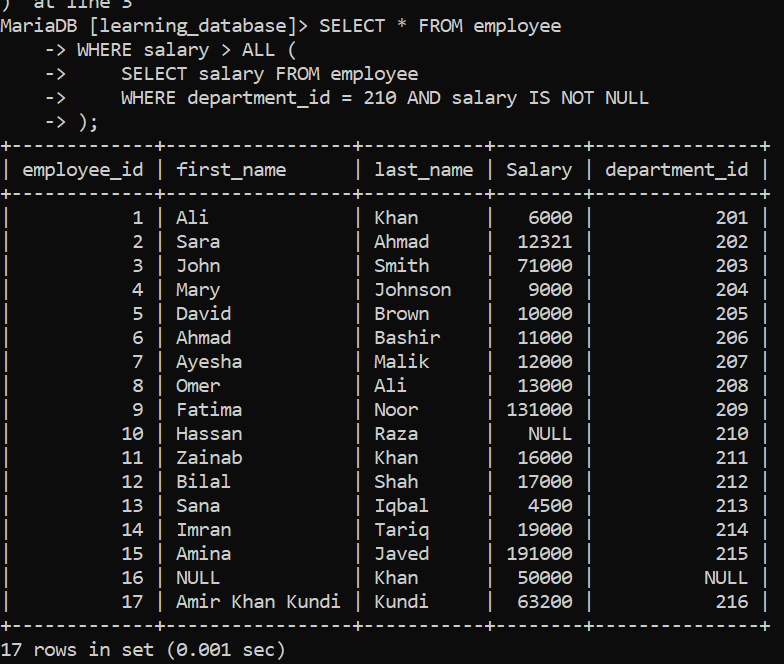

# Special Operator: ALL:

The `ALL` operator compares a single scalar value to **every** value returned by a subquery. The comparison must evaluate to `TRUE` against **every single row** returned by the subquery for the outer row to be selected.

`ALL` is always used together with a comparison operator (`=`, `!=`, `>`, `<`, `>=`, `<=`) — it is never used on its own.

> For the practice examples below, we will use the following table:

- `employee`: `employee_id`, `first_name`, `last_name`, `salary`, `department_id`


### Syntax

```sql
SELECT column_name(s)
FROM table_name
WHERE column_name operator ALL (subquery);
```

---

## 1. Find Employees with Salary Greater than All Employees in Department 210:

**SQL Query:** Find all employees whose salary is greater than the salary of every employee in department 210.

```sql
SELECT * FROM employee
WHERE salary > ALL (SELECT salary FROM employee WHERE department_id = 210);
```

**Output:**



**Explanation:**

This query effectively finds the **maximum** salary in department 210 and returns every employee whose salary is higher than that maximum. In other words, `salary > ALL (subquery)` is logically equivalent to `salary > (SELECT MAX(salary) FROM ...)`.

---

## 2. Find Employees with Salary Less than All Employees in a Department:

**SQL Query:** Find all employees whose salary is less than the salary of every employee in department 210.

```sql
SELECT * FROM employee
WHERE salary < ALL (SELECT salary FROM employee WHERE department_id = 210);
```

**Output:**



This is logically equivalent to `salary < (SELECT MIN(salary) FROM ...)`,  it finds employees whose salary is lower than even the lowest-paid employee in department 210.

---

## 3. ALL with Equality (`= ALL`):

`= ALL` only makes sense when the subquery returns a single distinct value repeated across all rows, since a value can only be equal to every row in the subquery if they're all the same. In most real cases, `= ALL` returns very few or no rows unless the subquery result set has just one unique value.

```sql
SELECT * FROM employee
WHERE salary = ALL (SELECT salary FROM employee WHERE department_id = 210);
```

**Output:**



For most practical "match any of these values" use cases, `IN` or `= ANY` is the operator you actually want, not `= ALL`.

---

## 4. ALL vs. ANY / SOME:

`ALL` is often confused with `ANY` (also called `SOME` in some databases), they behave very differently:

| Operator | Condition Must Be TRUE For | Example Meaning |
| :--- | :--- | :--- |
| `> ALL (subquery)` | **Every** row in the subquery | Greater than the maximum value |
| `> ANY (subquery)` | **At least one** row in the subquery | Greater than the minimum value |

**SQL Query:** Find employees whose salary is greater than at least one employee in department 210 (i.e., not the lowest-paid).

```sql
SELECT * FROM employee
WHERE salary > ANY (SELECT salary FROM employee WHERE department_id = 210);
```

**Output:**

   

---

## 5. Important Gotcha: Empty Subquery Results:

If the subquery inside `ALL` returns **zero rows**, the entire `ALL` condition evaluates to `TRUE` for every row in the outer query, because there's no value that fails the comparison. This can lead to surprising results if you expect an empty subquery to mean "no matches."

```sql
-- If department_id = 999 doesn't exist, this returns ALL employees
SELECT * FROM employee
WHERE salary > ALL (SELECT salary FROM employee WHERE department_id = 999);
```

**Output:**



---

## 6. ALL and NULL Values:

If the subquery returns any `NULL` value alongside other values, most comparison operators against `ALL` will evaluate to `UNKNOWN` for rows being compared against that `NULL`, effectively excluding them from the result. It's good practice to filter out `NULL`s in the subquery explicitly:

```sql
SELECT * FROM employee
WHERE salary > ALL (
    SELECT salary FROM employee
    WHERE department_id = 210 AND salary IS NOT NULL
);
```

**Output:**



---

## 7. Things to Keep in Mind:

- `ALL` must always be paired with a comparison operator; it cannot be used alone.
- `> ALL` is equivalent to comparing against the subquery's maximum value; `< ALL` is equivalent to comparing against its minimum.
- An empty subquery result makes `ALL` evaluate to `TRUE` for every outer row — a common source of unexpected results.
- `NULL` values inside the subquery can silently exclude rows from the result; filter them out with `IS NOT NULL` if needed.
- For "match any single value in a list" logic, use `IN` or `= ANY` instead of `= ALL`.

---

[← Back to main README](./README.md) | [← Previous Day (Day 44)](./Day-44-Special_Operator_IS_NULL_and_IS_NOT_NULL.md) | [Next Day (Day 46) →](./Day-46-Special_Operator_ANY_or_SOME.md)