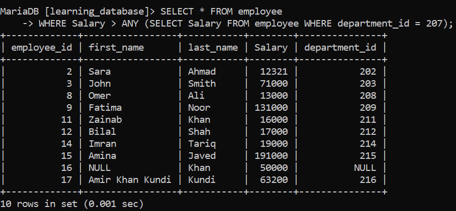
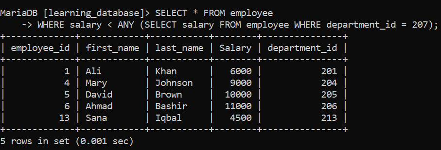
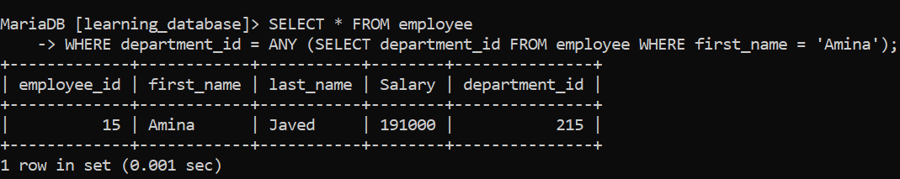
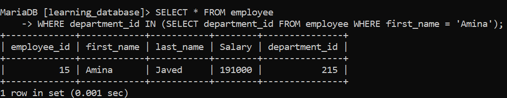
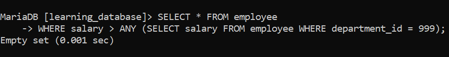
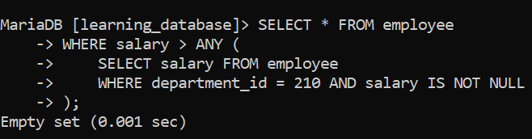

# ANY / SOME Special Operator in SQL:

The `ANY` operator compares a single scalar value to the values returned by a subquery. The condition only needs to evaluate to `TRUE` for **at least one** row in the subquery for the outer row to be selected.

`SOME` is an exact synonym for `ANY`, the two keywords are interchangeable in every major database engine. Like `ALL`, `ANY`/`SOME` must always be paired with a comparison operator (`=`, `!=`, `>`, `<`, `>=`, `<=`).

> For the practice examples below, we will use the following table:

- `employee`: `employee_id`, `first_name`, `last_name`, `salary`, `department_id`


### Syntax

```sql
SELECT column_name(s)
FROM table_name
WHERE column_name operator ANY/SOME (subquery);
```

---

## 1. Find Employees with Salary Greater than Any Employee in a Department:

**SQL Query:** Find all employees whose salary is greater than the salary of at least one employee in department 207.

```sql
SELECT * FROM employee
WHERE salary > ANY (SELECT salary FROM employee WHERE department_id = 207);
```

**Output:**



**Explanation:**

This query effectively finds the **minimum** salary in department 207 and returns every employee whose salary is higher than that minimum. In other words, `salary > ANY (subquery)` is logically equivalent to `salary > (SELECT MIN(salary) FROM ...)`.

---

## 2. Find Employees with Salary Less than Any Employee in a Department:

**SQL Query:** Find all employees whose salary is less than the salary of at least one employee in department 207.

```sql
SELECT * FROM employee
WHERE salary < ANY (SELECT salary FROM employee WHERE department_id = 207);
```

**Output:**



This is logically equivalent to `salary < (SELECT MAX(salary) FROM ...)`, it finds employees whose salary is lower than at least the highest-paid employee in department 207.

---

## 3. ANY with Equality (`= ANY`):

`= ANY` checks whether the value matches **any single value** in the subquery's result set. This makes `= ANY` functionally identical to `IN`.

```sql
       SELECT * FROM employee
       WHERE department_id = ANY (SELECT department_id FROM employee WHERE first_name = 'Amina');
```

**Output:**



```sql
-- Equivalent using IN
       SELECT * FROM employee
       WHERE department_id IN (SELECT department_id FROM employee WHERE first_name = 'Amina');
```

**Output:**




Most developers prefer `IN` for this exact case since it reads more naturally, and reserve `ANY`/`SOME` for use with `>`, `<`, `>=`, and `<=`.

---

## 4. ANY / SOME vs. ALL:

`ANY` and `ALL` are frequently confused because they look similar but behave in opposite ways:

| Operator | Condition Must Be TRUE For | Example Meaning |
| :--- | :--- | :--- |
| `> ANY (subquery)` | **At least one** row in the subquery | Greater than the minimum value |
| `> ALL (subquery)` | **Every** row in the subquery | Greater than the maximum value |

---

## 5. Important Gotcha: Empty Subquery Results:

If the subquery inside `ANY`/`SOME` returns **zero rows**, the entire condition evaluates to `FALSE` for every row in the outer query the opposite of how `ALL` behaves with an empty subquery (which evaluates to `TRUE`).

```sql
-- If department_id = 999 doesn't exist, this returns NO employees
SELECT * FROM employee
WHERE salary > ANY (SELECT salary FROM employee WHERE department_id = 999);
```

**Output:**


---

## 6. ANY and NULL Values:

If the subquery returns a mix of `NULL` and non-`NULL` values, comparisons against the `NULL` entries evaluate to `UNKNOWN` rather than `TRUE` or `FALSE`. As long as at least one non-`NULL` value in the subquery satisfies the condition, the overall `ANY` result is still `TRUE`, but it's still good practice to exclude `NULL`s explicitly for clarity:

```sql
SELECT * FROM employee
WHERE salary > ANY (
    SELECT salary FROM employee
    WHERE department_id = 210 AND salary IS NOT NULL
);
```

**Output:**



---

## 7. Things to Keep in Mind

- `ANY` and `SOME` are 100% interchangeable pick whichever reads better in context.
- `ANY`/`SOME` must always be paired with a comparison operator; it cannot be used alone.
- `> ANY` is equivalent to comparing against the subquery's minimum value; `< ANY` is equivalent to comparing against its maximum.
- An empty subquery result makes `ANY`/`SOME` evaluate to `FALSE` for every outer row the opposite of `ALL`'s behavior in the same situation.
- For simple "does this value appear in a list" checks, `IN` is generally clearer than `= ANY`, even though they're equivalent.

---

[← Back to main README](./README.md) | [← Previous Day (Day 45)](./Day-45-Special_Operator_ALL.md) | [Next Day (Day 47) →](./Day-47-Special_Operator_REGEXP_or_RLIKE.md)