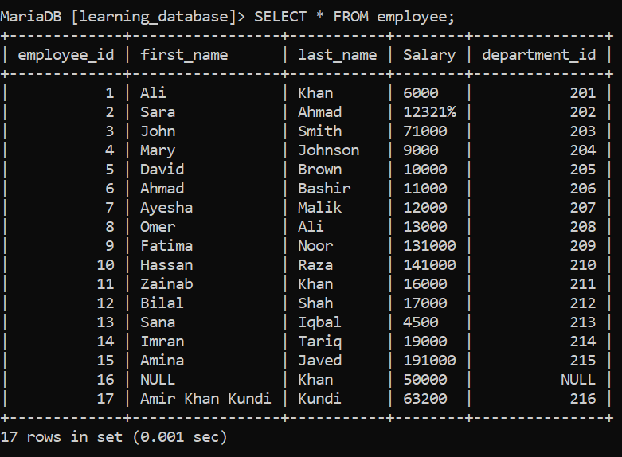
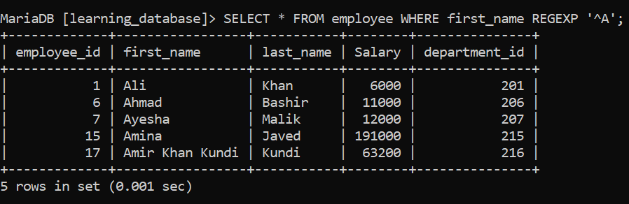
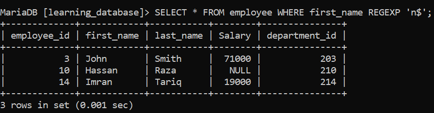
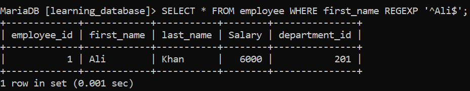
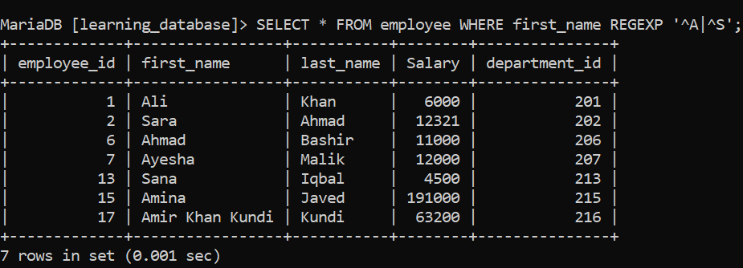
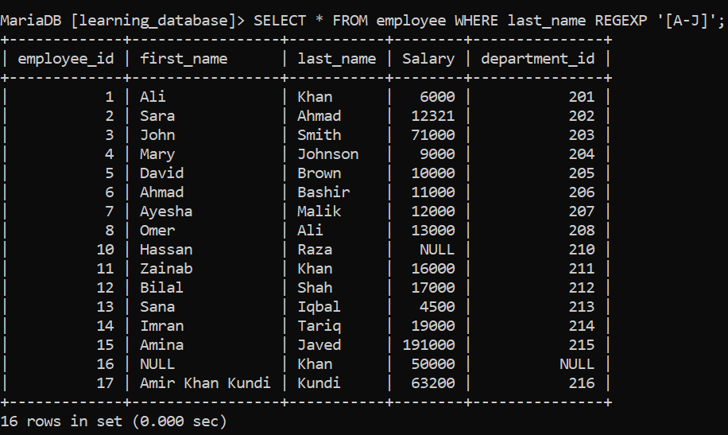
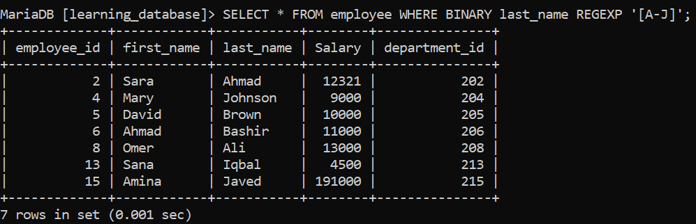
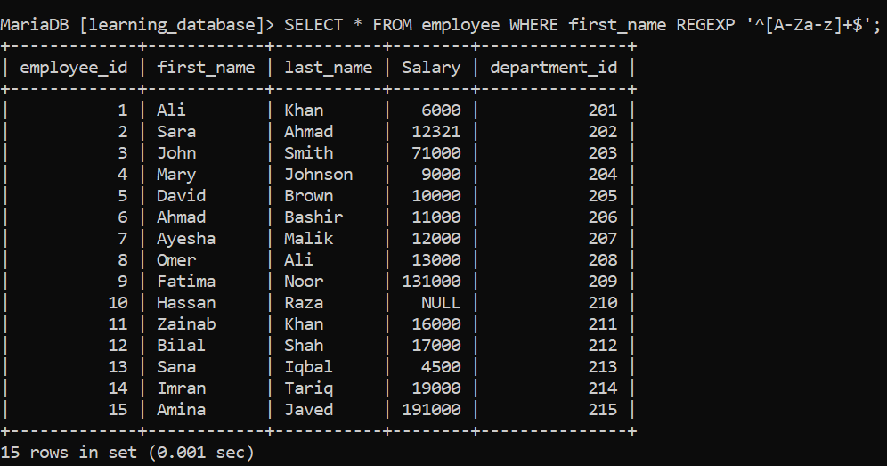
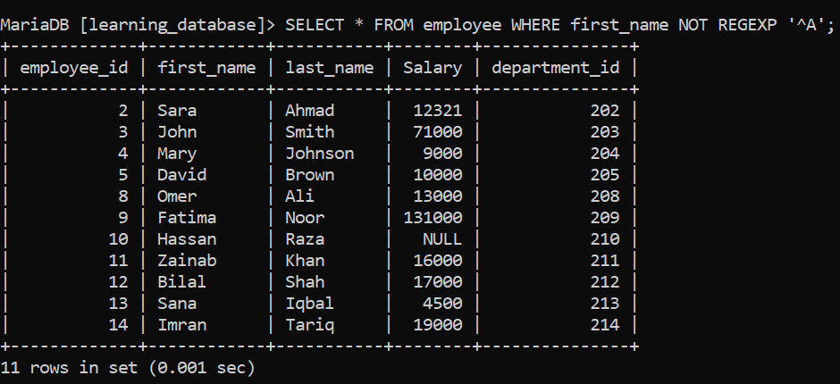

# REGEXP / RLIKE Special Operator:

The `REGEXP` operator provides advanced pattern matching using full **Regular Expressions**, instead of the basic wildcards (`%` and `_`) used by `LIKE`.

Instead of matching exact text or simple wildcards, `REGEXP` tests a column against a regular expression pattern. It evaluates to `1` (`TRUE`), `0` (`FALSE`), or `NULL`.

> For the practice examples below, we will use the following table:

- `employee`: `employee_id`, `first_name`, `last_name`, `salary`, `department_id`



### Syntax

```sql
SELECT column_name(s)
FROM table_name
WHERE column_name REGEXP 'pattern';
```

**Key Attributes of the REGEXP Operator:**

1. **Synonyms:** `RLIKE` is an exact synonym for `REGEXP` in MySQL/MariaDB.
2. **Negation:** You can negate it using `NOT REGEXP` or `NOT RLIKE`.
3. **In-place usage:** Because it is an operator, it is used directly inside `WHERE`, `HAVING`, or `SELECT` clauses without needing wrapper function parentheses.

**SQL Query:** Find all employees whose `first_name` starts with `'A'`.

```sql
SELECT * FROM employee WHERE first_name REGEXP '^A';
```

**Output:**



---

## 1. Common Regex Building Blocks:

| Pattern | Meaning | Example |
| :--- | :--- | :--- |
| `^` | Start of string | `'^A'` matches strings starting with A |
| `$` | End of string | `'n$'` matches strings ending with n |
| `.` | Any single character | `'a.b'` matches "aab", "acb", "a1b", etc. |
| `*` | Zero or more of the previous character | `'ab*'` matches "a", "ab", "abb", etc. |
| `+` | One or more of the previous character | `'ab+'` matches "ab", "abb" but not "a" |
| `[abc]` | Any one character in the set | `'[aeiou]'` matches any vowel |
| `[^abc]` | Any character NOT in the set | `'[^0-9]'` matches any non-digit |
| `[a-z]` | Any character in the range | `'[a-z]'` matches any lowercase letter |
| `\|` | Alternation (OR) | `'cat\|dog'` matches "cat" or "dog" |
| `{n,m}` | Between n and m repetitions | `'a{2,4}'` matches "aa" through "aaaa" |

---

## 2. Anchors: Start and End of String:

**SQL Query:** Find employees whose `first_name` ends with `'n'`.

```sql
SELECT * FROM employee WHERE first_name REGEXP 'n$';
```

**Output:**



**SQL Query:** Find employees whose `first_name` is exactly `'Ali'` (nothing before or after).

```sql
SELECT * FROM employee WHERE first_name REGEXP '^Ali$';
```

**Output:**



---

## 3. Alternation: Matching Multiple Patterns at Once:

Unlike `LIKE`, which can only test one pattern per call, `REGEXP` can match several alternatives in a single expression using `|` Alternation Operator (commonly referred to as the OR operator or Pipe character).

**SQL Query:** Find employees whose `first_name` starts with either `'A'` or `'S'`.

```sql
SELECT * FROM employee WHERE first_name REGEXP '^A|^S';
```

**Output:**




This is a common use case where `REGEXP` is far more concise than stacking multiple `LIKE ... OR LIKE ...` conditions.

---

## 4. Character Classes:

**SQL Query:** Find employees whose `last_name` contains any digit (useful for catching bad/dirty data).

```sql
SELECT * FROM employee WHERE last_name REGEXP '[A-J]';
```

**Output:**



**Case-Sensitive Range Match:** You can use the BINARY operator with character classes like [A-J] to enforce a case-sensitive range match, ensuring it matches only uppercase letters A through J while ignoring lowercase letters a through j.



**SQL Query:** Find employees whose `first_name` contains only letters (no digits or special characters).

```sql
SELECT * FROM employee WHERE first_name REGEXP '^[A-Za-z]+$';
```

**Output:**



---

## 5. Negation with NOT REGEXP:

**SQL Query:** Find employees whose `first_name` does NOT start with `'A'`.

```sql
SELECT * FROM employee WHERE first_name NOT REGEXP '^A';
```

**Output:**



---

## 6. REGEXP vs. LIKE: When to Use Which:

| Scenario | Recommended Operator | Why? |
| :--- | :--- | :--- |
| Simple prefix/suffix/substring match | `LIKE` | Simpler syntax, easier to read, often better optimized. |
| Matching multiple alternative patterns | `REGEXP` | `LIKE` can't express "starts with A OR S" in one pattern. |
| Validating format (emails, phone numbers, codes) | `REGEXP` | Regular expressions can express complex structural rules. |
| Matching based on character sets/ranges | `REGEXP` | `LIKE` has no equivalent to `[a-z]` or `[^0-9]`. |

---

## 7. Case Sensitivity:

Case sensitivity for `REGEXP` depends on the database engine and collation, similar to `LIKE`:

- **MySQL:** By default, `REGEXP` is usually case-insensitive with the default collation, but this depends on the column's collation settings.
- **PostgreSQL:** Uses `~` for case-sensitive regex matching and `~*` for case-insensitive matching (PostgreSQL does not use the `REGEXP`/`RLIKE` keywords).
- **SQL Server:** Does not support `REGEXP` natively; pattern matching close to this is typically done via `LIKE` with limited wildcards, or CLR functions for full regex support.

Always verify behavior on your specific database engine.

---

## 8. Performance Considerations:

- `REGEXP` generally cannot use standard indexes, since the database must evaluate the expression row by row. This makes it slower than `LIKE` on large tables, especially with complex patterns.
- Reserve `REGEXP` for cases where `LIKE`'s wildcards genuinely aren't expressive enough (e.g., validating formats or matching alternatives), rather than using it as a default habit for simple pattern matching.

---

[← Back to main README](./README.md) | [← Previous Day (Day 46)](./Day-46-Special_Operator_ANY_or_SOME.md) | [Next Day (Day 48) →](./Day-47-Special_Operator_REGEXP_or_RLIKE.md)