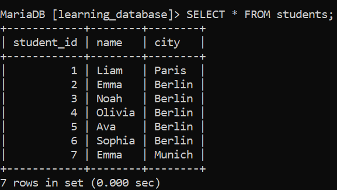
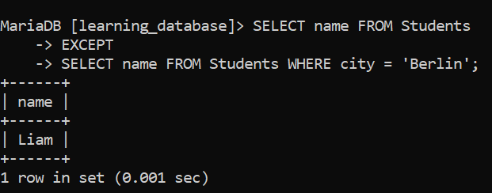
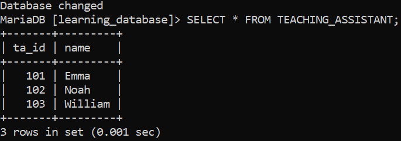
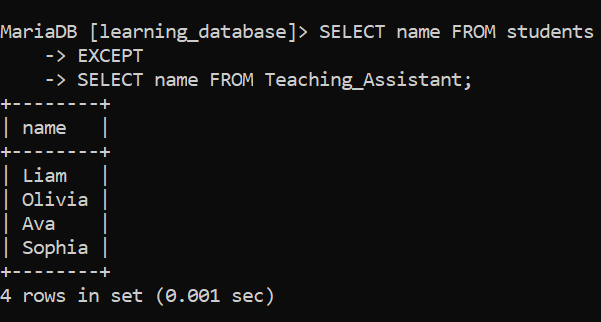
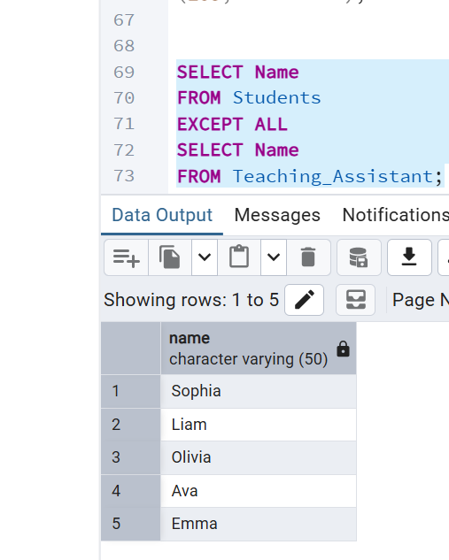

# SQL EXCEPT Operator

The `EXCEPT` operator returns rows from the first query that do **not** appear in the second. It works like subtracting one result set from another, and is useful for identifying unmatched or missing records between tables.

- Returns only rows unique to the first `SELECT`.
- Removes duplicates automatically.
- Helps compare datasets and find non-overlapping records.

---

## 1. Basic Example:

First, we'll create a demo SQL database and table on which to run the `EXCEPT` command.



**Query:**

```sql
SELECT name FROM Students
EXCEPT
SELECT name FROM Students WHERE city = 'Berlin';
```

**Output:**



---

## 2. Syntax of the EXCEPT Operator:

```sql
SELECT column1, column2, ...
FROM table1
EXCEPT
SELECT column1, column2, ...
FROM table2;
```

> **Note:** The two `SELECT` queries must return the same number of columns, and the corresponding data types must be compatible.

---

## 3. Examples of SQL EXCEPT:

For the examples below, we'll use two tables: `Students` and `Teaching_Assistant`.

- `Students` table:


- `Teaching_Assistant` table:



### Example 1: Filter Students

We want to find all the students who are not teaching assistants.

**Query:**

```sql
SELECT Name
FROM Students
EXCEPT
SELECT Name
FROM Teaching_Assistant;
```

**Output:**



### Example 2: Retaining Duplicates with EXCEPT ALL:

By default, `EXCEPT` removes duplicates from the result set. To retain duplicates, use `EXCEPT ALL` instead.

**Query:**

```sql
SELECT Name
FROM Students
EXCEPT ALL
SELECT Name
FROM Teaching_Assistant;
```

**Output:**



> **Note:** `EXCEPT ALL` is supported in databases like PostgreSQL and Oracle, but is not supported in SQLite or MySQL.

---

## 4. SQL EXCEPT vs. SQL NOT IN

| EXCEPT | NOT IN |
| :--- | :--- |
| Removes duplicates from the result | Retains duplicates in the result |
| Generally more efficient for large datasets, as it processes only the required rows | May be slower for large datasets, especially when checking multiple conditions |
| Best used when you need to find rows that exist in one result set but not the other | Best used when you need to check a specific column's values against a list |
| Not supported by MySQL | Supported by most SQL databases |

---

[← Back to main README](./README.md) | [← Previous Day (Day 48)](../Day-48-UNION-and-UNION_ALL-Operator.md) | [Next Day (Day 50) →](../Day-50-INTERSECT-Operator.md)