# Introduction to SQL Views:

## 1. What is a View?:

A **View** in SQL is essentially a **virtual table** based on the result-set of an SQL statement.

- **Virtual Nature**: A standard view does not store data physically on the disk like a regular table does. Instead, it stores a predefined `SELECT` query definition.

- **Dynamic Content**: Every time a user queries a view, the database management system (DBMS) executes the underlying query and generates the data dynamically from the base tables.

- **Table-Like Interaction**: To end-users or client applications, a view behaves just like a standard table. You can run `SELECT` queries on it, join it with other tables or views, and in certain conditions, execute `INSERT`, `UPDATE`, or `DELETE` operations.

---

## 2. Standard View: Syntax & Operations:

### Creating a View:

```sql
CREATE VIEW view_name AS
SELECT column1, column2, ...
FROM table_name
WHERE condition;
```

### Querying a View:

```sql
SELECT * FROM view_name;
```

### Modifying a View:

```sql
CREATE OR REPLACE VIEW view_name AS
SELECT column1, column2, ...
FROM table_name
WHERE new_condition;
```

### Dropping (Deleting) a View:

```sql
DROP VIEW view_name;
```

---

## 3. Core Concepts & Characteristics (Explained with Examples):

To illustrate how views work, let us consider a sample database with two tables: `Employees` and `Departments`.

#### Sample Tables:

**`Employees` Table:**

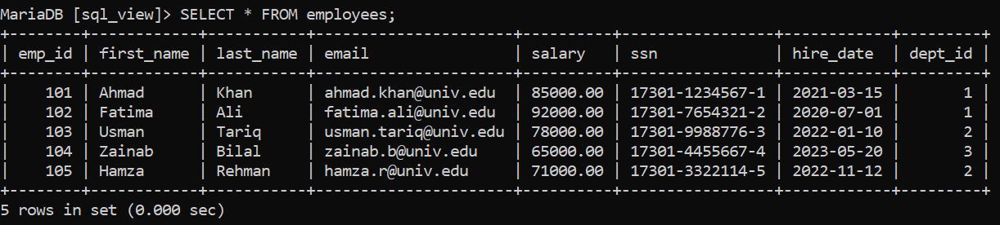

**`Departments` Table:**

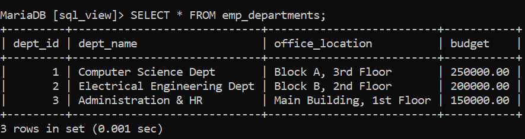

### A. Data Abstraction and Security (Column/Row Hiding):

- **Explanation**: Views allow administrators to restrict access to sensitive data (such as social security numbers, salaries, or internal flags) without creating separate duplicate tables. You expose only the columns and rows that a specific role needs to see.

- **Example**: Suppose recruiters need to see employee names and departments, but should **never** see salaries or Social Security Numbers (`ssn`).

**Query:**

```sql
CREATE VIEW PublicEmployeeDirectory AS
SELECT
    e.first_name,
    e.last_name,
    d.department_name
FROM Employees e
JOIN Departments d ON e.department_id = d.department_id;
```

**Output:**

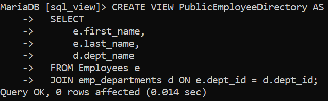

**Querying this view yields:**

```sql
SELECT * FROM PublicEmployeeDirectory;
```

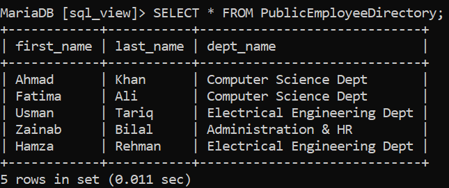

### B. Simplifying Complex Queries:

- **Explanation**: Complex database designs often require multi-table `JOIN` operations, aggregate calculations (`COUNT`, `AVG`, `SUM`), and nested subqueries. A view encapsulates this complexity into a simple reusable identifier.

- **Example**: Department-level statistics:

  ```sql
  CREATE VIEW v_department_payroll_summary AS
  SELECT
    d.dept_id,
    d.dept_name,
    d.budget,
    COUNT(e.emp_id) AS total_employees,
    COALESCE(SUM(e.salary), 0) AS total_payroll_cost,
    d.budget - COALESCE(SUM(e.salary), 0) AS remaining_budget,
    ROUND(AVG(e.salary), 2) AS average_salary
  FROM emp_departments d
  LEFT JOIN employees e ON d.dept_id = e.dept_id
  GROUP BY d.dept_id, d.dept_name, d.budget;
  ```

**Output:**

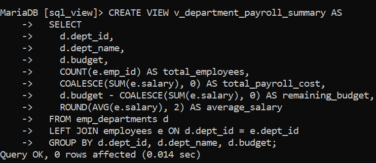

**Querying the view requires no knowledge of the underlying joins or `GROUP BY` logic:**

```sql
SELECT dept_name, total_employees, total_payroll_cost, remaining_budget
FROM v_department_payroll_summary
WHERE remaining_budget > 0;
```

**Query Output:**

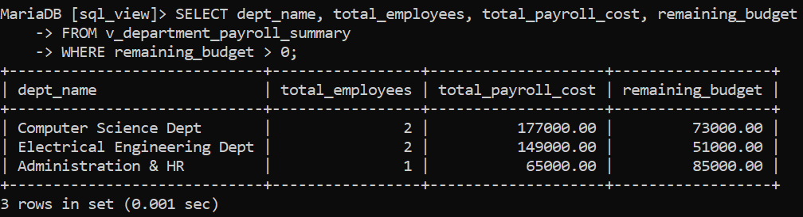

### C. Providing Data Consistency and Standardization:

- **Explanation**: Defining a view ensures everyone across an organization calculates business metrics (e.g., net revenue, active customers, formatted names) using the exact same logic.

- **Example**:

```sql
  CREATE VIEW StandardizedEmployees AS
  SELECT
      emp_id,
      CONCAT(first_name, ' ', last_name) AS full_name,
      salary
  FROM Employees;
```

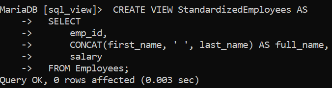

### D. Updatable Views vs. Read-Only Views:

- **Explanation**: Some views allow `UPDATE`, `INSERT`, or `DELETE` statements that propagate directly to the underlying base table.

- **Rules for Updatability:**
  A view is typically **updatable** only if:
  1. It references exactly one base table in the `FROM` clause.

  2. It does **not** contain aggregate functions (`SUM`, `AVG`, etc.).

  3. It does **not** use `DISTINCT`, `GROUP BY`, `HAVING`, or set operators (`UNION`).

- **Example**:

  ```sql
  CREATE VIEW EngineeringStaff AS
  SELECT emp_id, first_name, last_name, salary, dept_id
  FROM Employees
  WHERE dept_id = 1;

  -- Updating through the view:
  UPDATE EngineeringStaff
  SET salary = salary + 5000
  WHERE emp_id = 101;
  -- Updates John Doe's salary in the underlying 'Employees' table.

  SELECT * FROM Employees WHERE emp_id = 101;
  ```

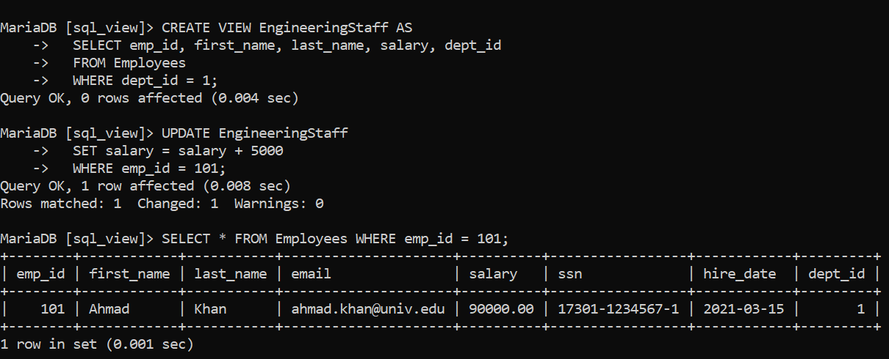

---

## 4. Types of SQL Views:

SQL views are categorized based on their underlying query structure, update capabilities, persistence, and engine role:

| View Type | Number of Tables | Contains Functions / Group By | Updatable (DML)? | Stores Physical Data? |
| :--- | :--- | :--- | :--- | :--- |
| **Simple View** | Only 1 table | No | Yes (Generally) | No |
| **Complex View** | 2 or more tables | Yes (Allowed) | Usually No (Read-only) | No |
| **Inline View** | Any | Yes (Allowed) | No | No (Temporary query block) |
| **Materialized View** | 1 or more | Yes (Allowed) | Direct DML unsupported | Yes (Cached on disk) |
| **System / Catalog View** | Internal metadata | Engine-managed | No (Read-only) | Managed by DB engine |

---

### 1. Simple View:

* **Definition**: Built on top of **a single base table** without grouping functions, aggregates (`SUM`, `AVG`), or `DISTINCT`.

* **Behavior**: Fully transparent to DML operations (`INSERT`, `UPDATE`, `DELETE`) subject to table constraints.

* **Example**:
```sql
CREATE VIEW v_simple_employees AS
SELECT emp_id, first_name, last_name, dept_id
FROM employees;

SELECT * FROM v_simple_employees;
```

**Output**:

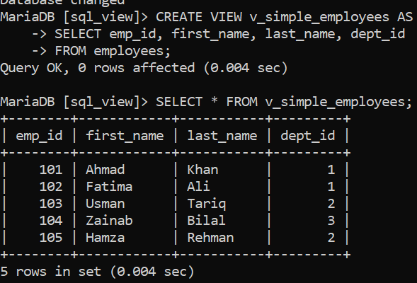

### 2. Complex View:

* **Definition**: Spans **multiple base tables** (via `JOIN`), or contains aggregate functions (`COUNT`, `SUM`, `AVG`), `GROUP BY`, or `HAVING` clauses.

* **Behavior**: Primarily used for reporting and data aggregation. Most database engines treat complex views as **read-only** for direct DML modifications.

* **Example**:
```sql
CREATE VIEW v_complex_dept_summary AS
SELECT 
    d.dept_name,
    COUNT(e.emp_id) AS total_staff,
    AVG(e.salary) AS avg_salary
FROM emp_departments d
LEFT JOIN employees e ON d.dept_id = e.dept_id
GROUP BY d.dept_name;

SELECT * FROM v_complex_dept_summary;
```

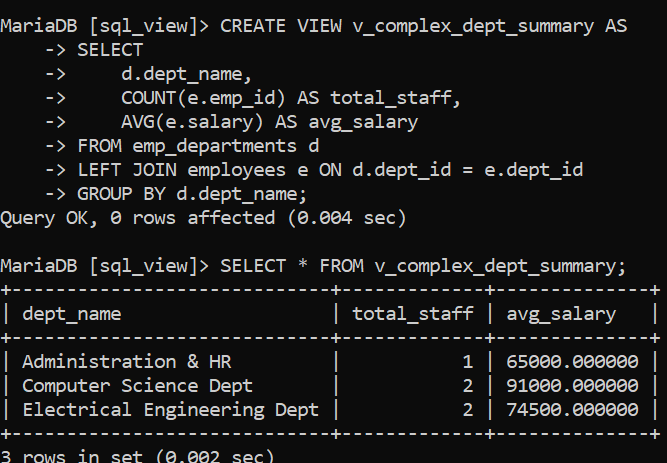

### 3. Inline View:

* **Definition**: An unnamed, transient subquery placed inside the `FROM` clause of a parent `SELECT` statement.

* **Behavior**: It is not saved in the database data dictionary with a name; it only exists for the duration of that single query execution.

* **Example**:
```sql
SELECT 
    dept_summary.dept_id,
    dept_summary.dept_payroll
FROM (
    -- This nested SELECT in FROM is an Inline View
    SELECT dept_id, SUM(salary) AS dept_payroll
    FROM employees
    GROUP BY dept_id
) AS dept_summary
WHERE dept_summary.dept_payroll > 100000;
```

**Output:**

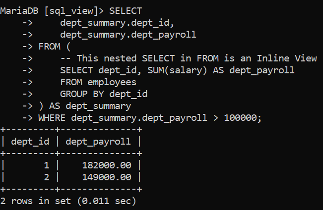

## 5. Materialized Views: Physical Caching for Performance:

### A. What is a Materialized View?

A **Materialized View** (supported in databases like PostgreSQL, Oracle, and Snowflake; known as _Indexed Views_ in SQL Server) is a view that **physically stores the query result on disk**, just like a concrete table.

- **Standard View**: Stores only the query text. Computes data on demand each time you query it.

- **Materialized View**: Computes the query once and saves the resulting rows to disk. When queried, it reads from the precomputed cache rather than touching the source tables.

### B. Why and When to Use Materialized Views?:

- **Heavy Aggregations**: Massive datasets requiring expensive `SUM`, `AVG`, or multi-table joins over millions of rows.

- **Reporting & Dashboards**: Analytical queries (OLAP) that can tolerate slightly stale data in exchange for sub-second response times.

- **Read-Heavy Workloads**: Situations where reads drastically outnumber writes.

### C. Basic Syntax & Examples:

#### 1. Creating a Materialized View:

```sql
-- 1. Create materialized view (PostgreSQL syntax)
CREATE MATERIALIZED VIEW mv_department_payroll_analytics AS
SELECT
    d.dept_id,
    d.dept_name,
    COUNT(e.emp_id) AS total_staff,
    SUM(e.salary) AS total_spent
FROM emp_departments d
LEFT JOIN employees e ON d.dept_id = e.dept_id
GROUP BY d.dept_id, d.dept_name;
```

#### 2. Querying a Materialized View

Querying works exactly like a regular table, but reads from pre-calculated disk storage:

```sql
SELECT * FROM mv_department_payroll_analytics;
```

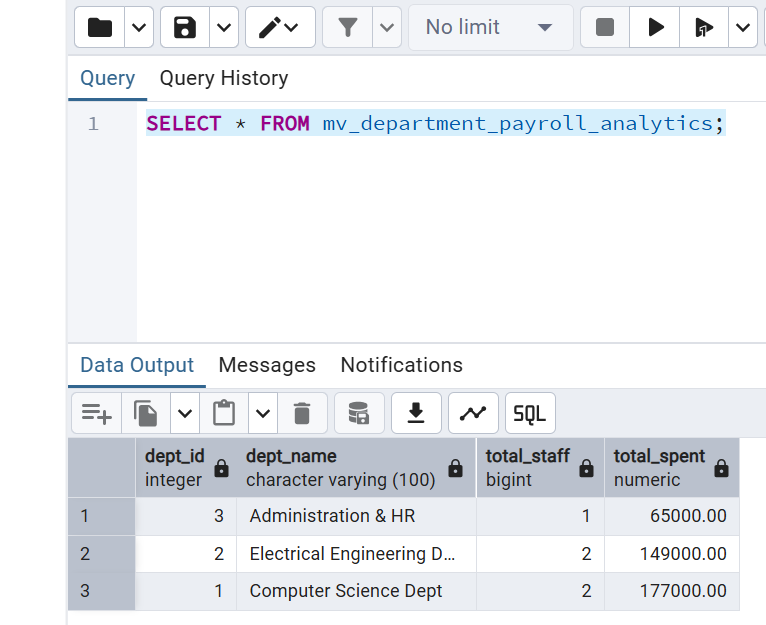

#### 3. Indexing a Materialized View:

Because data physically exists on disk, you can add indexes directly to speed up lookups even further:

```sql
CREATE INDEX idx_mv_dept_id ON mv_department_payroll_analytics(dept_id);
```

#### 4. Refreshing the Data:

Because the data is cached, updates to the base `emp_departments and employees` table will **not** automatically appear in the materialized view until it is refreshed.

- **Manual / On-Demand Refresh**:
  ```sql
  -- Standard refresh (may briefly lock the view)
  REFRESH MATERIALIZED VIEW mv_department_payroll_analytics;

  -- Step 1: Create a UNIQUE index on the materialized view
  -- (A unique index with no NULLs is mandatory for PostgreSQL concurrent refresh)
  CREATE UNIQUE INDEX idx_mv_dept_id_unique
  ON mv_department_payroll_analytics (dept_id);

-- Step 2: Refresh concurrently without blocking reads
  REFRESH MATERIALIZED VIEW CONCURRENTLY mv_department_payroll_analytics;

- **Scheduled Refresh**: Usually triggered via a cron job, database scheduler (like `pg_cron` or Oracle DBMS_SCHEDULER), or ETL pipeline.

---

## 6. Comparison: Standard View vs. Materialized View:

| Feature | Standard View | Materialized View |
| :--- | :--- | :--- |
| **Physical Storage** | No disk space (stores query logic only) | Stored on disk as actual data rows |
| **Data Freshness** | **Always 100% real-time** | **Point-in-time snapshot** (stale until refreshed) |
| **Query Speed** | Slower for complex/large queries | Extremely fast (reads precomputed data) |
| **Indexing** | Cannot index data directly | Can create indexes on view columns |
| **Impact of Base Table Writes** | None (view is computed on read) | Low write overhead (unless auto-refreshed on commit) |
| **Best For** | Real-time queries, security, encapsulation | Business Intelligence, OLAP, heavy aggregations |

---

## 7. Advantages and Limitations Summary:

### Advantages:

1. **Security & Governance**: Restricts row and column access without duplicating base tables.

2. **Simplicity**: Transforms complex joins and aggregations into clean, readable queries.

3. **Consistency**: Encapsulates common business logic in one reusable database object.

4. **Performance Tuning**: Materialized views offer massive speedups for analytical workloads.

### Limitations:

1. **Standard View Overhead**: Standard views can suffer severe latency when querying massive datasets with complex joins.

2. **Data Staleness in Materialized Views**: Must manage refresh cycles to prevent obsolete reporting.

3. **Updatability Constraints**: Only a narrow subset of standard views can handle `INSERT`/`UPDATE`/`DELETE` operations; materialized views are almost always read-only through direct query.

4. **Dependency Risks**: Dropping or renaming columns on base tables can invalidate existing views.

## 8. Multi-Vendor Implementation Note

> ### 📌 Note for the Reader: Database Engine Differences
>
> In this tutorial, two relational database engines are intentionally referenced:
>
> 1. **MySQL / MariaDB**:

>    * Used for the core table setup (Sections 2–4) and standard views.

>    * Standard views (`CREATE VIEW`) and updatable views follow ANSI SQL standards and operate identically across MySQL, MariaDB, and PostgreSQL.
>
> 2. **PostgreSQL**:

>    * Specifically introduced in Section 5 (**Materialized Views**).

>    * **Why switch engines?** Standard MySQL and MariaDB **do not provide native `CREATE MATERIALIZED VIEW` support**. In MySQL, caching query results typically requires creating physical summary tables updated by scheduled triggers or stored procedures.

>    * PostgreSQL natively implements `CREATE MATERIALIZED VIEW`, dedicated indexing on view results, and `REFRESH MATERIALIZED VIEW CONCURRENTLY`, making it the clearest engine to demonstrate enterprise-grade materialized views.

## 9. References & Further Reading:

 * [GeeksforGeeks: SQL Views](https://www.geeksforgeeks.org/sql/sql-views)

### Official Database Engine Documentation:

* **PostgreSQL Official Documentation**:

  * [PostgreSQL CREATE VIEW](https://www.postgresql.org/docs/current/sql-createview.html) Syntax, updatable view criteria, and rule systems.

  * [PostgreSQL CREATE MATERIALIZED VIEW](https://www.postgresql.org/docs/current/sql-creatematerializedview.html) Physical storage properties, `WITH [NO] DATA` options.

  * [PostgreSQL REFRESH MATERIALIZED VIEW](https://www.postgresql.org/docs/current/sql-refreshmaterializedview.html) Exclusive locks vs. `CONCURRENTLY` requirements and index prerequisites.

* **MySQL Official Documentation**:

  * [MySQL CREATE VIEW Statement](https://dev.mysql.com/doc/refman/en/create-view.html) View processing algorithms (`UNDEFINED`, `MERGE`, `TEMPTABLE`) and updatability rules.

* **Microsoft SQL Server (T-SQL)**:

  * [SQL Server CREATE VIEW Reference](https://learn.microsoft.com/en-us/sql/t-sql/statements/create-view-transact-sql) Standard views, `WITH SCHEMABINDING`, and Indexed Views.

* **Oracle Database**:

  * [Oracle CREATE MATERIALIZED VIEW Guide](https://docs.oracle.com/en/database/oracle/oracle-database/19/sqlrf/CREATE-MATERIALIZED-VIEW.html) Fast/incremental refreshes, refresh triggers, and query rewriting.

### Standards & Theoretical Foundation:

* **ISO/IEC 9075-2 (SQL/Foundation)**:

  * Standardized specification for relational view definitions, view update rules, and the integrity-enforcing `WITH CHECK OPTION` clause.

* **Codd, E. F. (1970)**:
  * *"A Relational Model of Data for Large Shared Data Banks"*, Communications of the ACM, 13(6), 377–387. Introduces the theoretical relational model, view derivation, and external schema abstraction.

* **Gupta, A., & Mumick, I. S. (1995)**:
  
  * *"Maintenance of Materialized Views: Problems, Techniques, and Applications"*, IEEE Data Engineering Bulletin, 18(2), 3–18. Foundation literature describing incremental maintenance and snapshot refresh algorithms.

  ---

[← Back to main README](./README.md) | [← Previous Day (Day 80)](../SQL-Joins/Day-80-Recursive-Join-in-SQL.md) | [Next Day (Day 82) →](./Day-82-SQL-CREATE-VIEW-Statement.md)