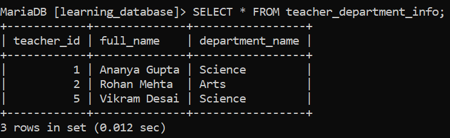

# SQL CREATE VIEW Statement:

The SQL `CREATE VIEW` statement creates a **virtual table** based on a `SELECT` query. A view doesn't store data of its own, it re-runs its underlying query each time it's accessed, and displays whatever the source table(s) currently contain. (This is different from a *materialized* view, which does store a physical copy of the result; neither MySQL nor MariaDB has materialized views every view in both engines works the way described here.)

---

## Syntax:

```sql
CREATE VIEW view_name AS
SELECT column1, column2, ...
FROM table_name
WHERE condition;
```

- `CREATE VIEW view_name`: creates a new view.

- `AS`: introduces the query that defines the view.

- `SELECT column1, column2, ...`: specifies the columns to include.

- `FROM table_name`: specifies the source table(s).

- `WHERE condition` *(optional)*: filters the data shown through the view.

---

## Example 1: Creating a Simple View:

Using the `teachers` table from `learning_database`, this view shows only the teachers earning above a certain salary:


**Query:**

```sql
CREATE VIEW senior_teachers AS
SELECT teacher_id, full_name, salary
FROM teachers
WHERE salary > 50000;
```

**Query the view like a table:**

```sql
SELECT * FROM senior_teachers;
```

**Output:**


- `senior_teachers` isn't a real, separately stored table it's a saved `SELECT` statement. Every time it's queried, the database re-runs `SELECT teacher_id, full_name, salary FROM teachers WHERE salary > 50000` against the current data.

- If a teacher's salary changes, or a new teacher above the threshold is added, `senior_teachers` reflects that automatically the next time it's queried there's nothing to refresh manually.

---

## Example 2: Creating a Joined View:

Views can be built from a join, combining columns from multiple tables into one convenient virtual table. Using `teachers` and `departments`:

**Query:**

```sql
CREATE VIEW teacher_department_info AS
SELECT t.teacher_id,
       t.full_name,
       d.department_name
FROM teachers AS t
JOIN departments AS d
    ON t.department_id = d.department_id;
```

```sql
SELECT * FROM teacher_department_info;
```

**Output:**



- A view named `teacher_department_info` is created.

- It exposes `teacher_id`, `full_name`, and `department_name` as if they all lived in one table.

- An `INNER JOIN` (via plain `JOIN`) links `teachers` and `departments` on `department_id` `Meera Kulkarni`, who has no department, is excluded here for the same reason she'd be excluded from the underlying join directly.

---

## Can You INSERT/UPDATE/DELETE Through a View?:

Sometimes this is one of the more commonly misunderstood parts of views. A view is only **updatable** if MySQL/MariaDB can unambiguously map a change back to exactly one row in exactly one base table. A view is **not** updatable if its query includes any of the following:

- Aggregate functions (`SUM()`, `COUNT()`, `AVG()`, etc.), `DISTINCT`, `GROUP BY`, or `HAVING`
- `UNION` or `UNION ALL`

- A subquery in the select list that refers to the same table used in the `FROM` clause

- Derived (computed) columns, such as `price * 1.1` or `UPPER(name)` only plain, unmodified columns are updatable

A join-based view like `teacher_department_info` can be updatable *if* it uses `INNER JOIN` (not an outer join) and the write only targets columns from a single one of the joined tables. Even then, `DELETE` is never supported through a multi-table view only `INSERT` and `UPDATE` are possible, and `INSERT` only works if it can insert into just one of the joined tables.

You can check whether a specific view is updatable without guessing, by querying `INFORMATION_SCHEMA.VIEWS`:

```sql
SELECT table_name, is_updatable
FROM information_schema.views
WHERE table_schema = 'learning_database';
```

---

## Controlling Writes: WITH CHECK OPTION:

For an updatable view built with a `WHERE` clause, `WITH CHECK OPTION` stops an `INSERT` or `UPDATE` from creating a row that the view's own `WHERE` clause wouldn't actually show:

```sql
CREATE VIEW Snior_teachers AS
SELECT teacher_id, full_name, salary
FROM teachers
WHERE salary > 50000
WITH CHECK OPTION;
```

- Without `WITH CHECK OPTION`, you could `UPDATE senior_teachers SET salary = 40000 WHERE teacher_id = 1` the row would vanish from the view immediately afterward, since it no longer matches `salary > 50000`, but the update itself would still succeed.

- With `WITH CHECK OPTION`, that same update is **rejected outright**, because the resulting row would fail the view's own `WHERE` condition.

---

## The ALGORITHM Clause (a MySQL/MariaDB Extension):

Both engines support an optional `ALGORITHM` clause controlling *how* the view is processed internally this isn't part of standard SQL, it's specific to MySQL/MariaDB:

```sql
CREATE ALGORITHM = MERGE VIEW Snior_teacher AS
SELECT teacher_id, full_name, salary
FROM teachers
WHERE salary > 50000;
```

| Value | Behavior |
|---|---|
| `UNDEFINED` (default) | The server picks automatically it prefers `MERGE` when possible, since it's generally more efficient |
| `MERGE` | The view's query is folded directly into the outer query at execution time; required for a view to be updatable |
| `TEMPTABLE` | The view's result is computed into a temporary table first necessary for views the server can't merge (those with aggregates, `DISTINCT`, `UNION`, etc.), but never updatable |

---

## References:

- [Geeks for Geeks: SQL CREATE VIEW Statement](https://www.geeksforgeeks.org/sql/sql-create-view-statement)

- [MySQL CREATE VIEW Statement](https://dev.mysql.com/doc/refman/8.0/en/create-view.html)

- [MySQL View Updatability](https://dev.mysql.com/doc/refman/8.0/en/view-updatability.html)

- [MariaDB CREATE VIEW](https://mariadb.com/docs/server/server-usage/views/create-view)

---

[← Back to main README](./README.md) | [← Previous Day (Day 81)](./Day-81-Introduction-to-SQL-Views.md) | [Next Day (Day 83) →](./Day-83-UPDATE-VIEW-in-SQL.md)