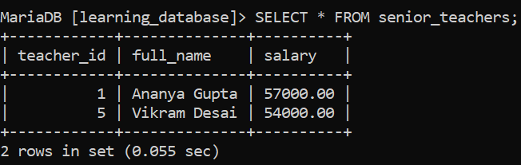
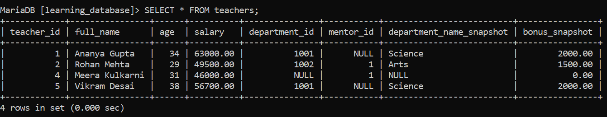
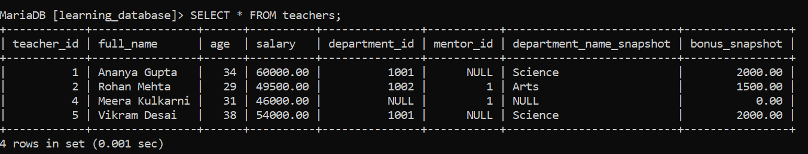
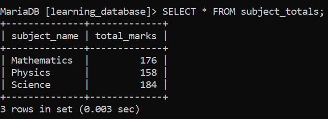
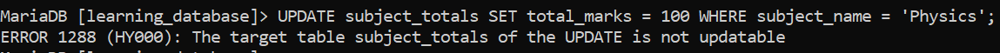
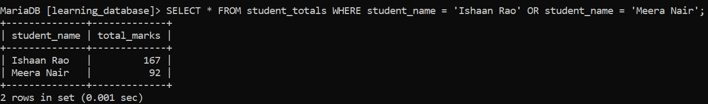

# UPDATE VIEW in SQL:

"Updating a view" actually covers **two genuinely different operations**, and mixing them up is the most common source of confusion on this topic:

1. **Updating data *through* a view** running an ordinary `UPDATE` statement against a view, which writes the change back to the underlying table. This only works if the view is *updatable* (see the CREATE VIEW document for the exact rules).

2. **Redefining what a view shows** changing the view's own `SELECT` query, using `CREATE OR REPLACE VIEW` or `ALTER VIEW`. This doesn't touch any data at all; it just swaps out the saved query the view runs.

These aren't interchangeable, and importantly a view redefined with `GROUP BY`, an aggregate function, or a subquery (operation 2) becomes **permanently non-updatable**: operation 1 can never be performed on it again until it's redefined back into a simple, single-table form.

---

## Syntax:

**Updating data through an updatable view:**

```sql
UPDATE view_name
SET column1 = value1, column2 = value2, ...
WHERE condition;
```

**Redefining the view's own query:**

```sql
CREATE OR REPLACE VIEW view_name AS
SELECT column1, column2, ...
FROM table_name
WHERE condition;
```

> **`ALTER VIEW` does the same job as `CREATE OR REPLACE VIEW`**, with one difference: `ALTER VIEW` requires the view to already exist and errors if it doesn't, while `CREATE OR REPLACE VIEW` creates it if missing and replaces it if not. Both are supported identically on MySQL and MariaDB; which one you reach for is mostly a matter of whether you want a missing view to be an error or silently handled.

>
> ```sql
> ALTER VIEW view_name AS
> SELECT column1, column2, ...
> FROM table_name
> WHERE condition;
> ```

---

## Setting Up: A Genuinely Updatable View:

We'll reuse `senior_teachers` from the CREATE VIEW document a simple, single-table view with no aggregates, no `GROUP BY`, and no subqueries, which is exactly what makes it updatable:

```sql
CREATE VIEW senior_teachers AS
SELECT teacher_id, full_name, salary
FROM teachers
WHERE salary > 50000;

SELECT * FROM senior_teachers;
```

**Output:**



---

## Part 1: Writing Data Through the View:

### Example 1: Updating a View Using WHERE / IN:

**Query:**

```sql
UPDATE senior_teachers
SET salary = 60000
WHERE teacher_id IN (1);
```

**Output:**



- This is a completely ordinary `UPDATE` statement it just happens to target a view instead of a table directly.

- Because `senior_teachers` is updatable, MySQL/MariaDB translates this into an update against the real `teachers` table underneath. Querying `teachers` directly afterward shows `Ananya Gupta`'s salary really did change to `60000`.

### Example 2: Updating a View Using an Arithmetic Expression:

**Query:**

```sql
UPDATE senior_teachers
SET salary = salary * 1.05;
```

**Output:**




- Gives every teacher currently visible through the view (i.e., everyone still earning above 50,000) a 5% raise.

- The expression on the *right-hand side* of `SET` can be arithmetic that's fine. What actually disqualifies a view from being updatable is a derived expression appearing in the view's own `SELECT` list (like `salary * 1.1 AS adjusted_salary`), not in the `SET` clause of an `UPDATE` run against it afterward.

---

## Part 2: Redefining the View's Own Query:

The next two examples are commonly (and confusingly) described as "updating the view," but they don't update any data they replace `senior_teachers`'s definition with something else entirely, using `CREATE OR REPLACE VIEW`.

### Example 3: Redefining a View to Use an Aggregate Function:

**Query:**

```sql
CREATE OR REPLACE VIEW subject_totals AS
SELECT subject_name, SUM(marks) AS total_marks
FROM enrollments
GROUP BY subject_name;

SELECT * FROM subject_totals;
```

**Output:**



- This is a structural redefinition of the view, not a data write no row in `enrollments` changes.

- Because this new definition uses `SUM()` and `GROUP BY`, `subject_totals` is now **non-updatable**. Trying to run `UPDATE subject_totals SET total_marks = 100 WHERE subject_name = 'Physics';` against it fails outright:



### Example 4: Redefining a View to Use a Subquery:

**Query:**

```sql
CREATE OR REPLACE VIEW student_totals AS
SELECT s.student_name,
       (SELECT SUM(e.marks) FROM enrollments e WHERE e.student_id = s.student_id) AS total_marks
FROM students s;

SELECT * FROM student_totals WHERE student_name = 'Ishaan Rao' OR student_name = 'Meera Nair';
```

**Output:**



- Like Example 3, this only changes what the view's query computes it reads from `enrollments` and `students`, but writes to neither.

- The subquery in the select list makes this view non-updatable too, for the same reason listed in the CREATE VIEW document: a derived/computed column disqualifies updatability, and a correlated subquery is exactly that.

---

## Summary:

| Goal | Statement | Requires the view to be updatable? |
|---|---|---|
| Change actual data in the underlying table, via the view | `UPDATE view_name SET ... WHERE ...` | Yes |
| Change what the view's query does/shows | `CREATE OR REPLACE VIEW` or `ALTER VIEW` | No — this works on any view, updatable or not |

---

## References:

- [GeeksforGeeks: Update SQL Views](https://www.geeksforgeeks.org/sql/update-view-in-sql)

- [MySQL CREATE VIEW Statement](https://dev.mysql.com/doc/refman/8.0/en/create-view.html)

- [MySQL ALTER VIEW Statement](https://dev.mysql.com/doc/refman/8.0/en/alter-view.html)

- [MySQL View Updatability](https://dev.mysql.com/doc/refman/8.0/en/view-updatability.html)

- [MariaDB ALTER VIEW](https://mariadb.com/docs/server/server-usage/views/alter-view)

---

[← Back to main README](./README.md) | [← Previous Day (Day 82)](./Day-82-SQL-CREATE-VIEW-Statement.md) | [Next Day (Day 84) →](./Day-84-Rename-View-in-SQL.md)