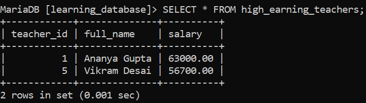
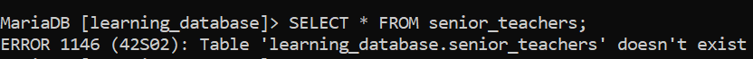

# Rename View in SQL:

Renaming a view changes its name without affecting its structure, its underlying query, or any data it exposes. It's useful for giving a view a more meaningful name as requirements evolve, without having to drop and recreate it from scratch.

> **`sp_rename` is a SQL Server stored procedure it doesn't exist in MySQL or MariaDB at all.** Running `EXEC sp_rename ...` on either engine fails immediately, since `EXEC` isn't even valid statement syntax there and `sp_rename` isn't a recognized procedure. MySQL and MariaDB rename views a completely different way: with `RENAME TABLE`.

---

## Syntax (MySQL/MariaDB):

```sql
RENAME TABLE old_view_name TO new_view_name;
```

This looks like it should only apply to tables, but it doesn't **in both MySQL and MariaDB, views and tables share the same namespace**, so `RENAME TABLE` works on a view exactly the same way it works on a table. There is no separate `RENAME VIEW` statement in either engine; `RENAME TABLE` is the correct and only direct way to do this.

- `old_view_name`: the view's current name.

- `new_view_name`: the name to rename it to.

- Multiple renames can be chained in a single statement, separated by commas: `RENAME TABLE a TO b, c TO d;` and MariaDB (10.6.1+) performs these atomically, so a crash mid-statement can't leave some renamed and others not.

- **A view cannot be renamed into a different database this way.** `RENAME TABLE old_db.my_view TO new_db.my_view;` fails with `ERROR 1450 (HY000): Changing schema from 'old_db' to 'new_db' is not allowed` this restriction applies specifically to views; ordinary tables *can* move between databases with `RENAME TABLE`, but views can't.

---

## Example: Renaming a View in `learning_database`:

We'll reuse `senior_teachers` from the CREATE VIEW document and rename it to something more descriptive, `high_earning_teachers`.

**Before renaming:**

```sql
SELECT * FROM senior_teachers;
```

**Output:**


**Query the rename itself:**

```sql
RENAME TABLE senior_teachers TO high_earning_teachers;
```

**Verification query the new name:**

```sql
SELECT * FROM high_earning_teachers;
```

**Output:**



- The view's data and definition are completely unchanged only its name is different.

- Querying the old name afterward correctly fails, since it no longer exists:

```sql
SELECT * FROM senior_teachers;
```

-**Output:**



---

## The Alternative: DROP and Recreate:

If you ever need to rename a view *and* move it to a different database in one conceptual step (which `RENAME TABLE` explicitly refuses to do), the fallback is to capture the view's definition, drop it, and recreate it under the new name optionally in a different database:

```sql
-- 1. Capture the current definition
SHOW CREATE VIEW high_earning_teachers;

-- 2. Drop the original
DROP VIEW high_earning_teachers;

-- 3. Recreate it under the new name (and/or in a different database)
CREATE VIEW sql_view.high_earning_teachers AS
SELECT teacher_id, full_name, salary
FROM learning_database.teachers
WHERE salary > 50000;
```

This is more work than a single `RENAME TABLE` statement, so it's worth reaching for only when you specifically need the cross-database move that `RENAME TABLE` can't do.

---

## Advantages of Renaming Views:

- **Adaptability:** update view names to reflect changing business logic.

- **Consistency:** aligns object names with naming standards.

- **Clarity:** improves schema readability and understanding.

- **Dependency Safety:** the view's stored definition, privileges, and dependent objects remain intact only the name changes.

- **Efficiency:** a single `RENAME TABLE` statement is far cheaper than dropping and recreating the view, especially for a complex, multi-join view definition.

---

## References:

- [GeeksforGeeks: Rename SQL Views](https://www.geeksforgeeks.org/sql/rename-view-in-sql)

- [MySQL RENAME TABLE Statement](https://dev.mysql.com/doc/refman/8.0/en/rename-table.html)

- [MariaDB RENAME TABLE Statement](https://mariadb.com/docs/server/reference/sql-statements/data-definition/rename-table)

---

[← Back to main README](./README.md) | [← Previous Day (Day 83)](./Day-83-UPDATE-VIEW-in-SQL.md) | [Next Day (Day 85) →](./Day-85-DROP-View-in-SQL.md)